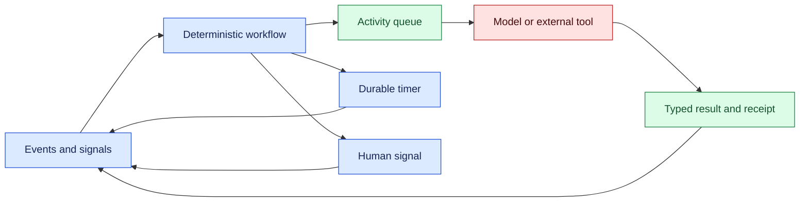
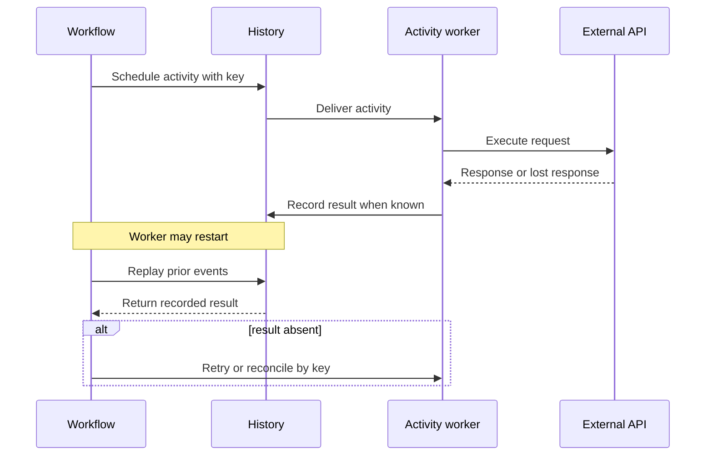

# Durable execution

Status: durable

Sources: [Google DeepMind news archive](https://deepmind.google/blog/) (issue discovery context); [Temporal documentation — Durable Execution](https://docs.temporal.io/what-is-temporal); [AWS Step Functions Developer Guide](https://docs.aws.amazon.com/step-functions/latest/dg/welcome.html)

## In one sentence

Durable execution records workflow decisions and external effects so an AI process can replay its orchestration after failure without rerunning unsafe side effects blindly.

## Background: what existed before

An ordinary function call keeps progress in memory. If the process exits, the caller retries the whole function or reports failure. A queue improves delivery but does not remember which branch of a multi-step workflow was taken. A database transaction helps when all work is local; it cannot atomically include a remote API, a human approval, and a timer.

Workflow engines introduced explicit activities, retries, timers, and state. Event histories let a worker reconstruct the current state after a crash. Deterministic orchestration is essential: replay should make the same scheduling decisions from the same recorded events. Nondeterministic values such as current time, random numbers, and network responses belong in recorded activity results, not directly in replayed workflow code.

AI agents add planning variability and expensive context. A model call is itself an activity with a version, input projection, output, cost, and policy decision. Persisting every hidden reasoning token is unnecessary; persisting the structured action and observed result is enough to resume the workflow and audit authority.

## What changed and why now

Long-lived agents increasingly wait on humans, builds, data jobs, and external systems. Durable execution makes those waits cheap because no worker must remain allocated. The issue’s source context reflects this shift toward tool-connected systems; the exact engine choice is deployment-specific. The architecture below is an engineering inference grounded in the cited workflow documentation.

The distinction from a general long-running task article is replay discipline. A task record says where a run is. Durable execution additionally defines how orchestration code is replayed, how side effects are isolated as activities, and how versioned workflows survive deployments.

## What changed this month

The useful design change is to move timers, retries, and branch decisions into a durable history. A worker can restart and reconstruct the workflow without asking a model to remember prior steps. This reduces duplicate calls and makes recovery behavior testable. It does not make an AI plan correct; policy gates, validation, and human review remain separate controls.

## Impact on current processing and architecture

Separate a deterministic workflow from side-effecting activities. The workflow reads prior events and schedules an activity. The activity calls a model or tool, returns a typed result, and is retried according to an explicit policy. The history stores activity completion, timer firing, signal receipt, and version markers. Large prompts and artifacts are referenced by content hash rather than copied into every event.



Replay must not repeat an external effect. The engine returns the recorded activity result when replay reaches an already-completed event. If an activity crashed after the remote service acted but before completion was recorded, use an idempotency key and reconciliation. A timeout is not proof that the effect failed.



Versioning is a core processing concern. A workflow started under one branch may still be running after code changes. Use a version marker or compatibility route so replay sees the old decision logic for old histories. Change activity behavior behind a versioned contract and retain old deserializers until all runs migrate or finish.

## Real-world applications

A coding workflow can wait for CI, sleep until a review window, and receive a human signal. The history records the commit revision, test receipt, approval identity, and timer. A restart does not rerun the build merely because the worker was replaced.

A data assistant can schedule a query, wait for a warehouse job, and summarize its result. Store query IDs and result hashes, not unbounded raw tables in workflow history. If the warehouse reports an unknown status, poll or reconcile before issuing a duplicate job.

A customer-operation workflow may require authorization before a financial or account change. Model proposals are activities; policy approval is a separate signal. The workflow should be able to expire an approval and escalate rather than treating silence as consent.

Constraints include history growth, schema migration, activity timeout selection, duplicate external effects, and sensitive data retention. Compact histories with snapshots or child workflows. Keep retry budgets finite and classify errors as retryable, terminal, or requiring reconciliation. Metrics should separate workflow wait time, activity time, replay time, and human delay.

An implementation team should first inventory the workflow’s irreversible boundaries. Sending a message, creating a cloud resource, charging an account, and publishing a report each need a stable operation key and a receipt lookup. Read-only activities can often be retried freely, but even reads may be expensive or rate-limited. Put timeouts and retry policies next to the activity contract so a code reviewer can see the failure behavior without reverse-engineering scheduler defaults.

Signals deserve the same rigor as API requests. Authenticate the sender, validate the payload against the current workflow state, and record the signal ID so a duplicate delivery does not cause two approvals. A late approval should be rejected or recorded as informational when the workflow has already expired. Human-facing clients should show the run version and requested decision, not just a generic “approve” button.

For AI activities, store the model identifier, prompt-template version, tool schema version, safety policy version, and a bounded input reference. If a model provider is unavailable, the workflow can wait or choose a documented fallback; it should not silently change model behavior during replay. Evaluate fallback outputs separately from normal completions and preserve the authority boundary around external actions.

A durable system also needs an operator runbook. Explain how to inspect history, pause a workflow, cancel pending activities, reconcile an unknown effect, and resume after a schema migration. Practice these actions in a staging environment. Recovery that exists only in an engineer’s memory is not durable operations.

Testing should include history-based replay tests checked into the repository as fixtures. Start a run, persist events through an approval and an activity, then replay it with the current worker and assert that no new side-effect request is emitted for the completed activity. Add a migration fixture from the previous workflow version and assert that its branch and timers remain legal. Inject duplicate signals, delayed timers, malformed model output, and activity timeouts. These cases reveal whether the system’s guarantees are encoded in transitions or depend on a lucky worker sequence.

Keep a small observability vocabulary across services: run ID, workflow version, activity ID, attempt, event sequence, and correlation key. Propagate these fields through logs and metrics while filtering prompts and credential values. During an incident, operators should be able to answer “what is waiting, what is committed, and what can be retried?” without opening a raw transcript. That question is the practical test of a durable design.

Cost controls belong in the history as well. Record model-token estimates, activity charges, and retry counts, then enforce a run budget before scheduling another attempt. A workflow that waits for a human should not continue consuming model calls on a timer. Explicit budget exhaustion gives the operator a useful escalation state and makes post-run accounting reproducible.

Data retention needs a workflow policy. Keep identifiers and hashes long enough to reconcile external effects, but expire raw model inputs, screenshots, and tool payloads according to tenant and regulatory requirements. A later replay may need a redacted artifact or a recorded decision rather than the original private content. Document which events are immutable, which references can expire, and how an operator handles a missing artifact during recovery.

Finally, make recovery a product feature. Show users whether a run is executing, waiting, paused, reconciling, or escalated, and explain the next safe action. Let an operator inspect the last committed event and approve a bounded retry. Clear status reduces duplicate manual submissions and gives support teams a shared vocabulary for incidents. Durable execution earns trust when its state is understandable, not only when its worker survives a restart.

## Mental model

Think of a durable workflow as a stage script plus a legally admissible production log. The script can be replayed to discover what should happen next; the log proves what already happened. Actors may improvise inside an activity, but the workflow records its result before advancing.

| Concern | Durable record | Why it matters |
| --- | --- | --- |
| Branch choice | Versioned event | Replay consistency |
| External call | Intent, key, receipt | Duplicate-effect control |
| Waiting | Timer or signal | No worker held open |
| Human authority | Identity and decision | Audit and expiry |
| Large artifact | Hash and reference | Bounded history |

## Engineering consequence

Keep workflow code deterministic: use engine time, recorded randomness, and activity results. Put model calls, HTTP, filesystem writes, and database mutations in activities. Add idempotency keys to every non-read activity and define reconciliation for uncertain outcomes. Test replay from saved histories and simulate worker loss at every activity boundary.

Use heartbeats for activities that legitimately run for a long time, with cancellation propagation. A heartbeat is liveness evidence, not a business receipt. The activity still needs a remote operation ID and final status. Apply backpressure to activity queues and cap per-tenant workflow concurrency.

## Limits and failure modes

## Design walkthrough: approval-gated deployment

Consider an assistant that prepares a deployment but cannot publish it without approval. The workflow begins by recording the repository revision, requested environment, and a policy decision that the environment is eligible. A planning activity produces a typed deployment plan and artifact references. A validation activity runs tests and stores a receipt; it does not mutate production. The workflow then schedules an approval signal with an expiry timer.

When an authorized reviewer approves, the signal event records identity, time, policy version, and the plan hash. The workflow schedules a deployment activity with an idempotency key derived from run ID and plan hash. The worker calls the deployment service and records its operation ID. If the response is lost, the next attempt queries that operation ID before issuing a new request. A successful receipt advances the workflow to observation, where a read-only activity checks health metrics.

Every branch has an explicit outcome. Rejection cancels the pending deployment and retains the reason. Approval expiry escalates or closes according to policy. A failed health check can trigger a documented rollback activity, but rollback is itself an external effect requiring a key and receipt. The workflow history therefore tells an operator not only that a deployment failed, but whether production may have changed and which reconciliation step is safe.

This example illustrates why durable execution is more than persistence. The workflow expresses authority, timing, evidence, and recovery. The model may help draft the plan or summarize test results, but it cannot bypass the approval signal or invent a deployment receipt. Deterministic replay makes those constraints visible in code review and repeatable in tests.

Durable history can grow without bound and expose sensitive data. Use retention, encryption, access controls, compression, and artifact references. Determinism bugs may appear only during replay after a deployment. Add compatibility tests for representative histories.

Retries can amplify outages or duplicate side effects. Classify errors, use exponential backoff with a ceiling, and reconcile before retrying uncertain writes. An engine cannot infer semantic correctness from a successful activity status.

## Build it locally

This toy event loop demonstrates replay: a recorded activity result is reused instead of invoking the side effect twice.

```python
events = []

def activity(key, result):
    for event in events:
        if event["key"] == key:
            return event["result"]
    events.append({"key": key, "result": result})
    return result

print(activity("email:42", "sent:msg-7"))
print(activity("email:42", "sent:msg-8"))
print(events)
```

1. Save as `replay.py` and run `python3 replay.py`.
2. Replace the second result with a different value and observe that replay keeps the recorded receipt.
3. Add a timer event and a workflow version field.
4. Model an unknown result and require reconciliation before adding a receipt.
5. Write a test that two replays produce identical event histories.

## Implementation exercises

1. Use Docker to run a local client, worker, and mock API; kill the worker between request and receipt.
2. Use Python and command-line logs to compare retryable, terminal, and reconciliation-required errors.
3. Capture only synthetic local traffic with Wireshark and verify that activity headers are absent from workflow history.
4. Draw the event/activity boundary in Markdown and document which values are replay-safe.

## Interview Q&A

**Why separate workflows and activities?** Workflows must replay deterministically; activities perform nondeterministic or side-effecting work.

**Does durable execution guarantee exactly once?** No. Idempotency and reconciliation handle uncertain external effects.

**Why version workflows?** Old histories must replay correctly after orchestration code changes.

**What belongs in history?** Decisions, typed results, receipts, timers, signals, and references—not unlimited raw prompts or artifacts.

## Glossary

**Activity:** Side-effecting or nondeterministic operation scheduled by a workflow.

**Deterministic replay:** Reconstructing the same workflow decisions from recorded events.

**Event history:** Durable sequence of workflow decisions, results, timers, and signals.

**Idempotency key:** Stable identifier preventing a repeated request from becoming a second business effect.

**Signal:** External message that changes workflow state, often from a human or service.

## References

- [Temporal: What is Temporal?](https://docs.temporal.io/what-is-temporal) — durable workflow concepts.
- [AWS Step Functions Developer Guide](https://docs.aws.amazon.com/step-functions/latest/dg/welcome.html) — state-machine and orchestration context.
- [Google DeepMind news archive](https://deepmind.google/blog/) — issue discovery context.

## Claim ledger

| Claim | Source | Fact or inference |
| --- | --- | --- |
| Durable workflow systems recover progress from persisted execution history. | Temporal documentation | Source-context fact |
| Orchestration should separate deterministic decisions from side-effecting activities. | Workflow practice | Engineering inference |
| AI model calls should be versioned, bounded activities with typed results. | Lesson synthesis | Engineering inference |
