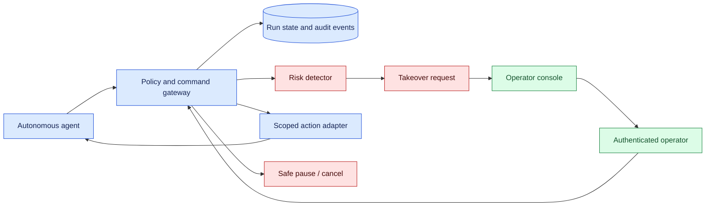
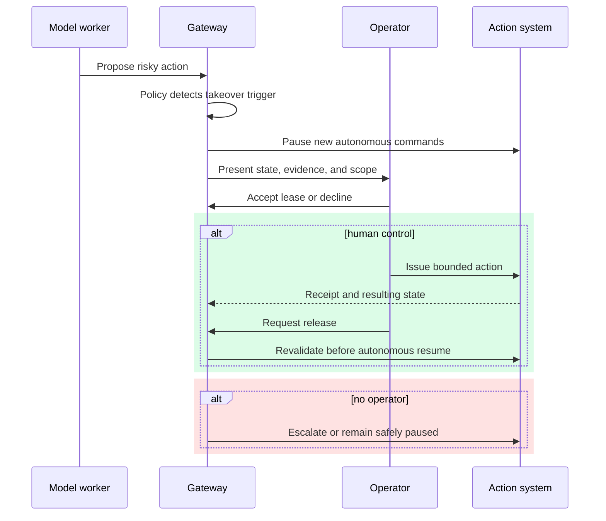

# Operator takeover

Status: emerging

Sources: [Google DeepMind — 2026-07-30, primary product post](https://blog.google/innovation-and-ai/models-and-research/google-deepmind/gemini-robotics-er-2/); [NIST — publication date not stated, accessed 2026-09-07, AI RMF](https://www.nist.gov/itl/ai-risk-management-framework); [OpenTelemetry — publication date not stated, accessed 2026-09-07, official documentation](https://opentelemetry.io/docs/)

## In one sentence

Operator takeover is a designed transfer from autonomous execution to accountable human control, with bounded authority, visible state, and a safe path back to automation.

## Prerequisites

Know authenticated leases, command arbitration, safe pause, sequence numbers, revalidation, trace context, and human workload. A takeover is complete only when autonomous authority is paused and the operator has a bounded, inspectable control surface.

## Background: what existed before

Automation systems historically used alarms and stop buttons. An alarm told a person that something unusual happened; a stop button removed energy or halted motion. Neither necessarily explained the task state, preserved evidence, or gave the person a way to continue without restarting. In software agents, “human in the loop” can be equally vague: a person may receive a notification but lack the context or permission to make a useful decision.

The baseline for reliable operations is a runbook. It names triggers, owners, actions, escalation paths, and completion evidence. Operator takeover extends that runbook into the product. The system must know when to request help, what authority the operator receives, how autonomous actions are paused, and how control is released. A chat box attached to an agent is not enough if a hidden worker can continue changing state.

## What changed and why now

Tool-connected AI systems can operate for longer periods and encounter ambiguous or high-impact situations. An operator may need to approve a financial action, resolve an identity mismatch, inspect a visual scene, or terminate a runaway loop. The issue source context reflects this broader autonomy; the specific takeover protocol below is an engineering inference grounded in risk-management and observability practice.

The important shift is from passive oversight to an explicit control lease. The takeover request contains reason, urgency, current state, proposed next action, evidence, and authority scope. Accepting the lease pauses autonomous commands, records identity, and exposes a limited control surface. Resumption requires revalidation and a recorded release, not a timeout that silently gives control back to the model.

## What changed this month

The verified July 30 robotics post reports proactive human intervention when the embodied reasoner is uncertain and describes human teleoperation as part of the robotics system. It does not establish a universal software operator-takeover protocol. The engineering translation is to make that intervention a first-class state transition for agents and robots. It joins model planning, policy, queues, and telemetry. Capability remains separate from accountability: a model may suggest an action, while a named operator owns an irreversible decision. This distinction makes incidents reviewable and gives teams a concrete way to evaluate whether automation is ready for a wider scope.

## Impact on current processing and architecture

Represent takeover as durable state: `AUTONOMOUS`, `TAKEOVER_REQUESTED`, `SAFE_PAUSED`, `HUMAN_CONTROL`, `REVALIDATING`, `RESUMING`, `ESCALATED`, and `CLOSED`. Every state has an owner, deadline, reason code, and allowed transitions. The command gateway checks the state before dispatching any action. A stale worker message must be rejected when a human owns the run.



The console should show the task objective, last committed action, pending effects, evidence links, uncertainty, budget, and exact permissions. Avoid presenting a model recommendation as a completed fact. For physical systems, show safety mode and sensor freshness. For software agents, show pending tool calls and whether a remote effect is unknown.

Takeover requires command arbitration. Use one active controller and an expiring authority lease. Autonomous workers renew only while the state is `AUTONOMOUS`; a lease loss moves them to a safe pause. Human actions use separate credentials and are logged with the target, parameters, and confirmation. The model can receive a sanitized observation that control changed, but it should not be able to reclaim control by issuing a normal tool call.

## Real-world applications and constraints

A coding agent can pause before merging a change that touches production configuration. The operator sees the diff, test receipts, policy reason, and rollback plan. Approval grants merge authority for that revision only; it does not grant unrestricted repository access.

A customer-service agent can escalate an account recovery when identity evidence conflicts. The operator receives the relevant fields and policy checks, not the entire private transcript. The agent remains paused until the person resolves the conflict or closes the case.

A warehouse robot can request help when a grasp is uncertain or a person enters the work area. The operator may identify an object or move it, but the robot resumes only after a fresh scene check and safety supervisor approval. A remote operator needs a local safe-stop path if network latency or loss makes direct control unsafe.

Constraints include operator workload, response latency, training, privacy, network availability, and authority separation. A system that raises hundreds of low-value requests trains people to ignore alarms. Tune thresholds with workload data and provide a safe automatic fallback when no operator is available. High-impact actions should expire rather than default to approval.

## Mental model

Think of takeover as changing pilots, not asking a passenger for advice. The outgoing pilot stabilizes the aircraft, states instruments and next risks, and confirms the incoming pilot’s identity. Only then does control move. Returning to autopilot also requires a checklist.



## Engineering consequence

Define takeover triggers explicitly: policy uncertainty, repeated tool failure, budget exhaustion, conflicting identity evidence, unsafe physical state, or a user-requested review. Each trigger should specify the safe pause, required role, evidence bundle, deadline, and timeout outcome. Store the trigger and policy version so later reviewers can distinguish a deliberate escalation from a crash.

Use OpenTelemetry-style trace IDs to connect model proposals, gateway decisions, operator events, and external receipts. Redact sensitive values and keep a separate restricted evidence store. Metrics should include request rate, acceptance time, takeover duration, stale-command rejections, releases, escalations, and outcomes after intervention.

| Decision | Default control | Evidence |
| --- | --- | --- |
| Low-risk ambiguity | Ask for clarification | User response and updated state |
| High-risk proposed effect | Pause and require scoped lease | Identity, policy, plan hash |
| Unknown external result | Reconcile before retry | Remote lookup or operator decision |
| Operator unavailable | Escalate or safe close | Timeout and final state |
| Resume after intervention | Revalidate assumptions | Fresh observation and release event |

## Limits and failure modes

### Escalation and recovery design

An escalation policy should be explicit about urgency and ownership. A low-risk ambiguity can wait for the next available operator; a suspected unauthorized action needs an immediate safe pause and security route. Include a reason code, affected resource, evidence links, requested decision, expiry, and fallback. The operator should be able to decline with a reason or transfer the lease to a qualified role. Silence must never be interpreted as approval.

Takeover also needs a recovery plan for partial actions. Suppose an agent opened a pull request, then requested approval, and the operator discovers that a generated file contains an unsafe change. The operator can reject the merge, annotate the issue, and return the run to a review state. If an external side effect is already unknown, the system must reconcile it before allowing a retry. Record the operation ID and plan hash so a later worker cannot create a duplicate.

Authority should be scoped along several dimensions: resource, action, environment, duration, and data visibility. A reviewer may approve a staging deployment for one revision but not production. A support specialist may edit a customer address but not change authentication factors. Encode these constraints in policy and test them at the gateway. Do not rely on role names rendered in a model-generated prompt.

Observability should support both live operation and after-action learning. A trace links the trigger, state snapshot, operator identity, command decisions, external receipts, and final outcome. Dashboards show waiting and overdue leases. A periodic review samples takeovers for unnecessary escalations, confusing evidence, and repeated failure patterns. Those findings can improve tools or prompts without weakening the authority boundary.

Run drills before launch. Kill the autonomous worker after a takeover request, disconnect the operator client during a command, revoke the operator session, and send a stale command from an old sequence. The expected result is deterministic: no unauthorized effect, a visible state, and a clear recovery route. Test accessibility and mobile constraints too; an operator who cannot read the evidence under real conditions is not an effective control.

Takeover can fail if the operator sees stale or incomplete context, receives too many requests, or is granted excessive authority. Keep interfaces focused and permissions narrow. Automation bias remains possible; show uncertainty and alternatives rather than only a recommended button.

Network partitions create split-brain control. A remote operator may believe a command was accepted while the robot is disconnected. Use leases, sequence numbers, acknowledgements, and local safe behavior. Never infer control transfer from a dropped connection.

Logs can expose private conversations, images, or credentials. Apply retention and access policies. A takeover audit should prove who acted and what changed without making every operator a reader of all customer data.

## Build it locally

### Takeover readiness review

Before enabling takeover in production, review the complete path from trigger to release. Confirm that every trigger has a safe pause and that every autonomous worker checks ownership immediately before an effect. Verify that the console displays the state snapshot timestamp, policy decision, active lease, pending effects, and expiry. A human should be able to explain what will happen after pressing each control.

Review the evidence contract with operations and security teams. Which fields are required to approve an action? Which artifacts are restricted? How long are traces retained? Who handles an unknown external result? Write these answers into a runbook and rehearse them with synthetic data. If a decision cannot be made from the presented evidence, improve the projection rather than asking the model to provide more confident prose.

Finally, set launch gates. Require zero stale-command executions in fault injection, bounded takeover-request rate, acceptable operator response time, and a tested rollback or safe-close path. Start with read-only or reversible actions, then expand scope only after reviewing real interventions. The goal is not to maximize human involvement; it is to make the moments that require judgment controlled, observable, and recoverable.

Keep the human interface honest about uncertainty. Show conflicting observations, missing receipts, and policy constraints in plain language. If the operator can only choose among prevalidated actions, label that boundary; if free-form input is accepted, run it through the same authorization and validation path as an autonomous proposal. A takeover should reduce risk by adding accountable judgment, not create a privileged back door around normal controls.

## Authority handoff protocol

The handoff has two different safety questions: who may issue the next command, and whether the command is still valid in the world described by the evidence. Authentication answers the first question; revalidation answers the second. A correctly identified operator can still be acting on a stale camera frame, an old repository diff, or a lease that expired while the console was offline. Treating identity as sufficient therefore creates a polished version of the same race condition that takeover was meant to control.

Use a monotonic run sequence as a fencing token. Every ownership change increments it, and the gateway rejects a command carrying any older value. A worker that generated a command before the takeover may still deliver that message after the operator accepts control. The stale sequence prevents that delayed message from producing an effect. Sequence checks must occur immediately before the effect adapter, not only when the command is placed on a queue; otherwise a queued command can pass an early check and execute after ownership has changed. The adapter should also receive the lease ID and resource scope so an incorrectly routed command cannot be mistaken for a current one.

Expiry is a safety transition, not a cleanup task. At or after the deadline, the gateway should stop accepting commands under the old lease, mark the run safely paused, and emit an expiry event containing the observed time and sequence. It should not silently transfer authority to the agent, because the operator may have intended to renew or the physical scene may have changed. A new operator can acquire a fresh lease only after the state is known. For robots, the local safety controller may also need to stop motion independently of the network gateway; for software, pending remote effects may require reconciliation before any retry.

Revalidation should name its inputs. A generic boolean called `validated=True` is useful for a toy, but a production release should carry observation timestamp, scene or resource version, policy version, plan hash, and the checks that passed. Compare the version observed by the operator with the current version at release time. If a file changed, a sensor became stale, an account lock appeared, or a tool receipt is unknown, keep the run paused and request another decision. This makes resumption a new authorization boundary rather than an automatic continuation of a conversation.

The operator console should make these fences visible. Show the active lease ID, expiry countdown, sequence, evidence freshness, pending effects, and the exact resources covered by the lease. Disable controls that cannot succeed and explain why, but still enforce the rule at the gateway because a UI can be bypassed or can be out of date. Record both accepted and denied commands. Denials are valuable evidence for detecting stale clients, clock skew, repeated automation races, or an operator trying to exceed scope.

Positive and negative tests must exercise the state machine, not only the happy-path message. Acquire a lease and prove that an agent command is rejected. Send the old sequence after a new lease and prove that it is rejected even when the actor string is otherwise valid. Advance time beyond expiry and prove that the run enters `SAFE_PAUSED`. Change the observed scene after a human action and prove that release is rejected until a fresh observation is supplied. Finally, prove that a valid release changes the sequence and permits only the narrowly defined resume command. These tests are the software equivalent of a physical safety drill and belong in deployment gates.

This toy gateway rejects autonomous commands while a human lease is active, expires the lease, rejects stale sequence numbers, and requires revalidation before release.

```python
from dataclasses import dataclass

@dataclass
class Gateway:
    owner: str = "agent"
    lease: str | None = None
    expires_at: int = 0
    sequence: int = 0
    state: str = "AUTONOMOUS"

    def acquire(self, operator: str, now: int, ttl: int = 10) -> None:
        self.lease = operator
        self.owner = operator
        self.expires_at = now + ttl
        self.sequence += 1
        self.state = "HUMAN_CONTROL"

    def command(self, actor: str, action: str, now: int, sequence: int) -> str:
        if now >= self.expires_at and self.lease is not None:
            self.state = "SAFE_PAUSED"
            return "denied: lease expired"
        if sequence != self.sequence:
            return "denied: stale sequence"
        if actor != self.owner:
            return "denied: active controller is " + self.owner
        return "accepted: " + action

    def release(self, actor: str, now: int, validated: bool) -> str:
        if actor != self.owner or now >= self.expires_at or not validated:
            return "denied: revalidation required"
        self.owner, self.lease, self.state = "agent", None, "AUTONOMOUS"
        self.sequence += 1
        return "released"

g = Gateway()
g.expires_at = 100
print(g.command("agent", "draft", 1, 0))
g.acquire("operator-7", now=10)
print(g.command("agent", "publish", 11, 0))
print(g.command("operator-7", "approve", 11, g.sequence))
assert g.command("agent", "publish", 11, g.sequence - 1).startswith("denied")
assert g.command("operator-7", "approve", 21, g.sequence).startswith("denied")
assert g.release("operator-7", 21, validated=True).startswith("denied")
g = Gateway(); g.acquire("operator-7", now=10)
assert g.release("operator-7", 11, validated=True) == "released"
assert g.command("agent", "resume", 12, g.sequence) == "accepted: resume"
```

1. Save as `takeover.py` and run `python3 takeover.py`.
2. Add a lease expiry and deny commands after expiry until the run is safely paused.
3. Add a sequence number so stale agent commands are rejected after takeover.
4. Log actor, action, decision, reason, and trace ID without storing secrets.
5. Add a release method that requires a fresh validation result before returning ownership to the agent.

## Implementation exercises

Takeover data can improve future automation, but only after review. Label whether the intervention corrected perception, policy interpretation, tool failure, or user intent. Aggregate these labels to find recurring triggers and decide whether to improve a sensor, narrow a tool, change a prompt, or leave the decision human-owned. Do not automatically train on operator commands as if they were universally correct; their authority and context are part of the example.

The same review should examine near misses. A denied stale command, an expired lease, or a takeover that arrived after the task safely closed is useful evidence even though no incident occurred. Classify these events, protect operator privacy, and feed the findings into threat modeling and usability tests. Over time, fewer unnecessary requests and clearer evidence are signs that the autonomous boundary is improving without erasing the human escape hatch.

1. Use Docker to run a mock agent, gateway, and operator client.
2. Use Python and command-line tools to inject duplicate, delayed, and out-of-order commands.
3. Capture synthetic local traffic with Wireshark and verify that lease credentials are not logged.
4. Document the state machine and permissions in Markdown with a flow and sequence diagram.

## Mini exercise (15–30 min)

Extend the gateway with a `TAKEOVER_REQUESTED` state and a reason code. Write tests for a duplicate operator acceptance, an expired lease, a stale autonomous sequence, and a release after the scene or tool state changed. Your final assertion should show that resumption is denied until a fresh validation result is attached.

## Interview Q&A

**Why is a notification not a takeover?** It does not pause autonomous effects or transfer bounded authority.

**What prevents a stale worker from acting?** The gateway checks durable ownership, lease, and sequence state before dispatch.

**When should control return to automation?** Only after an explicit release and fresh validation of relevant assumptions.

**How do you measure operator quality?** Track useful escalations, response time, stale-command blocks, intervention outcomes, and workload—not just takeover count.

## Glossary

**Authority lease:** Time-bounded permission for one actor to control a run.

**Command arbitration:** Deterministic choice of which actor’s command is eligible.

**Operator takeover:** Deliberate transfer from autonomous to human control.

**Safe pause:** State that prevents new autonomous effects while preserving recovery context.

**Stale command:** Action generated under an older owner, state, or sequence.

## References

- [NIST AI Risk Management Framework](https://www.nist.gov/itl/ai-risk-management-framework) — risk and accountability context.
- [OpenTelemetry documentation](https://opentelemetry.io/docs/) — trace and observability context.
- [Google DeepMind news archive](https://deepmind.google/blog/) — issue discovery context.

## Claim ledger
| Claim | Source | Fact or inference |
|---|---|---|
| The July 30 robotics post describes seeking human intervention when uncertain and halting near people. | [Google DeepMind — 2026-07-30](https://blog.google/innovation-and-ai/models-and-research/google-deepmind/gemini-robotics-er-2/) | Fact; provider release claim |
| NIST AI RMF includes governance and accountability considerations. | [NIST — accessed 2026-09-07](https://www.nist.gov/itl/ai-risk-management-framework) | Fact; framework scope |
| OpenTelemetry documents common observability concepts for traces and context. | [OpenTelemetry — accessed 2026-09-07](https://opentelemetry.io/docs/) | Fact; documentation scope |
| Software takeover should be a durable authority transition with expiry, sequence rejection, and revalidation. | This lesson’s architecture | Engineering inference |
