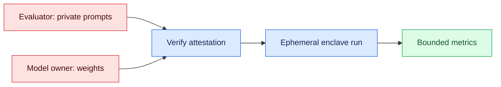
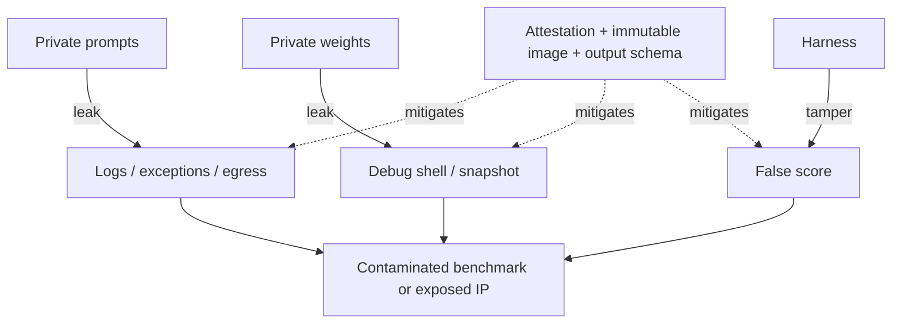

# Double-Blind Model Evaluations
Status: emerging
Sources: [Google DeepMind — 2026-08-27](https://deepmind.google/blog/piloting-the-worlds-first-double-blind-ai-evaluations/), [Technical report — 2026-08-27](https://storage.googleapis.com/deepmind-media/DeepMind.com/Blog/piloting-the-worlds-first-double-blind-ai-evaluations/double-blind-evaluations-technical-report.pdf)

## In one sentence

Double-blind evaluations turn benchmark testing into a hardware-enforced systems boundary, so the evaluator keeps prompts secret while the model owner keeps weights secret.

## Introduction

An evaluation asks how a model performs on a workload representing a capability or risk. It becomes less useful when private questions leak into training or proprietary weights expose intellectual property.

Double-blind evaluation (DBE) resolves that dual-confidentiality problem. It places model, benchmark, code, and policy in a temporary secure enclave. The parties verify the enclave identity before releasing secrets; it returns a bounded result and is decommissioned.

## Mental model

Think of this as a two-party zero-trust workflow. The evaluator owns the test set and the model provider owns the weights; neither side should inspect the other's secret inputs, and neither should swap in a different workload after the deal is struck.

That makes evaluation an infrastructure problem. The score matters, but so do attestation, encrypted memory, constrained outputs, and cloud trust.

Google DeepMind's pilot describes that stack: a proprietary Gemini 2.5 Flash Lite model was evaluated against private AILuminate prompts and a Singapore AI Safety Institute prompt set inside a Google Cloud secure enclave. The key claim is mutual secrecy during execution, not merely a score.

The word *blind* is about information flow, not ignorance of the interface. The model owner publishes a mock model interface—the request and response contract—without publishing weights. Neither participant gets arbitrary shell access, interactive debugging, or a copying channel.

## Prerequisites: a foundational primer

An API contract defines allowed requests, responses, limits, and errors. It gives the evaluator a stable way to call a private model without implementation access. Containers package the harness and dependencies; immutable, reproducible images make the exact program measurable.

Encryption in transit protects network traffic, at rest protects files and snapshots, and in use protects memory during computation. DBE needs all three; the enclave's distinctive contribution is hardware-assisted encryption of RAM and GPU memory while prompts and weights are active.

Remote attestation is signed evidence from hardware about the code and environment that booted. A *trusted computing base* (TCB) is the full stack whose behavior matters: firmware, kernel, container runtime, libraries, and application image. Attestation is useful only when both parties know expected TCB measurements, verify the vendor signature chain, check a fresh nonce, and release keys only to a matching measurement.

Least privilege gives each identity only its needed access: the evaluator submits prompts and reads aggregates, the owner submits weights, and the enclave temporarily reads both. A threat model states what is adversarial and what remains trusted.

### Secure-enclave boundary and attestation decision

The boundary is narrower than “the cloud is trusted.” A useful model treats the ordinary host, hypervisor operator, storage service, network observer, and either participant's accidental debug tooling as potentially hostile. The hardware package, vendor certificate roots, measured boot chain, enclave runtime, evaluation image, and the agreed protocol are trusted only to the extent the parties verify them. A malicious model can still produce a poor or strategically chosen answer; confidentiality does not make the model honest.

Key release should be a fail-closed sequence:

1. The enclave generates a fresh nonce and an ephemeral public key.
2. Hardware signs a quote containing the nonce, platform identity, and measurements of the booted TCB/image.
3. Each party checks the vendor chain, freshness, policy (for example, acceptable firmware and debug-disabled mode), and exact image digest.
4. Only after both checks pass does a key broker encrypt weights or prompts to that ephemeral key. A stale quote, unexpected measurement, or missing policy check means no secret is released.

This protects against a substituted harness or an ordinary host reading RAM, but not against a vulnerable attested image, a compromised vendor root, malicious inputs that exploit the model or scorer, or leakage intentionally returned through an allowed field. Measurement proves *what was launched*, not that the launched code is bug-free. Store the quote and verification decision beside the run ID so a later reviewer can reconstruct why release was authorized.

## What changed this month

On August 27, 2026, Google DeepMind announced what it called the first double-blind evaluation of a proprietary frontier-class model. The pilot addresses the tradeoff between exposing evaluation prompts and exposing model weights.

The technical report says the prototype uses a GPU enclave on Google Cloud, with OpenMined's PySyft handling the privacy-preserving workflow. It identifies Gemini 2.5 Flash Lite, private MLCommons AILuminate prompts, and a private Singapore AISI prompt set focused on harmful-content elicitation. The reported implementation used an NVIDIA H100 secure enclave with an Intel TDX host and an ephemeral lifecycle.

This is a pilot, not a universal standard. Its importance is enabling independent assessment without exchanging cleartext weights or a closed benchmark.

## End-to-end architecture

The workflow has seven stages:

1. **Publish the mock interface.** Specify request/response schemas, limits, model version, and failure behavior.
2. **Prepare the evaluation package.** Version private prompts, evaluation code, and output policies; build them reproducibly.
3. **Launch and attest.** The enclave emits a quote containing TCB measurements, a freshness nonce, and a public key bound to that boot. Both parties verify it independently.
4. **Release secrets over bound channels.** The owner streams weights into protected GPU memory and the evaluator streams prompts into protected host memory. Mutual TLS protects transit; attestation binds the channel to this enclave.
5. **Run the fixed computation.** The harness applies timeouts, sampling configuration, and no-egress rules. Conceptually, `R = EvalFn(weights, prompts)`.
6. **Return bounded metrics.** Emit only the agreed result—such as pass rate, mean score, confidence intervals, and run ID—not prompts, weights, completions, or hidden traces.
7. **Destroy ephemeral state.** Shut down the enclave and discard temporary keys; retain only evidence and approved audit results.

## Engineering consequence

For teams, model evaluation becomes a deployment pattern:

- The evaluator prepares a mock interface and private prompts.
- The model owner exposes only what the harness needs.
- Both sides verify attestation before secrets are released.
- The run happens in ephemeral, encrypted memory.
- The enclave returns bounded metrics rather than raw secrets.

Start with a threat model: assume a cloud operator can inspect ordinary VM memory, disk, network metadata, and process state. Decide whether either participant can modify the harness, submit code, influence retries, or choose sampling. Convert assumptions into immutable images, no SSH, deny-by-default egress, fixed seeds, schemas, rate limits, and signed artifacts.

Test the result path like an API boundary: verify no result field contains a prompt or weight blob, test denied network destinations, and run a canary prompt for accidental logging. Keep image digests, attestation quotes, benchmark/model versions, and score configuration. Reproducible builds make the producing code identifiable.

## Limits, threat model, and tradeoffs

This does not solve evaluation integrity in the abstract. It protects the run while it is inside the enclave, subject to hardware, TCB, and protocol assumptions.

- **Root-of-trust failure:** attestation depends on silicon keys, certificates, firmware, and verification. Hardware/cloud collusion defeats the guarantee.
- **TCB bugs:** an enclave can attest to vulnerable application code. The stack needs review, constrained functionality, and reproducible builds.
- **Output leakage:** schemas, exceptions, completions, timing, or retry logs can reveal data. “Aggregate only” must be enforced at egress.
- **Benchmark weakness:** a secure benchmark can still be unrepresentative, noisy, mislabeled, or gamed.
- **Contamination elsewhere:** DBE cannot prove prompts were absent from earlier training or copied datasets.
- **Contamination has multiple paths:** *training contamination* means test items or close paraphrases entered pretraining; *tuning contamination* means they influenced instruction tuning, preference optimization, or system-prompt design; and *evaluation contamination* means the provider saw the held-out items while debugging or selecting a checkpoint. DBE mainly blocks disclosure during this run. It does not establish that a private prompt was novel to the model, and it does not prevent a provider from overfitting to a public benchmark family.
- **Interpretation of a clean score:** compare performance with contamination audits, a fresh hidden slice, paraphrase or perturbation tests, and an unrelated task family. A high score on a contaminated set is evidence of task exposure or memorization as well as capability; a low score may instead reflect interface mismatch, sampling variance, or an ambiguous rubric. Report uncertainty and provenance, not just one aggregate number.
- **Operational cost:** enclaves, signing, attestation, and incident response add latency and work; debugging is harder.
- **Coverage tradeoff:** activation probes, token log-likelihood audits, representation steering, or offline weight verification may require white-box access. A bounded black-box result cannot replace every audit.

The goal is stronger, scalable evidence—not perfect trust. Document guarantees, organizational assumptions, and out-of-scope risks.

## Mini exercise (15–30 min)

Sketch a pipeline for a proprietary model and private benchmark. Include the interface owner, attestation point, RAM/disk encryption, final result, and forbidden logs. List attacks for prompt leakage, weight leakage, and result manipulation, with one prevention and detection control for each.

## Control flow


Attestation is a gate: secret inputs meet only after it, inside the ephemeral run. The result is a narrowed interface.

## Threat paths


The threat diagram shows that enclave software and output paths remain part of the system.

## Runnable check
```python
# python3 verify_metrics.py
allowed = {"pass_rate", "mean_score", "run_id"}
result = {"run_id": "r42", "pass_rate": 0.81, "mean_score": 0.74}
assert set(result) <= allowed and not {"prompt", "weights"} & set(result)
print("bounded result accepted")
```

This models output-policy enforcement. A real harness should validate types and ranges, reject nested fields, cap strings, and make the policy part of the attested image.

The passing assertion means only that this fixture obeys the *shape* of the intended egress contract: no prompt or weight field is present. It does not demonstrate enclave confidentiality, attestation, benchmark validity, or even that the score is correct. To make the check meaningful, add negative fixtures (an extra `completion` key, a nested prompt, a NaN score, and an out-of-range pass rate) and assert that each is rejected. Then inspect captured logs and mock network calls for prompt text. Treat those observations as evidence about the local harness policy, not evidence transferable to a cloud enclave; the real claim requires provider attestation verification and an independently reviewed TCB.

## Build it locally

1. **Prerequisites:** Python 3, the standard library, a JSON fixture, and no paid API. A local process is a teaching stand-in for an enclave, not a security boundary.
2. **Minimal implementation:** write a mock `run(prompt)` function, a private list of prompts, and a scorer that returns only `run_id`, `pass_rate`, and `mean_score`. Keep prompts in memory and never print them.
3. **What to test:** reject extra result keys, malformed scores, prompt text in logs, and network calls. Add a test that a failed case still returns no raw completion.
4. **Optional next step:** containerize, pin dependencies, produce an image digest, and compare it to an attestation measurement on a confidential-computing platform.

## Interview Q&A

**Q: What problem does DBE solve?** A: It keeps private prompts from the model owner and proprietary weights from the evaluator during one measured run.

**Q: Why is attestation necessary?** A: Encryption hides data, but attestation provides evidence that the agreed code—not a substituted program—will process it.

**Q: Does an enclave automatically make an evaluation trustworthy?** A: No. The TCB, benchmark quality, output policy, vendor roots of trust, and protocol still require trust and review.

**Q: Why return aggregate metrics only?** A: Raw outputs, errors, and timing can become side channels for prompts, weights, or hidden behavior; a bounded schema minimizes leakage.

**Q: What is the main operational tradeoff?** A: Stronger confidentiality and integrity evidence costs compute, setup, reproducible-build work, and makes debugging less interactive.

## Glossary

- **Attestation:** hardware-signed evidence of the code and environment that started.
- **Enclave:** an isolated execution environment intended to protect code and data in use.
- **TCB:** the firmware, kernel, runtime, libraries, and application whose integrity parties must trust.
- **Benchmark contamination:** test data influencing training or tuning, making measured performance less trustworthy.
- **Bounded output:** a restricted result schema exposing aggregate findings without raw secrets.

## References

- [Google DeepMind announcement — 2026-08-27](https://deepmind.google/blog/piloting-the-worlds-first-double-blind-ai-evaluations/)
- [Technical report — 2026-08-27](https://storage.googleapis.com/deepmind-media/DeepMind.com/Blog/piloting-the-worlds-first-double-blind-ai-evaluations/double-blind-evaluations-technical-report.pdf)

## Claim ledger
| Claim | Source | Fact or inference |
|---|---|---|
| DeepMind announced a double-blind AI evaluation pilot on August 27, 2026. | [DeepMind announcement](https://deepmind.google/blog/piloting-the-worlds-first-double-blind-ai-evaluations/) | Fact |
| The pilot involved a proprietary frontier-class model and confidential benchmarks. | [DeepMind announcement](https://deepmind.google/blog/piloting-the-worlds-first-double-blind-ai-evaluations/) | Fact |
| The technical report identifies Gemini 2.5 Flash Lite, private AILuminate prompts, and a Singapore AISI prompt set. | [Technical report](https://storage.googleapis.com/deepmind-media/DeepMind.com/Blog/piloting-the-worlds-first-double-blind-ai-evaluations/double-blind-evaluations-technical-report.pdf) | Fact |
| The implementation used a GCP-hosted NVIDIA H100 secure enclave and OpenMined’s PySyft. | [Technical report](https://storage.googleapis.com/deepmind-media/DeepMind.com/Blog/piloting-the-worlds-first-double-blind-ai-evaluations/double-blind-evaluations-technical-report.pdf) | Fact |
| DBE keeps evaluator prompts secret from the model owner and model weights secret from the evaluator. | [DeepMind announcement](https://deepmind.google/blog/piloting-the-worlds-first-double-blind-ai-evaluations/) [Technical report](https://storage.googleapis.com/deepmind-media/DeepMind.com/Blog/piloting-the-worlds-first-double-blind-ai-evaluations/double-blind-evaluations-technical-report.pdf) | Fact |
| Applying hardware attestation to the evaluation boundary is an infrastructure shift in how eval integrity can be enforced. | [DeepMind announcement](https://deepmind.google/blog/piloting-the-worlds-first-double-blind-ai-evaluations/) [Technical report](https://storage.googleapis.com/deepmind-media/DeepMind.com/Blog/piloting-the-worlds-first-double-blind-ai-evaluations/double-blind-evaluations-technical-report.pdf) | Inference |
| DBE reduces one class of contamination risk, but does not make a benchmark representative or a model safe by itself. | [DeepMind announcement](https://deepmind.google/blog/piloting-the-worlds-first-double-blind-ai-evaluations/) [Technical report](https://storage.googleapis.com/deepmind-media/DeepMind.com/Blog/piloting-the-worlds-first-double-blind-ai-evaluations/double-blind-evaluations-technical-report.pdf) | Inference |
