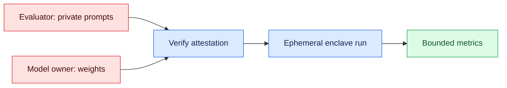

# Double-Blind Model Evaluations
Status: emerging
Sources: [Google DeepMind — 2026-08-27](https://deepmind.google/blog/piloting-the-worlds-first-double-blind-ai-evaluations/), [Technical report — 2026-08-27](https://storage.googleapis.com/deepmind-media/DeepMind.com/Blog/piloting-the-worlds-first-double-blind-ai-evaluations/double-blind-evaluations-technical-report.pdf)

## In one sentence
Double-blind evaluations turn benchmark testing into a hardware-enforced systems boundary, so the evaluator keeps prompts secret while the model owner keeps weights secret.

## Mental model
Think of this as a two-party zero-trust workflow. The evaluator owns the test set and the model provider owns the weights; neither side should be able to inspect the other side’s secret inputs, and neither side should be able to swap in a different workload after the deal is struck.

That makes evaluation an infrastructure problem. The score matters, but so do attestation, encrypted memory, constrained outputs, and the cloud trust model.

Google DeepMind’s pilot describes that stack: a proprietary Gemini 2.5 Flash Lite model was evaluated against private AILuminate prompts, and another run used a Singapore AI Safety Institute prompt set, both inside a secure enclave on Google Cloud. The key claim is not “we got a score”; it is that the system can provide evidence that the evaluator’s prompts and the model’s weights remained mutually hidden during execution.

## What changed this month
On August 27, 2026, Google DeepMind announced what it called the first double-blind evaluation of a proprietary frontier-class model. The pilot addresses a tradeoff: exposing either evaluation prompts or model weights.

The technical report says the prototype uses a GPU enclave on Google Cloud, with OpenMined’s PySyft handling the privacy-preserving workflow. It names the benchmark corpus and model family.

Hardware attestation is especially relevant to proprietary models and closed benchmarks.

## Engineering consequence
For CS and SWE teams, model evaluation becomes a deployment pattern:

- The evaluator prepares a mock interface and private prompts.
- The model owner publishes or exposes only what the harness needs.
- Both sides verify the enclave attestation before secrets are released.
- The run happens in ephemeral, encrypted memory.
- The enclave returns bounded metrics rather than raw secrets.

This matters when a benchmark is valuable or sensitive, including cybersecurity and government work.

It separates capability claims from benchmark-integrity claims.

## Limits and failure modes
This does not solve evaluation integrity in the abstract. It only protects the run while it is inside the enclave.

The main failure modes are practical:

- Attestation trust can be broken if the root of trust, verification chain, or enclave software is compromised.
- The harness can still leak through outputs if the structured-output policy is too permissive.
- A secure enclave does not make a bad benchmark good.
- The system adds cost and operational complexity, especially around GPU enclaves and reproducibility.
- It reduces one kind of leakage, but not broader contamination unless the benchmark itself stays private end to end.

The goal is stronger, scalable evidence—not perfect trust.

## Mini exercise (15–30 min)
Sketch a secure evaluation pipeline for a proprietary model and a private benchmark.

Include:

- who publishes the mock interface,
- where attestation happens,
- what is encrypted in RAM versus on disk,
- what the evaluator receives at the end,
- and which logs must never leave the enclave.

Then list one attack each for prompt leakage, weight leakage, and result manipulation.

## Control flow


## Runnable check
```python
# python3 verify_metrics.py
allowed = {"pass_rate", "mean_score", "run_id"}
result = {"run_id": "r42", "pass_rate": 0.81, "mean_score": 0.74}
assert set(result) <= allowed and not {"prompt", "weights"} & set(result)
print("bounded result accepted")
```

## Prerequisites
Confidential computing, hardware attestation, and least-privilege access; see [agent controls](04-agent-controls.md) for the runtime control-plane complement.

## Glossary
- **Attestation:** hardware-signed evidence of the code and environment that started.
- **Enclave:** an isolated execution environment intended to protect code and data in use.

## References
- [Google DeepMind announcement — 2026-08-27](https://deepmind.google/blog/piloting-the-worlds-first-double-blind-ai-evaluations/)
- [Technical report — 2026-08-27](https://storage.googleapis.com/deepmind-media/DeepMind.com/Blog/piloting-the-worlds-first-double-blind-ai-evaluations/double-blind-evaluations-technical-report.pdf)

## Claim ledger
| Claim | Source | Fact or inference |
|---|---|---|
| DeepMind announced a double-blind AI evaluation pilot on August 27, 2026. | [DeepMind announcement](https://deepmind.google/blog/piloting-the-worlds-first-double-blind-ai-evaluations/) | Fact |
| The pilot involved a proprietary frontier-class model and confidential benchmarks. | [DeepMind announcement](https://deepmind.google/blog/piloting-the-worlds-first-double-blind-ai-evaluations/) | Fact |
| The technical report identifies the model used in the pilot as Gemini 2.5 Flash Lite and says it was evaluated against private AILuminate prompts and a Singapore AISI prompt set. | [Technical report](https://storage.googleapis.com/deepmind-media/DeepMind.com/Blog/piloting-the-worlds-first-double-blind-ai-evaluations/double-blind-evaluations-technical-report.pdf) | Fact |
| The implementation used a GCP-hosted NVIDIA H100 secure enclave and OpenMined’s PySyft. | [Technical report](https://storage.googleapis.com/deepmind-media/DeepMind.com/Blog/piloting-the-worlds-first-double-blind-ai-evaluations/double-blind-evaluations-technical-report.pdf) | Fact |
| Double-blind evals are meant to keep the evaluator’s prompts secret from the model owner and the model’s weights secret from the evaluator. | [DeepMind announcement](https://deepmind.google/blog/piloting-the-worlds-first-double-blind-ai-evaluations/) [Technical report](https://storage.googleapis.com/deepmind-media/DeepMind.com/Blog/piloting-the-worlds-first-double-blind-ai-evaluations/double-blind-evaluations-technical-report.pdf) | Fact |
| Applying hardware attestation to the evaluation boundary is an infrastructure shift in how eval integrity can be enforced. | [DeepMind announcement](https://deepmind.google/blog/piloting-the-worlds-first-double-blind-ai-evaluations/) [Technical report](https://storage.googleapis.com/deepmind-media/DeepMind.com/Blog/piloting-the-worlds-first-double-blind-ai-evaluations/double-blind-evaluations-technical-report.pdf) | Inference |
| Double-blind evals reduce one class of benchmark contamination risk, but do not by themselves make a benchmark representative or a model safe. | [DeepMind announcement](https://deepmind.google/blog/piloting-the-worlds-first-double-blind-ai-evaluations/) [Technical report](https://storage.googleapis.com/deepmind-media/DeepMind.com/Blog/piloting-the-worlds-first-double-blind-ai-evaluations/double-blind-evaluations-technical-report.pdf) | Inference |
