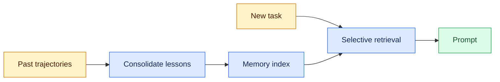
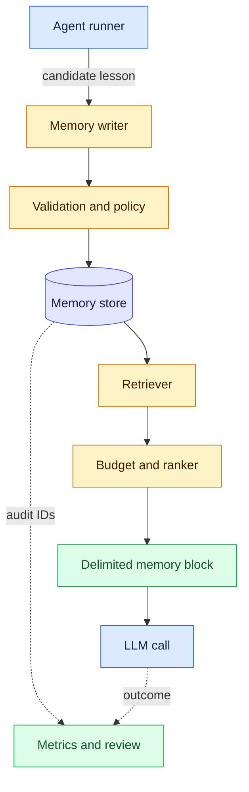

# Agent Memory
Status: emerging
Sources: [Hugging Face / IBM Research — 2026-08-18](https://huggingface.co/blog/ibm-research/altk-evolve-hmm)

## In one sentence
Agent memory is not “keep everything”; it is a control surface for injecting the right amount of distilled, reusable guidance back into the loop so an agent can improve without bloating every turn.

## Introduction
An agent starting every task from an empty prompt repeats mistakes; appending all history is noisy, expensive, and stale.

Agent memory is the state-management layer between past runs and the next model call. It decides what to retain, when it becomes stale, and which bounded subset belongs in a prompt. A useful design has explicit write/read paths, ownership and deletion rules, observability, and token and latency budgets.

## Background: what existed before

Earlier assistants used only the active prompt or manually assembled RAG context; both discard useful experience or repeatedly inject too much text.

## Impact on current processing and architecture

Agent memory adds a governed write, consolidation, retrieval, and prompt-assembly path.

## Real-world applications and constraints

It supports personalized support, coding agents, and long-running operations only when expiry, deletion, authorization, and stale-guidance risks are owned as normal data-system responsibilities.

## Mental model
Think of agent memory as a cache of operating lessons, not a chat transcript dump. In this August post, IBM Research describes ALTK-Evolve, which mines guidelines from an agent’s past trajectories, consolidates them, and feeds them back at inference time with no weight updates or human annotation. The point is that memory changes context, not model parameters.

Three terms are easy to conflate:

- **Context** is everything supplied to one model call: the system prompt, current conversation, tool results, and any retrieved memory. It is ephemeral unless something writes it elsewhere.
- **Memory** is deliberately retained state that can affect a later run. It might be a short guideline (“use idempotent writes”) or a user preference, with metadata for scope, provenance, confidence, and expiry.
- **Retrieval-augmented generation (RAG)** fetches external documents or records and places them in context. RAG commonly answers “what does this source say?” Agent memory answers “what reusable lesson or state should influence this run?” They can share an index, but not necessarily authorization, freshness, or evaluation policy.

The key idea is dosage: policies behave differently across model tiers. Strong models can absorb more, weaker models benefit from a compact core plus retrieval, and saturated models may see no gain. More memory adds cost and failure modes.

## What changed and why now
The August update frames memory as a pipeline: run tasks, extract lessons, consolidate them, then inject a full set or retrieved subset. That is closer to an internal recommendation system than a notes folder.

Across eight AppWorld models, weak models benefited most from curated retrieval, strong models with headroom from a full set, and saturated models gained nothing measurable. For gpt-oss-120b, curated retrieval improved completion by 16.1 points with about 5% token overhead. Memory is an ongoing bill.

The August IBM Research contribution matters because it makes an explicit distinction between learning in the weights and learning in the task context. ALTK-Evolve does not require another fine-tuning run after every trajectory. Instead, it treats completed trajectories as observations, asks an extraction step to propose guidelines, consolidates those guidelines, and selects them for a later prompt. That puts the new state in a service that can be inspected and changed. A team can compare a memory-enabled run with a baseline, remove one bad record, or change the selector without claiming that the underlying model has been retrained.

The benchmark result is also a warning against a single “memory improves agents” headline. The reported comparison varies both the model's capability and the memory delivery policy. A full guideline set has high recall: it is unlikely to omit a useful item, but it consumes context on every request. Curated retrieval spends fewer tokens and can improve focus, but similarity may select a superficially related rule or miss an unusual exception. A saturated model may not benefit because its baseline already solves the task or because extra instructions compete with the task. The August evidence therefore supports measuring a matrix of policies, not selecting one globally.

For an SDE, the new processing path resembles a feedback data product. A run emits events; an asynchronous worker produces candidate records; a validator applies scope and privacy rules; a store versions the accepted records; a retriever filters and ranks them at read time; and an evaluator attributes later outcomes to the selected IDs. Each edge can fail independently. A queue retry may duplicate a candidate, a consolidation job may merge incompatible rules, an index may lag the primary store, and a prompt budget may drop the only useful memory. The architecture needs state transitions and observability before it needs a sophisticated embedding model.

### Memory is a write policy, not just a read feature

The most consequential decision is what the system is allowed to remember. A transcript contains requests, secrets, accidental claims, and instructions quoted from external documents. A memory record should be a smaller proposition with a reason to reuse it. “The user pasted a token” is not a useful operational lesson and should be deleted or redacted. “For project Atlas, create invoices through the idempotent endpoint; verify the currency field first” may be useful, but it needs project scope, source run, writer identity, expiration, and a testable condition. The write path should reject records that cannot explain why they are durable.

Use an explicit candidate state machine. A candidate can be `observed`, `validated`, `active`, `superseded`, `quarantined`, or `deleted`. `observed` means an extractor suggested it; it is not yet trusted. `validated` means schema, authorization, and redaction checks passed. `active` means the serving path may retrieve it. `superseded` preserves lineage while preventing normal reads. `quarantined` keeps a suspicious record available to an investigator without exposing it to the agent. `deleted` means the serving contract guarantees it will not return, while a minimal tombstone may remain to stop stale replicas from resurrecting it. This is more reliable than overwriting a text column in place.

### Retrieval must be causally testable

A selected memory is not evidence that memory helped. If a task succeeds, the reason could be the model, the current user message, a tool result, or an unrelated change. Run paired trials with the same task distribution and model configuration: no memory, full memory, and selective memory. Keep the prompt assembly and tool availability constant. Record selected IDs and estimated tokens, but do not put private text into general metrics. Compare completion, tool errors, retries, latency, and cost by workload slice. For a guideline that says “retry a rate-limited request,” create a task where a 429 occurs and inspect whether the agent recovers; for a guideline about a tenant boundary, test both an in-scope and cross-tenant request.

The benchmark's improvement number should therefore be treated as publisher-reported evidence for that experimental setup, not as a universal production guarantee. Reproduce the broad shape locally with synthetic tasks, then validate on your own failure distribution. A help-desk agent, coding agent, and data-migration agent have different memory granularity and harm profiles. A support preference can be user-controlled; a migration procedure can change production state and should require stronger review. The memory service should expose enough provenance to explain a decision without exposing the original private conversation.

### Boundaries with retrieval and cache state

Agent memory and ordinary retrieval are adjacent but distinct. Retrieval answers a current information need from an external corpus; memory carries forward a prior interaction's distilled state or guidance. If a documentation page says an endpoint is deprecated, that is corpus evidence and should be fetched with document freshness and permissions. If a previous run learned that a particular tenant requires a confirmation step, that is operational memory and should be governed by source run, scope, and expiry. Combining both into one undifferentiated prompt makes it difficult to know whether a wrong answer came from stale business documentation or poisoned agent state.

Caching creates another boundary. A prompt cache can reuse a stable prefix for speed, but a cache key must include the memory version, tenant, user, model, and policy configuration whenever those fields affect content. Otherwise a record selected for one user can leak to another through a shared cached prefix. The safe order is authorization and version resolution first, cache lookup second, and final token-budget enforcement last. Invalidation should be tested as a distributed event: delete the primary row, remove the index entry, invalidate prompt caches, and verify that a delayed consumer cannot reintroduce the record.

### Choosing an initial implementation

Begin with a relational table and deterministic lexical filters. This makes scope, expiry, status, and deletion inspectable and keeps ranking behavior reproducible. Add a vector index only when a measured paraphrase miss justifies its memory and operational cost. A hybrid selector can use exact matches for identifiers and semantic similarity for natural-language lessons, but permissions must be applied before either ranking method. A vector is a retrieval aid, not an authorization token.

The service contract should return records plus metadata: memory ID, version, scope, source run, status, and reason code. It should also return a truncation indicator when the token budget prevents all eligible records from being injected. The model sees a delimited block that says these are retrieved memories, not higher-priority policy. The agent runner retains the selected IDs in the trace, allowing an evaluator to replay the same prompt assembly after a bug report. This design makes memory a replaceable subsystem rather than an invisible prompt concatenation.

## Read/write/retrieval lifecycle
Treat a memory as a record moving through four stages:

1. **Observe and write.** Collect candidate lessons from errors, repairs, corrections, and preferences. Do not write every utterance; require reuse, specificity, and authorization. Keep the source run ID for inspection or deletion.
2. **Consolidate.** Deduplicate, merge compatible lessons, and flag contradictions. A newer instruction may supersede an older one; a project rule may not override a user preference. High-impact memories deserve review or an approval queue.
3. **Index and retrieve.** Store searchable representations and metadata. At task time, filter scope and permissions first, then rank by lexical/semantic match, recency, confidence, and budget. Return bounded results with provenance.
4. **Inject and evaluate.** Put items in a delimited prompt section, apart from untrusted tool content. Record IDs, tokens, latency, and outcome. Compare no-memory, full, and selective policies; success alone does not prove causation.

Operators can pause writes, expire a bad rule, replay a snapshot, or honor deletion without searching raw transcripts.

## Data model and tradeoffs
A minimal memory row can be represented as:

```text
Memory {
  id, text, kind, scope, source_run_id,
  created_at, updated_at, expires_at,
  confidence, embedding, status
}
```

`kind` distinguishes a guideline, task-local note, preference, or audit pointer. `scope` prevents cross-workspace leaks. Timestamps support expiry; `status` can be active, superseded, quarantined, or deleted. The embedding is an index key, not a permission check or truth score.

Full guideline sets have predictable recall but consume tokens on every call and can distract smaller models. Selective sets lower cost and may improve focus, but can miss a lesson or overfit to weak similarity. Vector search handles paraphrases; lexical search helps exact identifiers and error codes. A hybrid ranker is often more robust, and the source notes cosine similarity does not perfectly predict usefulness.

Aggressive consolidation can erase exceptions and provenance; keeping raw events forever raises storage, privacy, and deletion costs. Separate operational memory from an access-controlled audit store when needed. Expose freshness, confidence, and specificity: a stale “always use endpoint X” rule is worse than no rule when an API changed.

### Schema and governance invariants
The row shape is only useful if its fields enforce behavior. Make `scope` a structured value (for example, tenant, user, project, and task), not an arbitrary string that callers can accidentally omit. Store the writer identity and policy decision alongside `source_run_id`; this makes an apparently helpful memory explainable and revocable. Keep a stable version or supersession link when consolidating rather than overwriting in place. A write should be rejected or quarantined when it has no scope, provenance, expiry policy, or reason to be reused.

Retention should be chosen by `kind`: a task-local note can expire at task completion, a preference may require explicit user deletion, and an operational guideline may need a short review interval. Deletion must cover the serving table, search index, caches, backups according to the service’s deletion contract, and any derived summaries. A tombstone or deletion ledger prevents an old replica from resurrecting a record. Do not put secrets, access tokens, or unnecessary personal data into a lesson; redact before indexing, encrypt at rest, and enforce read authorization before ranking. Semantic similarity is never an authorization mechanism: filter by tenant and purpose before the retriever sees candidate text.

## Engineering consequence
If you are building agents, memory should be treated like an indexed service with policy, not a blob of text.

Decide whether memory captures durable lessons, task reminders, or an audit trail; these are different storage problems. Separate durable core from per-task selection, and keep the static prefix stable for prompt caching.

For a first implementation, use a relational table and deterministic filters before adding embeddings. Define a write contract, token budget, tenant/user boundaries, expiry, and a delete API. Add embeddings when tests demonstrate a paraphrase problem. Log misses and false positives, and measure task success, tool-error rate, prompt tokens, p95 latency, and write volume separately.

Calibrate memory per model and workload, as you would a queue or cache: too much context can drown a smaller model; too little leaves capability unused.

## Limits and failure modes
This is promising, but it is not a solved general-purpose memory design. The source is one benchmark family, AppWorld, so the results may not transfer cleanly to every agent domain. The article also notes that its retrieval method ranks guidelines by cosine similarity, which does not perfectly predict usefulness.

Stale guidance can outlive its conditions, conflicts can accumulate without recency, and long prompts increase latency and cost. A malicious trajectory can seed a durable instruction, so writes need provenance, validation, and quarantine. Retrieved memories are data, not higher-priority instructions: delimit them and apply prompt-injection defenses.

Common production failures are usually state-management failures rather than model failures. An asynchronous writer can lose a useful lesson or duplicate it; use an idempotency key such as `(source_run_id, candidate_hash)`. A retriever can return a superseded record; filter status at read time and test concurrent updates. A prompt assembler can exceed the model budget; reserve tokens for the user request and tool output, then truncate by whole records with an explicit “no memory” fallback. A compromised or merely mistaken run can poison future runs; require provenance, constrain writable kinds, quarantine high-impact candidates, and support rollback to a known snapshot. Finally, measure false-positive retrievals and harmful-memory incidents, not only completion rate.

Separate capability from safety claims. This source is about capability, not proof of trustworthiness, privacy, or robustness. In production, ask who can read memory, how long it persists, and how it is corrected.

## Mini exercise (15–30 min)
Split one workflow into durable lessons, task-local reminders, and audit trail. Label five candidates with scope, source, confidence, and expiry; choose a token budget and one stale-memory rejection test.

## Memory flow


Top is writing; bottom is inference. Memory influences the call but does not update weights.

## Component boundaries


Separate writer/storage so validation can quarantine candidates, and retriever/prompt assembly so budget decides what fits. Audit IDs connect records to outcomes.

## Runnable selector
```python
# python3 select_memory.py
lessons = [
    {"id": "m1", "text": "use idempotent writes", "terms": {"write", "api"}, "scope": "acme", "active": True},
    {"id": "m2", "text": "retry 429s", "terms": {"api", "rate"}, "scope": "acme", "active": True},
    {"id": "m3", "text": "prefer CSV exports", "terms": {"report", "format"}, "scope": "other", "active": True},
    {"id": "m4", "text": "use the retired endpoint", "terms": {"api", "write"}, "scope": "acme", "active": False},
]

def select_memory(records, task_terms, scope, limit=2):
    return [r for r in records
            if r["active"] and r["scope"] == scope and r["terms"] & task_terms][:limit]

selected = select_memory(lessons, {"api", "write"}, "acme")
assert [r["id"] for r in selected] == ["m1", "m2"]  # positive retrieval
assert all(r["scope"] == "acme" for r in selected)   # tenant boundary
assert not any(r["id"] == "m3" for r in selected)    # cross-scope denial
assert not any(r["id"] == "m4" for r in selected)    # superseded memory denied
print([r["text"] for r in selected])
```

This toy selector shows the control point: task classification selects two lessons instead of all three. Set intersection is not semantic retrieval, authorization, ranking, or conflict resolution; production code must add those policies.

### Interpreting the local example
The selector is intentionally a pure function: the same lesson list and task terms produce the same output, which makes unit tests and incident replay easy. Its tuples stand in for rows returned after authorization and expiry filtering. In a real service, the sequence should be `authorize -> remove expired/superseded -> rank -> enforce token budget -> assemble`, never “retrieve broadly and trust the model to ignore unsafe rows.” Add a deterministic tie-breaker (for example, recency then ID) so prompt contents do not vary because of database order. The example also has no write path, so it cannot demonstrate consolidation, deletion propagation, or poisoning defenses; those need integration tests around the store and queue.

## Prerequisites
Before implementing memory, understand the model-call boundary. **Prompt construction** assembles instructions, conversation, tools, and records deterministically; stable prefixes help cache keys and delimiters stop retrieved text masquerading as policy. **Retrieval** selects candidates by lexical/semantic match and filters. **Indexes, APIs, queues, and databases** make lookup and state transitions reliable. These foundations matter because memory bugs involve wrong tenants, stale caches, unbounded prompts, or untraceable writes.

Distinguish scopes: context is per-call input; memory is retained state; RAG retrieves and injects external knowledge. They may share an index, but memory needs lifecycle, ownership, expiry, correction, and evaluation. See [multi-vector retrieval](03-late-interaction-retrieval.md).

## Build it locally
1. **Prerequisites:** Use Python 3 and the standard library; no paid API or hosted vector database is needed. Understand sets, JSON-like records, and basic test assertions.
2. **Minimal implementation:** Represent lessons as `(text, terms, scope, expires_at)`, filter by scope and expiry, then select term matches under a fixed count or token budget. Assemble the result between `<memory>` delimiters.
3. **What to test:** Add cases for no match, expired records, cross-tenant exclusion, conflicting lessons, duplicate writes, and a prompt that stays under budget. Log selected IDs so a result is reproducible.
4. **Optional next step:** Add a local SQLite table or a hybrid lexical/vector index only after the deterministic version exposes a real paraphrase or scale problem.
5. **Operational interpretation:** Treat each selected ID as an audit event. For a local experiment, persist `selected_ids`, prompt token estimate, and outcome in JSONL, then compare runs with memory disabled. This separates “the memory was retrieved” from “the memory caused improvement,” and exposes misses, stale hits, and budget truncation.

## Interview Q&A
**Q: Is conversation history memory?** A: Only if a system deliberately stores, governs, and retrieves it later; otherwise it is context for one run.

**Q: Why not inject every memory?** A: More tokens add cost and latency and can distract weaker or already-saturated models.

**Q: When should a memory be written?** A: When it is reusable, scoped, authorized, and supported by a useful outcome or explicit user instruction—not after every turn.

**Q: Vector search or SQL?** A: Start with SQL filters and exact matches; add vectors for paraphrases, usually with hybrid ranking.

**Q: How do you prevent stale memory?** A: Store timestamps and expiry, model supersession, validate writes, and test replay with old snapshots.

**Q: What must a delete guarantee?** A: That future reads cannot return the memory, including through indexes and caches; define how backups and derived summaries converge, and retain only a minimal tombstone if needed to prevent resurrection.

**Q: How do memory and audit data differ?** A: Memory is optimized for bounded, authorized reuse; audit data preserves evidence for debugging or compliance under stricter access controls. They can reference the same run ID without sharing retention or read permissions.

## Glossary
- **Trajectory:** the sequence of model and tool actions from one agent run.
- **Prompt caching:** reusing a stable prompt prefix to avoid reprocessing it.
- **Consolidation:** turning noisy observations into a smaller, deduplicated or superseding record.
- **Scope:** the user, tenant, project, or task boundary controlling memory use.
- **Supersession:** marking an older memory as replaced by a newer, more authoritative one.

## References
- [Hugging Face / IBM Research — 2026-08-18](https://huggingface.co/blog/ibm-research/altk-evolve-hmm)

## Claim ledger
| Claim | Source | Fact or inference |
|---|---|---|
| ALTK-Evolve mines guidelines from prior agent trajectories, consolidates them, and reinjects them at inference time without weight updates or human annotation. | [Hugging Face / IBM Research — 2026-08-18](https://huggingface.co/blog/ibm-research/altk-evolve-hmm) | Fact |
| The right amount of memory depends on model capability; strong, weak, and saturated models respond differently. | [Hugging Face / IBM Research — 2026-08-18](https://huggingface.co/blog/ibm-research/altk-evolve-hmm) | Fact |
| Curated retrieval can be both cheaper and more accurate than injecting a full guideline set for some models. | [Hugging Face / IBM Research — 2026-08-18](https://huggingface.co/blog/ibm-research/altk-evolve-hmm) | Fact |
| Agent memory should be treated like an indexed service with policy, not a blob of text. | [Hugging Face / IBM Research — 2026-08-18](https://huggingface.co/blog/ibm-research/altk-evolve-hmm) | Inference |
| Memory design should be calibrated per model and workload, similar to sizing a cache or queue. | [Hugging Face / IBM Research — 2026-08-18](https://huggingface.co/blog/ibm-research/altk-evolve-hmm) | Inference |
