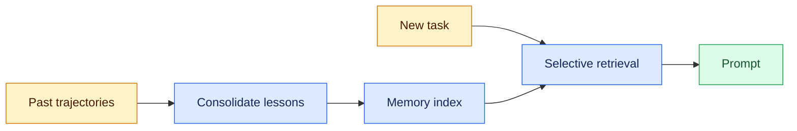

# Agent Memory
Status: emerging
Sources: [Hugging Face / IBM Research — 2026-08-18](https://huggingface.co/blog/ibm-research/altk-evolve-hmm)

## In one sentence
Agent memory is not “keep everything”; it is a control surface for injecting the right amount of distilled, reusable guidance back into the loop so an agent can improve without bloating every turn.

## Mental model
Think of agent memory as a cache of operating lessons, not a chat transcript dump. In this August post, IBM Research describes ALTK-Evolve, which mines guidelines from an agent’s past trajectories, consolidates them, and feeds them back at inference time with no weight updates or human annotation. The point is that memory changes context, not model parameters.

For a systems engineer, the key idea is dosage. The article’s result is that the same memory policy does not work equally well across model tiers: strong models can absorb a fuller guideline set, weaker models do better with a compact core plus task-specific retrieval, and saturated models may see no gain. More memory is not automatically better; it is a workload input with cost, latency, and failure modes.

## What changed this month
The August update makes agent memory concrete for product and infra work. It frames memory as a pipeline: run tasks, extract lessons from success and failure, consolidate them, then inject either the full set or a retrieved subset later. That is closer to an internal recommendation system than to a passive notes folder.

The article also ties memory choice to capability. Across eight models on AppWorld, weak models benefited most from curated retrieval, strong models with headroom benefited from a full guideline set, and saturated models gained nothing measurable. For gpt-oss-120b, curated retrieval improved task completion by 16.1 percentage points while adding only about 5% token overhead. Memory is not free context; it is an ongoing bill.

## Engineering consequence
If you are building agents, memory should be treated like an indexed service with policy, not a blob of text.

Start by deciding what the memory is for:

- capture durable lessons from prior runs,
- supply task-relevant reminders at inference time,
- or preserve an audit trail for debugging and review.

Those are different storage and retrieval problems. A helpful memory system will separate the durable core from the per-task selection layer. It will also keep the static prefix stable so prompt caching can reduce repeated-token cost. That detail matters because the article’s expensive cases are driven by sending the same long guidance back on every step.

The bigger lesson is organizational: memory should be calibrated per model and per workload, the same way you would size a queue, cache, or replica set. Push too much into context and you can drown a smaller model; push too little and you leave capability on the table.

## Limits and failure modes
This is promising, but it is not a solved general-purpose memory design. The source is one benchmark family, AppWorld, so the results may not transfer cleanly to every agent domain. The article also notes that its retrieval method ranks guidelines by cosine similarity, which does not perfectly predict usefulness.

The familiar risks still apply: stale guidance can outlive the task conditions that created it, conflicting lessons can accumulate without a recency policy, and long memory prompts can increase latency and token cost. The cleanest mental model is to separate capability claims from safety claims. This source is about capability, not proof that memory improves trustworthiness, privacy, or robustness.

## Mini exercise (15–30 min)
Split one agent workflow into durable lessons, task-local reminders, and audit trail. Identify overloaded and selectively retrieved buckets plus the stable prefix.

## Memory flow


## Runnable selector
```python
# python3 select_memory.py
lessons = [("use idempotent writes", {"write", "api"}), ("retry 429s", {"api", "rate"})]
task_terms = {"api", "write"}
selected = [text for text, terms in lessons if terms & task_terms]
print(selected)  # ['use idempotent writes', 'retry 429s']
```

## Prerequisites
Prompt construction, retrieval, and cache keys; see [multi-vector retrieval](03-late-interaction-retrieval.md) for a more expressive retrieval index.

## Glossary
- **Trajectory:** the sequence of model and tool actions from one agent run.
- **Prompt caching:** reusing a stable prompt prefix to avoid reprocessing it.

## References
- [Hugging Face / IBM Research — 2026-08-18](https://huggingface.co/blog/ibm-research/altk-evolve-hmm)

## Claim ledger
| Claim | Source | Fact or inference |
|---|---|---|
| ALTK-Evolve mines guidelines from prior agent trajectories, consolidates them, and reinjects them at inference time without weight updates or human annotation. | [Hugging Face / IBM Research — 2026-08-18](https://huggingface.co/blog/ibm-research/altk-evolve-hmm) | Fact |
| The right amount of memory depends on model capability; strong, weak, and saturated models respond differently. | [Hugging Face / IBM Research — 2026-08-18](https://huggingface.co/blog/ibm-research/altk-evolve-hmm) | Fact |
| Curated retrieval can be both cheaper and more accurate than injecting a full guideline set for some models. | [Hugging Face / IBM Research — 2026-08-18](https://huggingface.co/blog/ibm-research/altk-evolve-hmm) | Fact |
| Agent memory should be treated like an indexed service with policy, not a blob of text. | [Hugging Face / IBM Research — 2026-08-18](https://huggingface.co/blog/ibm-research/altk-evolve-hmm) | Inference |
| Memory design should be calibrated per model and workload, similar to sizing a cache or queue. | [Hugging Face / IBM Research — 2026-08-18](https://huggingface.co/blog/ibm-research/altk-evolve-hmm) | Inference |
