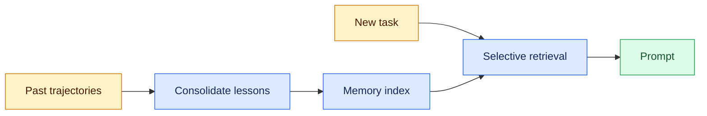
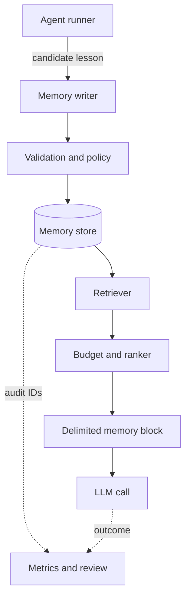

# Agent Memory
Status: emerging
Sources: [Hugging Face / IBM Research — 2026-08-18](https://huggingface.co/blog/ibm-research/altk-evolve-hmm)

## In one sentence
Agent memory is not “keep everything”; it is a control surface for injecting the right amount of distilled, reusable guidance back into the loop so an agent can improve without bloating every turn.

## Introduction
An agent starting every task from an empty prompt repeats mistakes; appending all history is noisy, expensive, and stale.

Agent memory is the state-management layer between past runs and the next model call. It decides what to retain, when it becomes stale, and which bounded subset belongs in a prompt. A useful design has explicit write/read paths, ownership and deletion rules, observability, and token and latency budgets.

## Mental model
Think of agent memory as a cache of operating lessons, not a chat transcript dump. In this August post, IBM Research describes ALTK-Evolve, which mines guidelines from an agent’s past trajectories, consolidates them, and feeds them back at inference time with no weight updates or human annotation. The point is that memory changes context, not model parameters.

Three terms are easy to conflate:

- **Context** is everything supplied to one model call: the system prompt, current conversation, tool results, and any retrieved memory. It is ephemeral unless something writes it elsewhere.
- **Memory** is deliberately retained state that can affect a later run. It might be a short guideline (“use idempotent writes”) or a user preference, with metadata for scope, provenance, confidence, and expiry.
- **Retrieval-augmented generation (RAG)** fetches external documents or records and places them in context. RAG commonly answers “what does this source say?” Agent memory answers “what reusable lesson or state should influence this run?” They can share an index, but not necessarily authorization, freshness, or evaluation policy.

The key idea is dosage: policies behave differently across model tiers. Strong models can absorb more, weaker models benefit from a compact core plus retrieval, and saturated models may see no gain. More memory adds cost and failure modes.

## What changed this month
The August update frames memory as a pipeline: run tasks, extract lessons, consolidate them, then inject a full set or retrieved subset. That is closer to an internal recommendation system than a notes folder.

Across eight AppWorld models, weak models benefited most from curated retrieval, strong models with headroom from a full set, and saturated models gained nothing measurable. For gpt-oss-120b, curated retrieval improved completion by 16.1 points with about 5% token overhead. Memory is an ongoing bill.

## Read/write/retrieval lifecycle
Treat a memory as a record moving through four stages:

1. **Observe and write.** Collect candidate lessons from errors, repairs, corrections, and preferences. Do not write every utterance; require reuse, specificity, and authorization. Keep the source run ID for inspection or deletion.
2. **Consolidate.** Deduplicate, merge compatible lessons, and flag contradictions. A newer instruction may supersede an older one; a project rule may not override a user preference. High-impact memories deserve review or an approval queue.
3. **Index and retrieve.** Store searchable representations and metadata. At task time, filter scope and permissions first, then rank by lexical/semantic match, recency, confidence, and budget. Return bounded results with provenance.
4. **Inject and evaluate.** Put items in a delimited prompt section, apart from untrusted tool content. Record IDs, tokens, latency, and outcome. Compare no-memory, full, and selective policies; success alone does not prove causation.

Operators can pause writes, expire a bad rule, replay a snapshot, or honor deletion without searching raw transcripts.

## Data model and tradeoffs
A minimal memory row can be represented as:

```text
Memory {
  id, text, kind, scope, source_run_id,
  created_at, updated_at, expires_at,
  confidence, embedding, status
}
```

`kind` distinguishes a guideline, task-local note, preference, or audit pointer. `scope` prevents cross-workspace leaks. Timestamps support expiry; `status` can be active, superseded, quarantined, or deleted. The embedding is an index key, not a permission check or truth score.

Full guideline sets have predictable recall but consume tokens on every call and can distract smaller models. Selective sets lower cost and may improve focus, but can miss a lesson or overfit to weak similarity. Vector search handles paraphrases; lexical search helps exact identifiers and error codes. A hybrid ranker is often more robust, and the source notes cosine similarity does not perfectly predict usefulness.

Aggressive consolidation can erase exceptions and provenance; keeping raw events forever raises storage, privacy, and deletion costs. Separate operational memory from an access-controlled audit store when needed. Expose freshness, confidence, and specificity: a stale “always use endpoint X” rule is worse than no rule when an API changed.

## Engineering consequence
If you are building agents, memory should be treated like an indexed service with policy, not a blob of text.

Decide whether memory captures durable lessons, task reminders, or an audit trail; these are different storage problems. Separate durable core from per-task selection, and keep the static prefix stable for prompt caching.

For a first implementation, use a relational table and deterministic filters before adding embeddings. Define a write contract, token budget, tenant/user boundaries, expiry, and a delete API. Add embeddings when tests demonstrate a paraphrase problem. Log misses and false positives, and measure task success, tool-error rate, prompt tokens, p95 latency, and write volume separately.

Calibrate memory per model and workload, as you would a queue or cache: too much context can drown a smaller model; too little leaves capability unused.

## Limits and failure modes
This is promising, but it is not a solved general-purpose memory design. The source is one benchmark family, AppWorld, so the results may not transfer cleanly to every agent domain. The article also notes that its retrieval method ranks guidelines by cosine similarity, which does not perfectly predict usefulness.

Stale guidance can outlive its conditions, conflicts can accumulate without recency, and long prompts increase latency and cost. A malicious trajectory can seed a durable instruction, so writes need provenance, validation, and quarantine. Retrieved memories are data, not higher-priority instructions: delimit them and apply prompt-injection defenses.

Separate capability from safety claims. This source is about capability, not proof of trustworthiness, privacy, or robustness. In production, ask who can read memory, how long it persists, and how it is corrected.

## Mini exercise (15–30 min)
Split one workflow into durable lessons, task-local reminders, and audit trail. Label five candidates with scope, source, confidence, and expiry; choose a token budget and one stale-memory rejection test.

## Memory flow


Top is writing; bottom is inference. Memory influences the call but does not update weights.

## Component boundaries


Separate writer/storage so validation can quarantine candidates, and retriever/prompt assembly so budget decides what fits. Audit IDs connect records to outcomes.

## Runnable selector
```python
# python3 select_memory.py
lessons = [
    ("use idempotent writes", {"write", "api"}),
    ("retry 429s", {"api", "rate"}),
    ("prefer CSV exports", {"report", "format"}),
]
task_terms = {"api", "write"}
selected = [text for text, terms in lessons if terms & task_terms]
print(selected)  # ['use idempotent writes', 'retry 429s']
```

This toy selector shows the control point: task classification selects two lessons instead of all three. Set intersection is not semantic retrieval, authorization, ranking, or conflict resolution; production code must add those policies.

## Prerequisites
Before implementing memory, understand the model-call boundary. **Prompt construction** assembles instructions, conversation, tools, and records deterministically; stable prefixes help cache keys and delimiters stop retrieved text masquerading as policy. **Retrieval** selects candidates by lexical/semantic match and filters. **Indexes, APIs, queues, and databases** make lookup and state transitions reliable. These foundations matter because memory bugs involve wrong tenants, stale caches, unbounded prompts, or untraceable writes.

Distinguish scopes: context is per-call input; memory is retained state; RAG retrieves and injects external knowledge. They may share an index, but memory needs lifecycle, ownership, expiry, correction, and evaluation. See [multi-vector retrieval](03-late-interaction-retrieval.md).

## Build it locally
1. **Prerequisites:** Use Python 3 and the standard library; no paid API or hosted vector database is needed. Understand sets, JSON-like records, and basic test assertions.
2. **Minimal implementation:** Represent lessons as `(text, terms, scope, expires_at)`, filter by scope and expiry, then select term matches under a fixed count or token budget. Assemble the result between `<memory>` delimiters.
3. **What to test:** Add cases for no match, expired records, cross-tenant exclusion, conflicting lessons, duplicate writes, and a prompt that stays under budget. Log selected IDs so a result is reproducible.
4. **Optional next step:** Add a local SQLite table or a hybrid lexical/vector index only after the deterministic version exposes a real paraphrase or scale problem.

## Interview Q&A
**Q: Is conversation history memory?** A: Only if a system deliberately stores, governs, and retrieves it later; otherwise it is context for one run.

**Q: Why not inject every memory?** A: More tokens add cost and latency and can distract weaker or already-saturated models.

**Q: When should a memory be written?** A: When it is reusable, scoped, authorized, and supported by a useful outcome or explicit user instruction—not after every turn.

**Q: Vector search or SQL?** A: Start with SQL filters and exact matches; add vectors for paraphrases, usually with hybrid ranking.

**Q: How do you prevent stale memory?** A: Store timestamps and expiry, model supersession, validate writes, and test replay with old snapshots.

## Glossary
- **Trajectory:** the sequence of model and tool actions from one agent run.
- **Prompt caching:** reusing a stable prompt prefix to avoid reprocessing it.
- **Consolidation:** turning noisy observations into a smaller, deduplicated or superseding record.
- **Scope:** the user, tenant, project, or task boundary controlling memory use.
- **Supersession:** marking an older memory as replaced by a newer, more authoritative one.

## References
- [Hugging Face / IBM Research — 2026-08-18](https://huggingface.co/blog/ibm-research/altk-evolve-hmm)

## Claim ledger
| Claim | Source | Fact or inference |
|---|---|---|
| ALTK-Evolve mines guidelines from prior agent trajectories, consolidates them, and reinjects them at inference time without weight updates or human annotation. | [Hugging Face / IBM Research — 2026-08-18](https://huggingface.co/blog/ibm-research/altk-evolve-hmm) | Fact |
| The right amount of memory depends on model capability; strong, weak, and saturated models respond differently. | [Hugging Face / IBM Research — 2026-08-18](https://huggingface.co/blog/ibm-research/altk-evolve-hmm) | Fact |
| Curated retrieval can be both cheaper and more accurate than injecting a full guideline set for some models. | [Hugging Face / IBM Research — 2026-08-18](https://huggingface.co/blog/ibm-research/altk-evolve-hmm) | Fact |
| Agent memory should be treated like an indexed service with policy, not a blob of text. | [Hugging Face / IBM Research — 2026-08-18](https://huggingface.co/blog/ibm-research/altk-evolve-hmm) | Inference |
| Memory design should be calibrated per model and workload, similar to sizing a cache or queue. | [Hugging Face / IBM Research — 2026-08-18](https://huggingface.co/blog/ibm-research/altk-evolve-hmm) | Inference |
