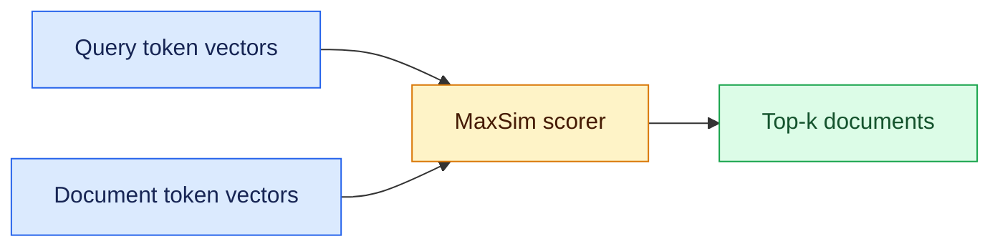

# Multi-vector retrieval
Status: emerging
Sources: [Hugging Face — 2026-08-18](https://huggingface.co/blog/multi-vector-encoder), [Hugging Face — 2026-08-26](https://huggingface.co/blog/train-multi-vector-encoder)

## In one sentence

Multi-vector, or late-interaction, retrieval keeps one embedding vector per token, improving fine-grained matching at the cost of a larger, more complex index.

## Mental model

Dense retrieval is a lossy summary service: a document becomes one vector, which can blur identifiers, code symbols, and multi-part constraints.

Late-interaction retrieval changes the storage and scoring shape. The encoder still runs once per document, but it emits a small vector for each token. At query time, the system compares each query token against the document token that matches it best, then sums those best matches with MaxSim. In plain English: each query term gets to "argue for itself" instead of being averaged into a single document summary.

ColBERT-style retrieval sits between a compressed, fast bi-encoder and a precise, expensive cross-encoder.

## What changed this month

Hugging Face's August 18 post says Sentence Transformers v6.0 now includes a `MultiVectorEncoder`, so late-interaction retrieval is no longer just a separate research stack. The same API that already handled dense, sparse, and reranker models now loads PyLate, ColBERT, and related checkpoints. The post also shows how the model can be used for text retrieval and for visual document retrieval, where a text query can be matched directly against page images without an OCR step.

The August 26 companion post adds training guidance, making this a common-interface stack for loading, scoring, indexing, and training.

## Engineering consequence

For a CS or SWE team, this is a choice about memory, latency, and tuning effort.

- If your corpus has short passages, identifiers, or structured-ish text, late interaction can recover matches dense retrieval may miss.
- If your documents are long, index size grows fast because you store many vectors per document, not one.
- Low-latency serving at scale may need token pooling, compression, or a two-stage pipeline.
- If you work with scanned documents or page images, the same architecture can be extended to visual retrieval, which changes your ingestion and evaluation pipeline because OCR is no longer the only way to represent the page.

The design question is whether recall and ranking gains justify the operational cost; it is often a targeted precision layer, not a universal replacement.

## Limits and failure modes

The biggest limitation is index growth. One vector per token is materially more storage and memory traffic than one vector per document, and that cost shows up in ingest, replication, cache pressure, and query-time bandwidth.

You must tune tokenizer behavior, pooling, score aggregation, compression, and thresholds together; otherwise offline gains can yield unstable search.

MaxSim is not a probability or portable confidence score; use validation queries, tail-case analysis, and replay tests.

## Mini exercise (15–30 min)

Take one search workload you care about and classify 20 queries into three buckets: broad semantic search, exact identifier lookup, and multi-constraint lookup. Then sketch two candidate architectures:

1. Dense-only retrieval.
2. Dense retrieval plus a multi-vector reranker or narrow candidate retriever.

For each one, write down the likely bottleneck in memory, latency, and evaluation. If your hardest queries are mostly identifiers or multi-part constraints, late interaction is probably worth prototyping.

## Retrieval flow


## Runnable MaxSim sketch
```python
# python3 maxsim.py
query = [[1, 0], [0, 1]]
document = [[.9, .1], [.2, .8]]
score = sum(max(sum(a*b for a, b in zip(q, d)) for d in document) for q in query)
print(round(score, 2))  # 1.7
```

## Prerequisites
Embeddings, dot products, approximate nearest-neighbor indexes, and dense retrieval.

## Glossary
- **Bi-encoder:** encodes query and document independently for fast vector search.
- **MaxSim:** sums each query token’s best similarity with a document token.

## References
- [Hugging Face — 2026-08-18](https://huggingface.co/blog/multi-vector-encoder)
- [Hugging Face — 2026-08-26](https://huggingface.co/blog/train-multi-vector-encoder)

## Claim ledger

| Claim | Source | Fact or inference |
|---|---|---|
| Sentence Transformers v6.0 adds `MultiVectorEncoder` for ColBERT-style late interaction retrieval. | [Hugging Face — 2026-08-18](https://huggingface.co/blog/multi-vector-encoder) | Fact |
| Multi-vector models keep one vector per token and score with MaxSim. | [Hugging Face — 2026-08-18](https://huggingface.co/blog/multi-vector-encoder) | Fact |
| Late interaction preserves token-level matching that a single vector can blur away, but it increases index size. | [Hugging Face — 2026-08-18](https://huggingface.co/blog/multi-vector-encoder) | Fact |
| The August 26 companion post shows that training guidance for multi-vector models is now part of the same ecosystem. | [Hugging Face — 2026-08-26](https://huggingface.co/blog/train-multi-vector-encoder) | Fact |
| For production search, multi-vector retrieval is often best treated as a precision layer or reranker, not an unconditional replacement for dense retrieval. | [Hugging Face — 2026-08-18](https://huggingface.co/blog/multi-vector-encoder), [Hugging Face — 2026-08-26](https://huggingface.co/blog/train-multi-vector-encoder) | Inference |
