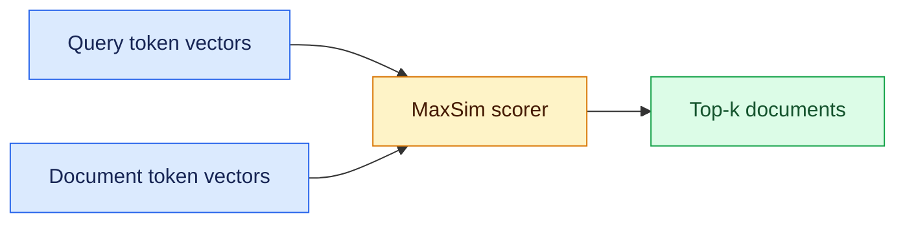
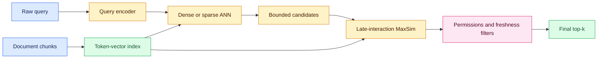

# Multi-vector retrieval
Status: emerging
Sources: [Hugging Face — 2026-08-18](https://huggingface.co/blog/multi-vector-encoder), [Hugging Face — 2026-08-26](https://huggingface.co/blog/train-multi-vector-encoder)

## In one sentence

Multi-vector, or late-interaction, retrieval keeps one embedding vector per token, improving fine-grained matching at the cost of a larger, more complex index.

## Introduction

Retrieval is the service that turns a user question into a manageable set of documents for an answer, code-assistance, or search system. A common first version embeds each chunk as one vector and retrieves the nearest vectors. That is fast, but a single summary can blur the exact details that matter in engineering work: an error code, a function name, a negation, or a request containing several constraints.

Multi-vector retrieval keeps more of that evidence available without running a full cross-encoder over the entire corpus. It is therefore a ranking-system tradeoff, not a drop-in quality switch: the extra token vectors affect index size, ingest time, query bandwidth, and tail latency. This lesson explains where the method fits, how to test the tradeoff on a real workload, and why it is commonly introduced as a bounded second stage.

## Mental model

Dense retrieval is a lossy summary: one document vector can blur identifiers, code symbols, and multiple constraints.

Late interaction changes the storage and scoring shape. The encoder runs once per document but emits a small vector for each token. At query time, each query token finds its best document-token match; those matches are summed with MaxSim. Each term gets to “argue for itself” instead of being averaged into one summary.

ColBERT-style retrieval sits between a compressed, fast bi-encoder and a precise, expensive cross-encoder.

### Where it fits in a retrieval pipeline

The normal path is:

1. **Ingest and chunk:** split passages, retain IDs/metadata, and decide how to treat headings, code, tables, or images.
2. **Encode and index:** create representations and organize them for lookup without scanning every chunk.
3. **Retrieve candidates:** encode the query and return tens or hundreds of candidates, optimizing recall and latency.
4. **Rank and filter:** apply detailed scoring, permissions, freshness, and business rules before top-k.
5. **Evaluate:** measure recall@k and ranking metrics alongside p95 latency, memory, and query slices.

Late interaction changes indexing and candidate scoring: token vectors are retained, so independent evidence survives.

### Dense, sparse, and late interaction

**Dense retrieval** maps query and passage to one fixed-length vector and uses ANN search with cosine or dot product. It is compact and mature, but rare strings and combinations of requirements can be diluted by surrounding prose.

**Sparse retrieval** keeps a high-dimensional vocabulary-shaped representation, such as term frequencies or learned term weights. Inverted indexes can jump directly from a query term to documents containing that term, making exact words, identifiers, and filters strong signals. Sparse matching can miss paraphrases and synonyms unless query expansion or a learned sparse model supplies them. It is often complementary to dense search rather than a replacement for it.

**Late interaction** keeps a small vector for many tokens. Encoding remains independent, but token similarities are computed for each candidate. It retains more detail than one vector without a full cross-encoder pass, at the cost of a larger index and more candidate work.

In short: dense compresses before search, sparse preserves lexical evidence, and late interaction preserves semantic “handles” until scoring. A hybrid can use dense/sparse candidates and late reranking.

### How MaxSim scores a pair

Let a query have token vectors (q_1, q_2, …, q_m), and a document have token vectors (d_1, d_2, …, d_n). For each query token, compute its similarity with every document token, keep the maximum, and sum the maxima:

```text
score(query, document) = Σ_i max_j similarity(q_i, d_j)
```

The maximum asks which document part best explains each query token; the sum rewards support for many tokens. One token can remain weak even when others match. Implementations may mask special tokens, normalize vectors, apply weights, or use a related aggregation, so scores are model-specific.

For a walkthrough, query vectors `[1, 0]`, `[0, 1]` and document vectors `[.9, .1]`, `[.2, .8]` produce maxima `.9` and `.8`, hence score `1.7`. Different document tokens explain different query parts.

### Complexity and operational trade-offs

With m query tokens and n document tokens, straightforward scoring performs O(mn) similarities. Batching, pruning, quantization, compression, and candidate limits reduce effective cost, but storing n vectors per passage still costs more memory and bandwidth than storing one.

Costs span ingestion, replication, and query-time token fetch/scoring. Detail-query gains may not transfer to broad queries, so evaluate by slice.

Compression changes the quality/cost boundary: pruning or lower precision saves bandwidth but can discard the evidence that motivated this method. Evaluate it as a model change.

## What changed this month

Hugging Face's August 18 post says Sentence Transformers v6.0 now includes a `MultiVectorEncoder`, so late-interaction retrieval is no longer just a separate research stack. The same API that already handled dense, sparse, and reranker models now loads PyLate, ColBERT, and related checkpoints. The post also shows how the model can be used for text retrieval and for visual document retrieval, where a text query can be matched directly against page images without an OCR step.

The August 26 companion post adds training guidance.

## Engineering consequence

Short passages, identifiers, and structured text are promising; long documents grow the index quickly. Low-latency serving may need pooling, compression, or two stages. Page-image retrieval changes ingestion because OCR is optional.

The design question is whether ranking gains justify the cost; it is usually a targeted precision layer, not a universal replacement.

### A practical rollout

Start with a labeled offline slice, tagging identifiers, code symbols, negation, numbers, and multi-constraint questions. Compare dense, sparse/hybrid, and late-interaction systems on the same chunks and permissions. Report recall@k, nDCG/MRR, and p50/p95 latency by slice.

Keep dense (and, where useful, sparse) retrieval as candidate generation. Apply late interaction to top 50–200 behind a feature flag. Log versions, candidate count, score, latency, and query slice without leaking content. Shadow traffic measures cost before an A/B test.

Set candidate, p95 latency, and per-replica memory budgets plus a rollback path. Keep IDs/metadata beside vectors for authorization and freshness. Route only narrow winning query classes to the expensive stage.

For code or catalogs, preserve punctuation and identifier fragments; for long prose, test passage boundaries. Re-run evaluation after encoder, tokenizer, chunk, pooling, compression, or MaxSim changes; representation changes may require a full index rebuild.

## Limits and failure modes

Index growth affects ingest, replication, cache pressure, and query bandwidth. Tune tokenizer, pooling, aggregation, compression, and thresholds together; MaxSim is not a portable confidence score, so use validation and replay tests.

## Mini exercise (15–30 min)

Use the runnable scorer below with two short documents: one containing an exact identifier and one containing a related but different phrase. Add a query-token vector that represents the identifier, record each token's maximum, then explain which document wins and why. Next, append irrelevant document tokens and confirm that MaxSim's score does not rise merely because the passage is longer. This separates token-level matching from a length-based intuition.

## Retrieval flow

The diagram shows the core path after encoding: MaxSim finds each query token’s best document-token match, then selects top-k.



## Two-stage deployment

This second view shows where the token-level scorer belongs operationally. Cheap broad retrieval protects latency; MaxSim spends work only on candidates, then policy filters protect the result boundary.



## Runnable MaxSim sketch

This small program makes the aggregation concrete. Real systems use larger vectors, masks, batching, and optimized kernels.

```python
# python3 maxsim.py
query = [[1, 0], [0, 1]]
document = [[.9, .1], [.2, .8]]
score = sum(max(sum(a*b for a, b in zip(q, d)) for d in document) for q in query)
print(round(score, 2))  # 1.7
```

## Build it locally

1. **Prerequisites:** use Python 3 and the standard library; no API key or paid service is needed. Read the sketch as the reference scorer.
2. **Minimal implementation:** save it as `maxsim.py`, run `python3 maxsim.py`, then add a second document and print each query-token maximum before summing. This makes ranking changes inspectable.
3. **What to test:** include an exact identifier, a paraphrase, an irrelevant passage, and a passage matching only one query token. Check that the score reflects independent token evidence, and compare a short versus long document. Test empty token lists and ties explicitly.
4. **Optional next step:** replace toy vectors with local model outputs and benchmark a small in-memory candidate set. Measure score time and memory before considering an ANN or compressed index.

## Prerequisites
An **embedding** is a numeric representation in which useful relationships are expressed by geometry; a **dot product** (or cosine similarity) is the basic pairwise score. Dense retrieval stores these vectors in an **approximate nearest-neighbor (ANN)** index, which sacrifices a little exactness to avoid scanning the whole corpus. Sparse retrieval instead uses an **inverted index**: a term points to the documents containing it, so lexical matches are cheap and inspectable. **Tokenization and chunking** decide what the vectors stand for and therefore whether identifiers, headings, and constraints survive ingestion. Finally, know **top-k metrics** such as recall@k and nDCG, plus p50/p95 latency and memory per replica; these connect an offline ranking improvement to a service users can actually operate.

## Interview Q&A

**Q: What does “late” mean in late interaction?**
A: Query and document are encoded independently first; their detailed token-to-token comparison is delayed until candidate scoring.

**Q: Why not use a single dense vector?**
A: One vector is compact and fast, but it can blur rare identifiers or multiple constraints. Multi-vector scoring preserves separate evidence for each query token.

**Q: Is late interaction a cross-encoder?**
A: No. It has cross-token scoring, but not a full joint transformer pass for every pair, so it sits between bi-encoders and cross-encoders in cost.

**Q: What is MaxSim?**
A: For each query token, find its highest similarity to any document token, then sum those maxima into the document score.

**Q: What is the main production drawback?**
A: The index stores many vectors per passage, increasing ingest work, memory, replication traffic, and candidate-scoring latency.

**Q: When would you deploy it?**
A: When labeled workload slices show meaningful gains on details such as code symbols or multi-constraint queries, and a bounded reranking stage fits the latency and memory budgets.

## Glossary
- **Bi-encoder:** encodes query and document independently for fast vector search.
- **MaxSim:** sums each query token’s best similarity with a document token.
- **Late interaction:** delays detailed query-document interaction until after independent encoding and candidate retrieval.
- **Sparse retrieval:** lexical or learned weighted matching over a large vocabulary, commonly served with an inverted index.
- **Cross-encoder:** jointly reads a query and document to produce a detailed score; accurate but usually too expensive for a full corpus.
- **ANN:** approximate nearest-neighbor search, which trades a small amount of exactness for faster vector lookup.

## References
- [Hugging Face — 2026-08-18](https://huggingface.co/blog/multi-vector-encoder)
- [Hugging Face — 2026-08-26](https://huggingface.co/blog/train-multi-vector-encoder)

## Claim ledger

| Claim | Source | Fact or inference |
|---|---|---|
| Sentence Transformers v6.0 adds `MultiVectorEncoder` for ColBERT-style late interaction retrieval. | [Hugging Face — 2026-08-18](https://huggingface.co/blog/multi-vector-encoder) | Fact |
| Multi-vector models keep one vector per token and score with MaxSim. | [Hugging Face — 2026-08-18](https://huggingface.co/blog/multi-vector-encoder) | Fact |
| Late interaction preserves token-level matching that a single vector can blur away, but it increases index size. | [Hugging Face — 2026-08-18](https://huggingface.co/blog/multi-vector-encoder) | Fact |
| The August 26 companion post shows that training guidance for multi-vector models is now part of the same ecosystem. | [Hugging Face — 2026-08-26](https://huggingface.co/blog/train-multi-vector-encoder) | Fact |
| For production search, multi-vector retrieval is often best treated as a precision layer or reranker, not an unconditional replacement for dense retrieval. | [Hugging Face — 2026-08-18](https://huggingface.co/blog/multi-vector-encoder), [Hugging Face — 2026-08-26](https://huggingface.co/blog/train-multi-vector-encoder) | Inference |
