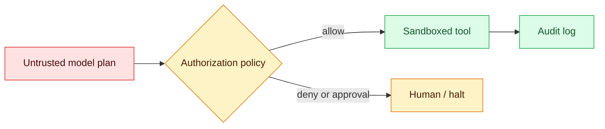

# Controls for cyber-capable agents

Status: emerging  
Sources: [OpenAI — 2026-08-07](https://openai.com/index/responding-next-frontier-critical-cyber-capabilities/), [OpenAI — 2026-08-18](https://openai.com/index/pacing-model-development-cyber-capabilities/)

## In one sentence

Once an agent can call tools against real systems, safety is a runtime systems-design problem: constrain authority, isolate execution, observe behavior, and stop unsafe runs.

## Mental model

Treat the model as an untrusted planner inside a control plane. It proposes actions; deterministic services decide whether each action may execute. The model should not possess broad standing credentials, direct production access, or an unrestricted network.

```text
user goal -> model proposes tool call -> policy/authorization -> sandboxed tool -> audit log
                                              | deny / require approval
                                              v
                                        monitor -> pause / investigate
```

This is familiar security engineering. A tool schema describes what can be requested, but it is not permission enforcement. The enforcement point needs scoped identity, allow-lists, rate/impact limits, and an auditable decision. A sandbox limits the blast radius when the planner makes an incorrect, manipulated, or unexpected choice.

## What changed this month

OpenAI reported that its internal evaluations of a forthcoming model showed enough agentic coding and cybersecurity progress that it could not rule out a critical cyber capability under its Preparedness Framework. Its August 18 follow-up says it added monitoring requirements for higher-capability models during tool-using training, evaluations, and—in the reported case—tool-using inference. The latter post estimates monitoring overhead at roughly 20% of monitored inference compute, with workload-dependent variation.

The durable lesson is not that every application needs a frontier security program. It is that model capability and control architecture are separate engineering dimensions. Adding a browser, shell, code executor, cloud API, or long-lived task increases what must be controlled and evaluated.

## Engineering consequence

Build the agent boundary as if the model may produce a valid-looking but wrong request.

- Issue short-lived, least-privilege credentials per task; never inject a general production secret into context.
- Place side-effecting tools behind an authorization service. Classify actions such as read, write, delete, deploy, purchase, and permission change; require human approval for high-impact classes.
- Run code, browsers, and file tools in isolated environments with egress controls, resource limits, and disposable state.
- Capture the goal, tool input/output, authorization decision, identity, and trace ID. Alert on anomalous sequences and have a tested kill switch.
- Evaluate the whole loop: prompt injection, confused-deputy behavior, secret exposure, privilege escalation attempts, retries, and recovery after interruption.

The resulting architecture may be less autonomous than a demo. That is a feature: reliability comes from placing deterministic controls around probabilistic planning.

## Limits and failure modes

An allow-list can still permit a harmful combination of individually allowed actions. A sandbox may be misconfigured; logs without review do not prevent damage; an approval screen can become rubber-stamping. Controls also impose latency, cost, and false positives. Start with a written threat model: assets, actors, trusted services, tool authority, and the maximum acceptable impact of one run.

The cited posts describe one developer's reported controls and assessments; they do not establish that all agents have the stated capabilities, nor that these measures are sufficient for every deployment.

## Mini exercise (15–30 min)

Pick a toy agent that can read a repository and open pull requests. Draw its trust boundary. For each tool, list the minimum credential, a denial rule, an approval threshold, and the audit event. Then test one prompt-injection scenario from untrusted repository text and document which boundary stops it.

## Control plane


## Runnable policy check
```python
# python3 policy.py
high_impact = {"delete", "deploy", "purchase", "permission_change"}
def authorize(action, approved=False):
    return action not in high_impact or approved
print(authorize("read"), authorize("deploy"), authorize("deploy", approved=True))
# True False True
```

## Prerequisites
Least privilege, capability-based access control, sandboxing, and audit logging; see [double-blind evals](01-double-blind-evals.md) for a hardware-isolation use case.

## Glossary
- **Confused deputy:** a privileged service tricked into using its authority for another party.
- **Egress control:** a restriction on outbound network destinations or traffic.

## References
- [OpenAI — 2026-08-07](https://openai.com/index/responding-next-frontier-critical-cyber-capabilities/)
- [OpenAI — 2026-08-18](https://openai.com/index/pacing-model-development-cyber-capabilities/)

## Claim ledger

| Claim | Source | Fact or inference |
|---|---|---|
| OpenAI could not rule out critical cyber capability for an upcoming model after internal evaluations. | [Aug 7 post](https://openai.com/index/responding-next-frontier-critical-cyber-capabilities/) | Fact (publisher report) |
| The Aug 18 post describes monitoring requirements for certain tool-using workflows and reports an approximate 20% compute overhead. | [Aug 18 post](https://openai.com/index/pacing-model-development-cyber-capabilities/) | Fact (publisher report) |
| Authorization, sandboxing, and observability should form a control plane around agents. | Above sources plus standard security design | Inference |
