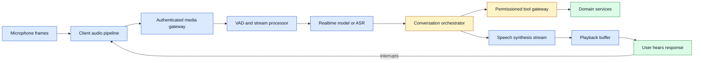

# Realtime voice agents
Status: draft — substantive review pending
Sources: [OpenAI Developer Community — announcements](https://community.openai.com/c/announcements/6)

## In one sentence

A realtime voice agent is a streaming system that must coordinate audio capture, turn detection, model inference, tool calls, and audio playback quickly enough that people can speak naturally and interrupt it safely.

## Background: what existed before

The first common voice applications were turn-based pipelines. A client recorded an utterance, sent a complete audio file to speech-to-text, passed the transcript to a text model or rules engine, converted the answer to speech, and finally played the whole response. This approach is easy to reason about because each stage has a clear input and output. It is also slow. A user waits through end-of-speech silence, upload, transcription, model generation, synthesis, and download before hearing anything.

Human conversation is not turn-based in that way. People begin responding before they have planned every word, use pauses to signal uncertainty, overlap briefly, interrupt when a response is wrong, and react to tone as well as words. A voice system that keeps speaking after an interruption feels broken; one that asks the user to wait after every sentence feels like an answering machine. Realtime systems reduce perceived delay by streaming partial results through the pipeline instead of waiting for a complete recording or completion.

The original architecture also separated modalities strictly. Speech recognition produced text, a text system decided an answer, and speech synthesis produced audio. That remains a valid design, especially when transcript retention, deterministic prompts, or a specialized language model matter. Modern realtime systems may combine some stages, but the systems problem remains: audio is an ordered time series, network connections are unreliable, model output is incremental, and external tools have much longer and less predictable latency than a single audio packet.

The August source queue includes realtime voice-agent announcements. That is a release-specific pointer to an active product area, not proof that every voice model achieves low latency, accurate transcription, or safe tool use. The durable engineering change is that voice is increasingly treated as a bidirectional streaming interface rather than a batch transcription feature.

## What changed and why now

Streaming transport makes it possible to send small audio frames while the user is speaking and receive partial transcript, response text, or audio frames while the system is still reasoning. A client no longer has to buffer a ten-second recording before any server work begins. The server can use voice activity detection (VAD), a lightweight model or signal-processing method that estimates whether speech is present, to identify likely turns. A model can begin formulating an answer from a stable partial transcript and a synthesizer can begin playing approved output before the final sentence is ready.

This changes the primary unit of work. Instead of one HTTP request per conversation turn, the system manages a session with events: audio frame received, speech started, partial transcript changed, turn ended, tool requested, tool result received, output started, output interrupted, and output completed. Every event needs a sequence number or timestamp, session identity, and a policy for stale or duplicated delivery. The session is a small distributed system, not simply a chat endpoint with a microphone attached.

Low latency is valuable, but early output creates a correctness trade-off. A partial transcript may change: “book a table for four” can become “book a table for fourteen.” An agent must not execute a reservation, payment, or external message merely because it heard a plausible prefix. Streaming helps the user feel heard; it does not remove the need for confirmation and server-side authorization at an effect boundary.

## Impact on current processing and architecture

Design the path as several independently observable streams. The client captures frames—often 10 to 40 milliseconds each—performs local echo cancellation and noise handling where available, and sends frames over a persistent connection. The media gateway authenticates the session, enforces frame-size and rate limits, and forwards audio to the recognition or realtime-model service. A conversation orchestrator receives events, keeps durable session state, invokes tools through a controlled gateway, and sends generated audio frames back to the client.



Keep several states distinct. Capture state describes microphone permission, device availability, and whether the client is sending audio. Turn state describes whether the user is speaking, whether the system considers the transcript provisional, and whether silence has ended the turn. Generation state describes whether output is planned, streaming, paused for a tool, cancelled, or completed. Effect state describes whether a proposed tool operation is awaiting confirmation, authorized, running, succeeded, failed, or has an unknown outcome. Combining these into one Boolean such as `is_talking` makes interruption and retry bugs nearly inevitable.

The client needs a jitter buffer: a small queue that smooths variable network arrival times before playback. A larger buffer makes audio less choppy but increases the delay before the user hears a response. Use a latency budget rather than optimizing a single component. For example, capture may consume 20 ms per frame, network one-way transport 50 ms, turn detection 200 ms, initial inference 250 ms, synthesis 150 ms, and playback buffering 80 ms. The first audible response is then about 750 ms after a final turn signal, before any slow tool call. Measure percentiles, especially p95 and p99, because a system that is fast on average but regularly pauses for several seconds feels unreliable.

```mermaid
sequenceDiagram
    participant U as User
    participant C as Client
    participant O as Orchestrator
    participant T as Tool gateway
    participant P as Playback
    U->>C: speaks audio frames
    C->>O: frames and sequence numbers
    O-->>C: partial transcript
    O->>O: turn end; plan response
    O->>T: request calendar availability
    T-->>O: typed result
    O-->>P: stream first audio frames
    P-->>U: begins answer
    U->>C: starts speaking to interrupt
    C->>O: barge-in event
    O-->>P: cancel output by generation ID
    O-->>C: acknowledge new turn
```

Barge-in is the feature that lets a user interrupt. It is not enough to mute playback on the client. The client should send an interruption event with the current generation ID; the orchestrator cancels future generation and tool plans that are safe to cancel; the playback queue discards buffered frames for that ID; and the transcript marks the assistant response as interrupted rather than complete. If audio output leaks after a barge-in, users may speak over stale instructions and the following model turn receives a confusing mixed context.

## Real-world applications and constraints

Customer service is a strong fit when the agent can answer account questions, collect a structured issue description, and hand off complex cases. The system should identify itself, offer a text alternative, disclose recording or transcription where required, and avoid exposing sensitive account details until the caller is authenticated. A voice interface does not make identity proof easier; it can make it harder because household members, background speakers, and synthetic audio may be present.

Scheduling assistants can search availability and prepare a meeting, but should confirm time zone, attendee set, and final slot before creating an event. Field-service assistants can help technicians retrieve manuals with hands-free interaction, yet their audio environment may be noisy and connectivity intermittent. Accessibility applications may need slower playback, captions, custom voice selection, and a way to repeat an answer without restarting the entire model turn.

Cost is often dominated by continuously processed audio and long sessions, not only by final tokens. Enforce idle timeouts, maximum session duration, frame-rate limits, and tool-call budgets. Privacy is another operational constraint. Decide whether raw audio is stored, how long transcripts are retained, who can access them, and whether the model provider receives audio or only local transcripts. Send the minimum audio and metadata needed for the chosen feature.

## Mental model

Think of a voice agent as a telephone switchboard plus a transaction coordinator. The switchboard moves many small, ordered media events quickly and handles an interruption immediately. The transaction coordinator ensures that a conversational suggestion becomes a real-world effect only after it has the required data, policy decision, and confirmation. Neither responsibility should be buried in a single prompt or a frontend callback.

The useful rule is: stream conversation, gate consequences. It is acceptable to stream a provisional acknowledgement such as “I can look that up.” It is not acceptable to stream an invented booking confirmation before the booking service has returned a receipt. The user experience can remain fluid while the effect path remains explicit.

## What changed this month

The source announcement channel is the factual basis for placing realtime voice agents in this monthly queue. The detailed architecture here is an engineering inference: teams adopting agent voice interfaces need event-oriented session design, interruption semantics, latency measurements, and the same authorization boundaries expected for text agents. The novelty is not only a model speaking; it is making a live audio conversation reliable around slower, stateful software systems.

## Engineering consequence

Start with a session event schema. Include `session_id`, `event_id`, monotonic sequence number, media timestamp, event type, and a generation ID for every assistant response. Persist only the events necessary to resume or audit a session; raw high-frequency frames are costly and sensitive. Separate ephemeral media routing from durable business state, such as a pending appointment confirmation. On reconnect, reissue only the durable state and require a fresh audio stream rather than trying to replay every lost frame.

Define cancellation at every asynchronous boundary. A user interruption should cancel model output, queued audio, pending retries, and any unneeded tool request. Some actions cannot be cancelled once sent to an external service; label those as `in_progress` or `unknown`, then reconcile using a receipt rather than pretending the interruption reversed them. Give each effectful tool an idempotency key derived from an explicit user-confirmed action, not merely the evolving transcript.

Test recordings should include silence, long pauses, background speech, overlapping speech, changing devices, packet loss, reconnects, and deliberate interruption at different output stages. Test semantic cases too: a correction near the end of an utterance, a different date after the agent repeats one, a request to cancel a previous action, and an ambiguous pronoun after a handoff. Evaluate both recognition accuracy and action accuracy; a correct transcript is not enough if the planner selects the wrong tool or target.

Instrument the pipeline with timestamps for capture, server receipt, first partial transcript, final turn decision, first model output, tool start/end, first synthesized frame, first audible frame, interruption, and final receipt. Correlate those events with client network type and device category. When users report lag, this trace distinguishes slow VAD, an overloaded model, a slow tool, or a playback buffer that is too deep.

## Limits and failure modes

VAD can cut off a quiet speaker or wait too long for a hesitant one. Provide user controls such as push-to-talk, a visible listening state, and a way to adjust pause sensitivity. Never make a safety-critical decision based only on a probabilistic end-of-turn signal. Transcription can also misrecognize proper names, addresses, numbers, and negations; repeat high-impact values back through a structured confirmation.

Echo is a subtle failure mode. If the microphone hears the assistant's own playback, the system may transcribe itself and start an accidental loop. Use platform echo cancellation where available, suppress recognition while playback is loud when appropriate, and distinguish client playback from user audio in telemetry. Do not rely on a text prompt to solve an acoustic feedback problem.

Voice can make persuasion feel more natural, which raises product risks. Keep disclosures clear, provide a quick handoff to a person, and do not use a conversational tone to hide fees, consent, or data collection. A user who cannot hear well or who prefers text must be able to complete the same core task through another channel.

## Build it locally

This dependency-free simulation models events rather than audio. It shows how an interruption invalidates queued audio from a previous generation while keeping a new turn alive.

```python
from dataclasses import dataclass, field


@dataclass
class Session:
    active_generation: int = 0
    playback: list[tuple[int, str]] = field(default_factory=list)

    def start_response(self, chunks: list[str]) -> int:
        self.active_generation += 1
        generation = self.active_generation
        self.playback.extend((generation, chunk) for chunk in chunks)
        return generation

    def interrupt(self, generation: int) -> None:
        if generation == self.active_generation:
            self.playback = [(g, text) for g, text in self.playback if g != generation]

    def play_next(self) -> str | None:
        while self.playback:
            generation, text = self.playback.pop(0)
            if generation == self.active_generation:
                return text
        return None


session = Session()
first = session.start_response(["I found ", "three appointments."])
print(session.play_next())
session.interrupt(first)
session.start_response(["What day works better?"])
print(session.play_next())
assert session.play_next() is None
```

1. Save it as `voice_session.py` and run `python3 voice_session.py`.
2. Remove `session.interrupt(first)` and observe the stale audio that would have played after the user changed direction.
3. Add a `session_id` and sequence number to each queued chunk.
4. Add a `pending_tool` field and decide which simulated tools can be cancelled versus reconciled.
5. Write a test for an interruption that arrives after a tool has created an external draft.

## Interview Q&A

**Why is a persistent connection useful?** It avoids repeated setup work and supports ordered, bidirectional partial events. It still needs authentication, reconnection limits, and backpressure.

**What is barge-in?** It is a user interruption of assistant playback. A correct implementation cancels server generation and client buffering, not merely speaker volume.

**How do you improve perceived latency safely?** Stream low-risk acknowledgements and audio after stable output is available, while delaying external effects until a tool receipt and confirmation exist.

**Why separate media state from business state?** Frames can be dropped or replayed without changing a booking. Durable actions need transactions, idempotency, and reconciliation.

## Glossary

- **Audio frame:** a short, ordered chunk of captured or synthesized sound.
- **Barge-in:** a user speaking while the system is playing output, causing that output to stop.
- **Jitter buffer:** a queue that smooths uneven network arrival before audio playback.
- **Turn detection:** deciding when a participant has finished speaking for now.
- **VAD:** voice activity detection, an estimate of speech versus silence or noise.
- **p95 latency:** the delay at or below which 95 percent of observed requests finish.

## References

- [OpenAI Developer Community announcements](https://community.openai.com/c/announcements/6) — primary announcement channel for this month’s realtime voice topic.
- [WebRTC API](https://www.w3.org/TR/webrtc/) — browser standard for real-time media transport.
- [RFC 8839: WebRTC](https://www.rfc-editor.org/rfc/rfc8839) — protocol overview and architecture.

## Claim ledger

| Claim | Source | Fact or inference |
|---|---|---|
| The August queue includes realtime voice-agent announcements. | OpenAI Developer Community announcements | Release-specific fact |
| Voice applications require event-oriented handling of media, turns, and interruption. | This lesson’s system design | Engineering inference |
| Streaming can improve perceived latency but does not make partial speech safe for irreversible actions. | This lesson’s system design | Engineering inference |
| Effectful voice actions need confirmation, idempotency, and reconciliation. | Distributed-systems practice applied here | Engineering inference |
