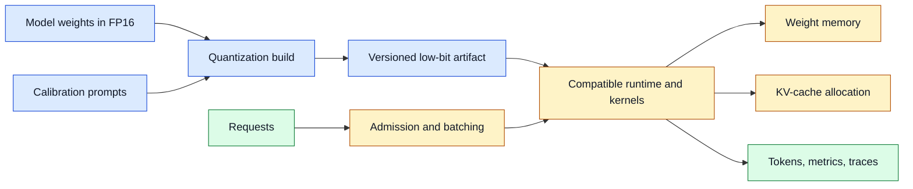
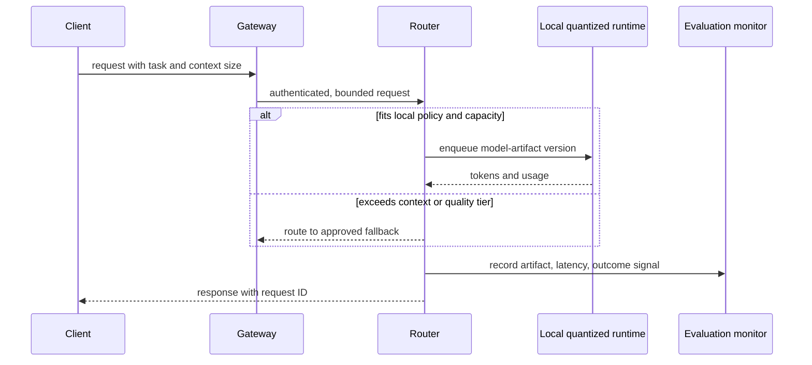

# Quantized open models
Status: draft — substantive review pending
Sources: [Hugging Face Blog](https://huggingface.co/blog)

## In one sentence

Quantization stores and computes model values with fewer bits, trading numerical precision for lower memory use, lower bandwidth demand, and potentially faster or cheaper inference on the hardware you actually deploy.

## Background: what existed before

Neural-network parameters are commonly trained and served with floating-point numbers. A 32-bit floating-point value gives ample numeric range and precision, while 16-bit variants reduce memory and can accelerate matrix operations on modern accelerators. A large model, however, contains billions of parameters. At 16 bits, each parameter needs two bytes before accounting for runtime state, tokenizer assets, key-value cache, temporary tensors, and framework overhead. The resulting model may not fit a laptop GPU, a modest server card, or the memory budget of a local deployment.

Quantization represents some values with fewer bits, often eight, six, four, or fewer. A quantizer maps a continuous or high-precision range to a finite collection of representable values. During inference, the runtime either performs low-bit operations directly or reconstructs approximate higher-precision values for a kernel. The saved bits reduce the bytes that must be loaded from memory. For many generation workloads, moving weights from memory is a central bottleneck, so reducing model size can improve throughput even when arithmetic itself is not the limiting factor.

The baseline alternative was simple but expensive: choose a smaller model, rent a larger accelerator, or accept slow CPU inference. Those are still valid choices. Quantization is not a magic compression setting; it changes errors, kernel compatibility, latency distribution, and sometimes safety behavior. A model that produces plausible text after a four-bit conversion may still regress on code generation, multilingual tokens, long contexts, rare factual questions, or structured-output tasks. The relevant question is not “does it run?” but “does it meet this product’s workload and operational budget?”

The August source queue identifies quantized open models as a relevant topic through the Hugging Face engineering ecosystem. That source establishes a practical open-model context, not a universal claim that one precision level is best. This lesson focuses on the durable systems decisions around deploying a lower-precision artifact.

## What changed and why now

Open weights, local inference runtimes, and commodity accelerators make model placement an application design decision for more teams. A developer can compare a larger quantized model with a smaller higher-precision model on the same device rather than treating model hosting as a remote API-only concern. That flexibility changes privacy, offline availability, cost predictability, upgrade procedures, and capacity planning.

Quantization methods also differ in where they apply approximation. Weight-only quantization reduces stored parameter size. Weight-and-activation quantization can produce greater hardware efficiency but requires more calibration and kernel support. Post-training quantization converts an already trained model, usually using representative data or heuristics. Quantization-aware training introduces simulated quantization during training and may preserve quality better, but needs a training pipeline and is less convenient for a downloaded model.

The practical change is to treat a quantized checkpoint as a separate build artifact with a declared format, precision, calibration method, runtime, tokenizer version, and evaluation report. Naming a file `model-q4` is not enough. Teams need to know whether “four-bit” means grouped weight quantization, whether a few layers remain higher precision, which execution kernels are required, and which benchmark slices were measured.

## Impact on current processing and architecture

At startup, a model server selects a compatible artifact, loads weights into CPU RAM or accelerator memory, initializes kernels, allocates the key-value (KV) cache, and exposes a request queue. Quantization changes all of these. Smaller weights lower cold-start transfer time and capacity pressure, but a long context can still exhaust memory because the KV cache grows with sequence length, layer count, hidden size, and concurrent requests. A team that only calculates weight size may deploy a model that loads successfully but fails under realistic parallel conversations.



For a rough capacity calculation, a model with `P` parameters at `b` bits per parameter needs approximately `P * b / 8` bytes for the raw weights. Real use needs more: per-group scales and zero points, runtime metadata, CPU copies, temporary buffers, and the KV cache. A 7-billion-parameter artifact at four bits has a raw lower bound near 3.5 GB, not a complete server footprint. If the runtime reserves 2 GB for cache and overhead, a device advertised with 8 GB may leave little room for concurrent requests.

Routing should be explicit. Some workloads may use a local quantized model for drafting, classification, retrieval query expansion, or offline assistance, while other requests route to a larger or higher-precision deployment. The route should use non-sensitive features such as task type, required context, latency target, and data residency—not a model’s self-reported confidence alone. Log the chosen artifact and runtime version so a quality regression can be traced to a deployment change.



Batching is another trade-off. Combining requests can increase accelerator utilization, but a large batch delays the first token and increases tail latency. Continuous batching admits new requests between generation steps, yet it competes for KV-cache memory. Quantization may free enough weight memory to permit more cache, but the correct concurrency setting still depends on request length and service-level objectives. Benchmark short interactive prompts and long document tasks separately.

## Real-world applications and constraints

Local or private-document assistants are a common fit. A company may want retrieval and first-pass summarization near sensitive files, with no raw document text leaving a site. Quantization can make that possible on a workstation or edge server. The organization still needs access controls, encrypted storage, update controls, logging policy, and an incident process; local placement reduces one data-transfer path but does not make a system automatically private.

Developer tooling can use a small quantized model for code completion, search query rewriting, or test explanation where low response time matters more than maximum reasoning quality. A support desk can use it for intent classification and draft suggestions, then require a separate policy-controlled service for customer actions. Offline field devices can use it where connectivity is intermittent, provided updates and model provenance are managed safely.

Hardware is a constraint, not a footnote. A quantization format built for one GPU kernel may run slowly or not at all on another accelerator, CPU architecture, mobile neural-processing unit, or browser runtime. Thermal limits can turn a fast local demo into a throttled field device. Disk size affects update rollout, and cold starts matter for serverless or autoscaled processes. License terms and model-card restrictions can also limit redistribution or intended use.

## Mental model

Think of quantization as choosing a smaller representation for a large, frequently moved data structure. It resembles storing images as JPEG rather than raw pixels: storage and transfer improve, but errors appear and their visibility depends on the content. Unlike a simple file compressor, however, a low-bit model interacts with numerical kernels, prompt distribution, token generation, and downstream application rules. The artifact is part of a serving system, not merely a download.

The model’s output quality is therefore an end-to-end property. A small loss in a token probability can be harmless in an internal draft but harmful in a JSON parser, a safety classifier, or a code patch. Measure the business task, not only perplexity or a leaderboard average.

## What changed this month

The queue’s Hugging Face source is the release-specific context for discussing open-model quantization this month. The architecture recommendations are engineering inferences: teams should version quantized artifacts, calculate memory including caches, test representative task slices, and retain a fallback path. The meaningful change is the availability of deployment choices, not a guarantee that a lower-bit model is equivalent to the original.

## Engineering consequence

Build a small evaluation set before converting or adopting a quantized artifact. Include the language, context length, tool schema, structured output, and failure cases that matter to your product. Compare the candidate against a baseline with fixed prompts, decoding settings, tokenizer, and runtime. Record exact match for parsable outputs, human rating for drafts, task success for workflows, first-token latency, tokens per second, peak memory, and failure modes. Averages hide important regressions, so segment by task and input length.

Version the complete serving tuple: model identifier and hash, quantizer and configuration, calibration data description, tokenizer, runtime release, kernel backend, hardware class, and evaluation report. Store it in deployment metadata and include it in traces. If an incident appears after an upgrade, this makes rollback possible without guessing which “Q4 model” was installed.

Use admission control to protect memory. Estimate each request’s context and requested output budget, reserve KV-cache capacity, and reject or route requests that do not fit rather than overcommitting the device. Set maximum context and generation lengths at the gateway. A graceful fallback can tell a user that a long document will be handled by a different approved service; an out-of-memory crash can drop many unrelated sessions.

Treat conversion as supply-chain work. Download artifacts from an authenticated source, record hashes, scan or review accompanying code, and avoid loading serialized objects that execute arbitrary code. Test the runtime in an isolated environment before exposing network access. When updating, canary the new artifact on a small traffic slice, compare task metrics and error rates, then retain the previous version for rollback.

### Choosing a deployment tier

Make the precision decision per service tier rather than declaring one artifact the organization-wide default. An interactive assistant may prioritize first-token latency and fit a four-bit artifact on a local GPU. A nightly extraction job may prefer eight-bit precision, a larger batch, and a longer queue because small quality losses create expensive manual correction. A safety-sensitive classification path may retain the baseline model until a task-specific evaluation proves the alternative acceptable. These are product choices expressed through routing and capacity policy.

Keep the fallback observable. A router that silently sends every difficult request to a remote model can hide the fact that local capacity or quality is insufficient. Record fallback reason codes such as `context_too_long`, `memory_reservation_failed`, `quality_tier_high`, or `local_runtime_unhealthy`. The data lets engineers decide whether to change context limits, buy hardware, improve a quantization build, or narrow the local use case. It also prevents cost estimates based on an optimistic local-traffic percentage from becoming misleading after deployment.

## Limits and failure modes

Lower precision can produce subtle degradation that a casual chat demo misses. Structured output may become invalid more often, rare domain terms may be corrupted, and tool selection can become less stable. Do not compensate by granting the model broader tool access or silently retrying effectful calls. Tight schema validation and policy gates matter more when quality varies.

Calibration mismatch is another problem. A conversion tested on short English prompts can behave poorly on long multilingual documents or code. Include representative distributions, but acknowledge that no fixed calibration set covers every future input. Monitor live, privacy-preserving quality signals and keep a rollback threshold.

Quantized formats can also create operational fragmentation. Different runtimes may use similar labels for incompatible layouts. A file that loads may fall back to slow dequantization and provide no performance benefit. Verify supported kernels and profile on the intended hardware. Do not extrapolate desktop benchmark numbers to a shared production node without contention, cooling, and concurrency tests.

## Build it locally

This example estimates the lower-bound weight memory for several precisions and reserves a simple overhead budget. It does not predict real memory exactly; it makes the missing-cache-and-overhead assumption visible.

```python
def gibibytes(bytes_count: float) -> float:
    return bytes_count / (1024 ** 3)


def estimate_memory(parameters: int, bits: int, overhead_gib: float) -> float:
    raw_weight_bytes = parameters * bits / 8
    return gibibytes(raw_weight_bytes) + overhead_gib


parameters = 7_000_000_000
for bits in (16, 8, 4):
    total = estimate_memory(parameters, bits, overhead_gib=2.0)
    print(f"{bits}-bit: about {total:.2f} GiB including 2 GiB overhead")

assert estimate_memory(parameters, 4, 2.0) < estimate_memory(parameters, 8, 2.0)
```

1. Save it as `quant_memory.py` and run `python3 quant_memory.py`.
2. Change the parameter count to a model you use and compare 16-, 8-, and 4-bit lower bounds.
3. Increase overhead for a long-context service and observe why raw weight size is not sufficient capacity planning.
4. Add an estimated KV-cache field per concurrent request, then reject a request when capacity would be exceeded.
5. Record the assumptions beside a real benchmark instead of treating this calculation as a performance guarantee.

## Interview Q&A

**Why can quantization speed up inference?** Smaller weights often reduce memory bandwidth pressure. The result depends on a compatible low-bit kernel, batching, and the hardware bottleneck.

**What is the biggest capacity-planning mistake?** Counting only model weights and ignoring KV cache, runtime buffers, metadata, and concurrent request length.

**How do you decide whether a model is good enough after quantization?** Evaluate representative product tasks with fixed settings, segmented metrics, and operational measurements—not a single conversational sample.

**Can a quantized model be used for tools?** Yes, but validate structured arguments and enforce authorization independently; model quality does not constitute permission.

## Glossary

- **Activation:** an intermediate tensor produced while a model processes input.
- **Calibration:** choosing quantization parameters using representative values or data.
- **KV cache:** stored attention keys and values used to avoid recomputing prior context during generation.
- **Kernel:** a low-level implementation of a compute operation for particular hardware.
- **Post-training quantization:** converting a trained model without retraining it for the lower precision.
- **Quantization:** representing numeric values with fewer discrete levels or bits.

## References

- [Hugging Face Blog](https://huggingface.co/blog) — primary engineering ecosystem source for the monthly topic.
- [Hugging Face Transformers quantization documentation](https://huggingface.co/docs/transformers/main/en/quantization/overview) — framework documentation on quantization approaches.
- [MLPerf Inference](https://mlcommons.org/benchmarks/inference-datacenter/) — benchmark context for inference measurements.

## Claim ledger

| Claim | Source | Fact or inference |
|---|---|---|
| The month’s source queue includes quantized open models. | Hugging Face Blog | Release-specific fact |
| Lower-bit weights reduce the raw bytes required to store parameters. | Numeric representation | Engineering fact |
| End-to-end quality must be evaluated on product tasks after conversion. | This lesson’s system design | Engineering inference |
| KV-cache and runtime overhead affect serving capacity beyond raw weight size. | This lesson’s system design | Engineering inference |
