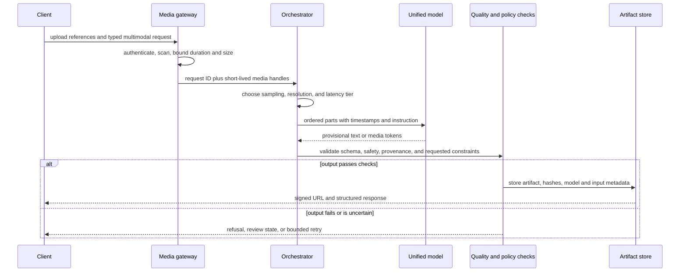

# Multimodal Unified Models
Status: emerging
Sources: [Google Blog — 2026-08-27](https://blog.google/innovation-and-ai/technology/developers-tools/build-with-gemini-omni-1-1-flash/), [OpenAI GPT-4o System Card — 2024-05-13](https://openai.com/index/gpt-4o-system-card/), [Google DeepMind — 2021-08-03](https://deepmind.google/blog/building-architectures-that-can-handle-the-worlds-data/), [Google DeepMind — 2024-06-17](https://deepmind.google/blog/generating-audio-for-video/)

## In one sentence

A multimodal unified model accepts or produces several kinds of media through a coordinated representation and interface, changing an AI application from a chain of specialist converters into a system that must manage alignment, modality-specific quality, permissions, and end-to-end evaluation.

## Background: what existed before

Most early production AI pipelines were modality-specific. A phone call became text through automatic speech recognition (ASR); a language model interpreted that text; a text-to-speech (TTS) engine synthesized a response. A document assistant extracted pages, ran optical character recognition (OCR), embedded the text, retrieved passages, and asked a text model to answer. A video application sampled frames, captioned them, and separately analyzed the soundtrack. Each component had a clear contract and could be replaced independently.

That decomposition remains useful. A specialized OCR engine may be more reliable for a particular form. A rules-based audio gate may be cheaper than sending every sound to a large model. A separate moderation service can produce an auditable decision, while a generative model is allowed only to draft content. The baseline was not “bad”; it was explicit orchestration around different data types.

The cost was semantic loss at every boundary. Speech recognition can drop prosody, overlapping speakers, hesitation, or a word that matters. OCR can lose layout, handwriting, tables, and reading order. A frame sampler can miss an event between sampled images. Converting everything to text makes downstream processing convenient, but the conversion is an irreversible compression of the original signal. The application then has to join timestamps, speaker IDs, page coordinates, frame numbers, and text spans by hand.

An embedding is a numeric representation intended to preserve useful relationships for a model. A *token* is a discrete unit consumed by an autoregressive model; in text it is often a word fragment, while audio and images require other forms of discretization or continuous features. A *modality* is a data type or channel such as text, image, audio, or video. A unified model can map multiple modalities into a shared processing space, or learn a common sequence interface in which different media are represented as compatible inputs and outputs.

The important distinction is between a single product and a unified model. A product may offer image, audio, and text features while quietly routing them through separate models. That can still be an excellent architecture. The engineering concept in this lesson is a model and serving interface designed to reason across modalities, preserve relationships between them, and sometimes generate more than one kind of output.

## What changed and why now

Recent systems made multimodal interaction a primary model concern rather than a bolt-on preprocessor. OpenAI’s GPT-4o system card describes an autoregressive omni model trained end-to-end across text, vision, and audio, accepting combinations of text, audio, image, and video and producing combinations of text, audio, and image. That is a release-specific description of one system, not a guarantee that every “omni” model has the same training or input/output coverage.

Google DeepMind’s earlier Perceiver work illustrates the architectural motivation: a general architecture can process images, point clouds, audio, video, and combinations by routing large and varied inputs through a smaller latent array. The broader lesson is durable: inputs have different sizes and sampling rates, so a model needs an interface that controls the cost of cross-modal attention rather than concatenating every raw element into one enormous sequence.

The August 27, 2026 Google announcement for Gemini Omni 1.1 Flash shows the product consequence. It describes scene extension using up to ten seconds of prior video context, cumulative extensions up to forty seconds, first-and-last-frame conditioning, three-second video references, 360p drafts, and 1080p or 4K output. These are vendor-reported capabilities. They demonstrate that a multimodal API can expose temporal references and output controls, not only a prompt plus a still image. The same announcement says 360p previews are up to 60% faster and one third the cost of standard 720p in the described system; treat those as release-specific throughput and pricing claims that must be measured in your account.

This changes the application contract. Instead of `transcript -> answer`, a request may contain text instructions, an image reference, a video segment, timestamps, a desired resolution, and a request to preserve a character or scene. The response may contain text metadata and a media artifact. The caller must track asset IDs, content types, dimensions, frame rates, audio sampling rates, generation IDs, expiration, and provenance. Media is now stateful data, not merely a large string in a prompt.

## Impact on current processing and architecture

The first processing decision is representation. Images can be divided into patches or encoded into visual tokens. Audio is a time series, commonly converted into short-time features or learned audio tokens. Video adds a temporal axis: a system must choose frame sampling, clip length, motion cues, and possibly audio-video synchronization. Text has variable-length discrete tokens. A model can use modality-specific encoders followed by a shared transformer, a shared encoder with modality tags, or a more tightly coupled end-to-end design. Each choice creates different latency, memory, and alignment behavior.

Do not assume “shared representation” means identical information quality. A small object in a high-resolution image can disappear after resizing. A brief sound can be excluded by a clip window. A video generator can maintain broad scene identity while changing a hand, sign, or spoken word. A unified model may be good at saying what a picture contains and poor at counting tiny objects. Capability is a vector across tasks and modalities, not one scalar intelligence label.

The serving path should separate media ingestion, policy, model work, artifact storage, and verification. Validate content type and size before decoding. Normalize media only under explicit rules: resizing, color conversion, audio resampling, frame sampling, and duration clipping can all affect the answer. Store the original or a content hash when reproducibility matters. Run malware scanning and decompression-bomb limits for uploaded files. Keep user-provided media in a tenant-scoped object store and pass short-lived references to model workers.

```mermaid
flowchart LR
    I[Text image audio video inputs] --> V[Validate type size tenant policy]
    V --> N[Decode normalize sample and align]
    N --> E[Modality encoders or tokenizers]
    E --> X[Shared multimodal model]
    X --> G[Text or media generation]
    G --> P[Output policy and provenance checks]
    P --> S[Artifact store and response metadata]
    classDef input fill:#dbeafe,stroke:#1d4ed8,color:#111827;
    classDef process fill:#fef3c7,stroke:#b45309,color:#111827;
    classDef output fill:#dcfce7,stroke:#15803d,color:#111827;
    class I input;
    class V,N,E,X,G process;
    class P,S output;
```



The model gateway should expose an explicit content schema. A simple request might contain ordered parts, where each part declares `text`, `image_ref`, `audio_ref`, or `video_ref`, plus optional timestamps. The schema needs limits per part and per request. A video reference can mean the entire file, a time interval, or a sampled preview; ambiguity causes cost surprises and inconsistent results. Return a request ID and a model version. If generation is asynchronous, return a job ID and make status reads idempotent.

Alignment is the central systems problem. If a user asks, “What did the person say while the red car passed?”, the answer depends on joining language and visual events. Use timestamps when the source provides them, but document clock domains and drift. Audio and video may begin at different offsets. A transcript word timestamp is not necessarily the exact interval in which a mouth movement occurs. When precision matters, retain intermediate evidence: selected frames, audio windows, transcript spans, and the model’s cited time ranges. A free-form answer without evidence is hard to debug.



Streaming introduces another state machine. An interactive voice or video request may be `accepted -> decoding -> grounding -> generating -> interrupted -> completed`. A media generation job may be `queued -> running -> awaiting_policy -> published` or `failed`. Do not mark a job complete when the model emits its last token: encoding, moderation, watermarking, upload, and checksum verification may remain. A retry must use an idempotency key and either reuse the same artifact or create a new version; otherwise a network timeout can create duplicate paid media.

Multimodal batching is less regular than text batching. Requests may have different frame counts, image sizes, audio durations, and output formats. Padding a batch to the largest input wastes memory, while separate queues reduce accelerator utilization. Create queues by modality mix and normalized cost estimate. Admission control should consider decoded bytes, estimated tokens, video duration, KV-cache demand, and output resolution. A 4K output is not just “more tokens”; it may require a separate decoder and much more storage and egress.

Measure end-to-end latency in phases: upload, decode, preprocessing, time to first output, generation, policy checks, encoding, and download. Track p50 and p95 by modality mix. Also record cost per successful task, not only cost per request. A low-resolution draft that lets a user reject nine bad ideas before one high-resolution render may reduce total spend, but only if the draft predicts final quality well enough.

## Real-world applications and constraints

Accessibility tools can combine a camera view, spoken questions, and text or speech output. The user may ask what is on a sign, whether a curb is clear, or how a control panel is arranged. Latency and uncertainty are safety constraints: a stale frame can be worse than no answer, and a confident description of an unseen obstacle is dangerous. Show capture time, allow “repeat” and “zoom,” and distinguish observed content from an inference. High-impact navigation should retain human judgment or use dedicated sensors.

Media editing systems benefit from cross-modal control. A creator can provide a reference image, a short video, and a textual camera instruction; a unified model can preserve more context than a text-only prompt. The August Omni announcement’s scene extension, keyframe conditioning, reference-video input, low-resolution drafts, and upscaling are examples of workflow-shaped controls. Operationally, the editor needs versioned timelines, deterministic asset references, cancellation, quotas, and a way to compare outputs. “Same character” is a quality target, not a cryptographic identity guarantee.

Education and enterprise search can use screenshots, diagrams, meeting audio, and documents together. The system should preserve access control from the source document into the derived transcript, embedding, caption, and answer. A derived representation can leak information even if the original file is protected. Deletion therefore means finding derivatives, cached thumbnails, embeddings, transcripts, and generated artifacts, not only removing the upload.

Healthcare, finance, legal review, and industrial inspection have stricter constraints. The model can assist with triage or drafting, but a multimodal answer should not silently become a diagnosis, credit decision, legal conclusion, or machine command. Store model version, preprocessing parameters, input hashes, output evidence, reviewer identity, and final disposition. Validate numerical readings with deterministic tools. Keep the model away from irreversible actuators unless a separate authorization layer checks the exact command and current sensor state.

Privacy is modality-specific. Faces, voices, license plates, screens, location clues, and background conversations can identify people. Consent for an audio recording may not cover face analysis. Data residency and retention policies must include temporary decode buffers and provider-side logs. Encrypt media at rest, use scoped access tokens, redact where feasible, and make deletion observable. Do not send an entire video when a five-second interval or a few frames answer the question.

## Mental model

Think of a unified model as a translation-aware team sharing a workbench. Vision, sound, motion, and language arrive in different physical forms, but the model can place useful evidence on one bench and reason across it. The workbench does not make every specialist equally accurate. The engineer still decides what evidence is admitted, how it is aligned, what action is allowed, and how the result is checked.

The best architecture is often hybrid. Use a unified model for cross-modal understanding and flexible interaction; use deterministic decoders, OCR, speech recognition, search, validators, and policy services where exactness, cost, or auditability matters. “Unified” is a capability choice, not a reason to delete well-tested boundaries.

## What changed this month

On August 27, 2026, Google announced Gemini Omni 1.1 Flash as a production-oriented update for generative video workflows. The release-specific controls include extending a scene while considering up to ten seconds of prior context, extending in ten-second increments to a cumulative forty seconds, specifying first and last frames, supplying up to three seconds of video references, drafting at 360p, and producing 1080p or 4K outputs. The announcement also lists API and platform availability.

The engineering consequence is more important than the product name: media APIs are exposing temporal context, reference assets, resolution tiers, and continuation semantics. Those controls turn a model call into a versioned media workflow. A developer must model asset lineage, cost tiers, retries, output checks, and user approval. The announcement’s examples and customer statements are vendor or customer claims; they should be validated on the scenes, languages, devices, and latency distribution relevant to your application.

## Build it locally

The Python exercise below uses only the standard library, so it runs without an API key or model download. Save this file’s fenced example as `evidence_windows.py`, run `python3 evidence_windows.py`, and then change the question interval and budget. In a real adapter, replace the `Clip` manifest with metadata produced by a trusted media decoder. Keep the selector deterministic so a failed model request can be retried with the same evidence.

## Engineering consequence

When adopting a unified model, begin by writing a modality matrix. For each task, record accepted inputs, output types, maximum duration, required alignment precision, quality metric, privacy classification, fallback, and allowed side effects. This prevents a demo’s “image plus text” path from quietly becoming an unrestricted video upload service.

Next, make preprocessing observable. Log dimensions, duration, sampled-frame count, audio rate, truncation, and model-visible references without logging sensitive payloads. Pin the model and preprocessing versions. Capture hashes for immutable source assets. A quality regression can come from a changed frame sampler rather than a changed model.

Use staged release gates:

1. Build a small, representative fixture set containing each modality mix and known edge cases.
2. Define task metrics: transcription error, temporal localization error, object recall, structured-field accuracy, refusal precision, and human preference where appropriate.
3. Run no-model and specialist baselines so “unified” is compared against a real alternative.
4. Add adversarial fixtures: occlusion, background speech, low light, accents, tiny text, edits between frames, conflicting captions, and prompt injection embedded in media.
5. Test output contracts and artifact hashes, including interrupted jobs and duplicate retries.
6. Shadow a candidate model on production-like traffic without exposing its outputs to users.
7. Roll out by tenant or traffic percentage with budget, latency, and quality rollback thresholds.

The smallest low-cost local experiment is to model temporal evidence selection without calling a paid model. It makes the cost/coverage trade-off visible:

```python
from dataclasses import dataclass

@dataclass(frozen=True)
class Clip:
    start: float
    end: float
    label: str

def select_windows(clips: list[Clip], question_start: float, question_end: float,
                   max_seconds: float) -> list[Clip]:
    """Select overlapping evidence in time order under a duration budget."""
    chosen = []
    used = 0.0
    for clip in sorted(clips, key=lambda item: item.start):
        overlap = max(0.0, min(clip.end, question_end) - max(clip.start, question_start))
        if overlap and used + overlap <= max_seconds:
            chosen.append(clip)
            used += overlap
    return chosen

clips = [Clip(0, 2, "intro"), Clip(2, 5, "red car passes"), Clip(5, 8, "speaker talks")]
evidence = select_windows(clips, 1.5, 6.0, 4.0)
print([(item.label, item.start, item.end) for item in evidence])
```

This is not a multimodal model. It is a local test of an application responsibility: selecting bounded, timestamped evidence before inference. Extend it with a media manifest, access checks, and a cost estimate. Then compare selected windows with an all-media baseline and inspect what events are missed.

## Limits and failure modes

1. **Cross-modal hallucination:** The model can invent a relationship that no channel supports, such as attributing speech to the wrong person. Require citations, timestamps, or a reviewer for consequential outputs.
2. **Temporal aliasing:** Sampling one frame per second misses brief events. Adaptive sampling improves coverage but raises cost and can still miss the decisive instant.
3. **Resolution loss:** Resizing or compression removes small text and fine visual detail. Preserve an original and route detail-sensitive questions to a crop or specialist tool.
4. **Audio contamination:** Background speakers, music, echo, and synthetic audio can alter interpretation. Use speaker separation and confidence signals, but do not treat confidence as proof.
5. **Prompt injection in media:** A screenshot, subtitle, PDF, or spoken sentence can contain instructions aimed at the agent. Treat extracted content as untrusted data; it must not override system policy or tool permissions.
6. **Modality imbalance:** Training data and evaluation coverage may favor text or common accents, objects, and languages. Report slice results instead of one aggregate score.
7. **Output provenance gaps:** Generated images, video, speech, or text can be copied away from the originating UI. Attach provenance where supported, retain lineage internally, and communicate uncertainty to downstream users.
8. **Availability and cost variance:** Large media uploads, encoding queues, and provider rate limits create tail latency. Use quotas, asynchronous jobs, cancellation, backpressure, and a degraded specialist fallback.
9. **State and retry bugs:** A timed-out client may retry after the server finished generation. Idempotency keys and durable job state prevent duplicate artifacts and charges.
10. **Safety mismatch:** A model that can understand a dangerous image or generate persuasive audio may need different safeguards than a text-only assistant. Evaluate input and output combinations, not each modality in isolation.

## Mini exercise (15–30 min)

Create a manifest for three short clips containing a spoken sentence, a visible action, and a background sound. Define a question that requires two modalities. Implement a selector that returns the smallest time windows covering both evidence types. Add a deliberate clock offset and show how the answer changes. Finally, write a policy test that rejects any tool call unless the selected evidence is still inside the user’s authorized media interval. The exercise teaches that multimodal quality starts with data selection and authorization before the model sees a prompt.

## Interview Q&A

**Q: Is a multimodal product necessarily a unified model?**
A: No. It may orchestrate independent ASR, vision, language, and generation services. Ask where representations are joined, which inputs and outputs share parameters, and which boundaries are externally observable.

**Q: Why not convert every modality to text?**
A: Text is convenient, but conversion loses timing, layout, tone, visual geometry, and nonverbal evidence. Use text conversion when its loss is acceptable and a direct modality path when it is not.

**Q: What is the hardest production problem?**
A: Usually the complete contract: media limits, alignment, preprocessing, cost, output validation, privacy, and retries. Model capability alone does not solve those distributed-systems concerns.

**Q: How would you evaluate a video question-answering feature?**
A: Build task-specific slices with timestamped ground truth, compare specialist and unified baselines, measure temporal localization and answer correctness, test noisy and adversarial media, and review harmful or high-impact errors separately.

**Q: When should a tool call be allowed?**
A: Only after the model’s proposal passes schema, authorization, freshness, and domain validation. Media-derived intent is evidence for a decision, not authorization itself.

## Glossary

- **Alignment:** preserving correspondence between signals, such as a transcript span and a video interval.
- **ASR:** automatic speech recognition, which converts speech into text or related representations.
- **Embedding:** a numeric representation used to compare or process items by learned relationships.
- **Modality:** a kind of input or output, including text, image, audio, or video.
- **OCR:** optical character recognition, extraction of text from images or scanned documents.
- **Preprocessing:** validation and transformation before model inference, such as resizing or sampling.
- **Temporal aliasing:** missing an event because a time-varying signal was sampled too sparsely.
- **TTS:** text-to-speech synthesis.
- **Unified model:** a model designed to process multiple modalities through shared or coordinated representations and interfaces.

## References

- [Google Blog: Gemini Omni 1.1 Flash](https://blog.google/innovation-and-ai/technology/developers-tools/build-with-gemini-omni-1-1-flash/) — release-specific controls, API workflow, resolution tiers, and vendor-reported performance.
- [OpenAI GPT-4o System Card](https://openai.com/index/gpt-4o-system-card/) — an example of end-to-end multimodal model and safety-evaluation framing.
- [Google DeepMind: Building architectures that can handle the world’s data](https://deepmind.google/blog/building-architectures-that-can-handle-the-worlds-data/) — Perceiver motivation for varied inputs and latent processing.
- [Google DeepMind: Generating audio for video](https://deepmind.google/blog/generating-audio-for-video/) — video/audio synchronization architecture and limitations.

## Claim ledger

| Claim | Source | Fact or inference |
|---|---|---|
| Gemini Omni 1.1 Flash was announced on August 27, 2026. | Google Blog | Fact |
| Omni 1.1 supports the described scene extension, keyframe, reference-video, draft-resolution, and upscaling controls. | Google Blog | Fact, release-specific |
| 360p generation is reported as up to 60% faster and one third the cost of standard 720p in that announcement. | Google Blog | Fact as vendor-reported; validate locally |
| Unified models can reduce semantic loss at specialist conversion boundaries. | Multimodal architecture sources | Engineering inference |
| A multimodal API must track asset lineage, alignment, permissions, and idempotent job state. | System-design analysis | Engineering inference |
| Cross-modal capability does not imply equal reliability across tasks or modalities. | GPT-4o System Card; DeepMind safety discussion | Engineering inference supported by evaluation framing |
| Media-derived instructions should remain untrusted and cannot grant tool authorization. | Application security design | Engineering inference |
