# Local Inference
Status: planned
Sources: [Hugging Face Blog](https://huggingface.co/blog), [Google Gemma](https://ai.google.dev/gemma)

## In one sentence
Local inference moves model execution onto a device or private server, exchanging provider dependency for hardware, update, privacy, and reliability responsibilities.

## Background: what existed before
Hosted APIs hid accelerator selection, model loading, scaling, and patching behind an HTTP endpoint. The application sent data away and received a response. This was convenient, but it introduced network latency, recurring usage cost, data-transfer concerns, and dependence on service availability.

## What changed and why now
Open-weight models, quantized checkpoints, CPU/GPU runtimes, and capable personal hardware make local execution practical for more workloads. The interesting change is architectural: a model becomes a versioned binary and local process in the product’s deployment graph rather than an external dependency.

## Impact on current processing and architecture
Local serving needs model download verification, memory admission, request queues, crash recovery, telemetry, and a fallback policy. Device memory must cover weights, runtime buffers, and context cache. Offline mode also needs local tokenization and safe behavior when tools or policy services are unreachable.

## Real-world applications and constraints
Use local inference for private document triage, offline field assistance, low-latency drafting, and edge classification. It is constrained by thermal throttling, battery, storage, model licensing, hardware diversity, and delayed security updates.

## Mental model
Treat the model like a database binary shipped to every host: pin its digest, measure it, update it safely, and assume some hosts will be stale or unavailable.

## What changed this month
August’s open-model activity makes local placement a product decision rather than only an infrastructure experiment. Release-specific performance claims require workload testing on the target device.

## Engineering consequence
Define minimum hardware, model digest, context limit, p95 latency, offline permissions, and rollback behavior before shipping a local model.

## Limits and failure modes
Stale artifacts, unsupported kernels, memory exhaustion, unmonitored sensitive output, and inconsistent behavior across devices are common risks.

## Prerequisites: the processing path

Before designing local inference, separate four ideas that are often collapsed into the phrase “run the model locally.” The **model artifact** is the parameter file and associated metadata. The **runtime** loads that artifact and executes kernels on a CPU, GPU, neural-processing unit, or another accelerator. The **application service** manages requests, permissions, context, and tools. The **device fleet** distributes versions, observes health, and handles machines that are offline or physically accessible to an attacker. A model can be small enough for a laptop while its runtime or application still fails under realistic load.

Inference is the act of producing an output from fixed model parameters. Unlike training, it normally does not update those parameters. A **cold start** includes loading the artifact and initializing kernels; a **warm request** reuses that state. **Throughput** is work completed per unit time, while **latency** is the time one request takes. A useful service reports both, because a batch-oriented device may achieve high throughput while making an interactive assistant feel slow.

Memory has several consumers. The raw weight size is approximately parameter count multiplied by bytes per parameter, but the process also needs tokenization assets, runtime metadata, temporary activations, and a key-value cache for autoregressive generation. The cache grows with context length and concurrent requests. On a device shared with a camera pipeline or user interface, the advertised RAM is not the model budget. Measure the resident set after initialization and during the longest supported request.

Local execution can improve privacy, but “the data stays on the device” is not a complete privacy claim. Logs, crash dumps, swap files, backups, telemetry, copied prompts, and generated files can still contain sensitive data. A local model can also leak information through its output or through a tool that it is permitted to call. Privacy is a data-flow property, not a geographic label.

## What changed in the deployment baseline

The old deployment question was usually, “Which hosted endpoint should this application call?” The modern question is, “Which parts of this workload should execute on this device, gateway, or hosted fallback?” Smaller open models and quantized artifacts create more options, but they also expose choices that a hosted API previously hid: accelerator compatibility, tokenizer version, thermal behavior, disk space, update cadence, and supply-chain verification.

That choice should be workload-specific. A local model may be appropriate for intent classification, retrieval query rewriting, first-pass redaction, or offline assistance. A larger hosted model may be preferable for a difficult reasoning task when policy permits transmission. A deterministic local parser may be better than either model for a structured command. Treat the route as part of the product’s policy, not an optimization that can silently change based on an unreliable confidence score.

There is also a different failure boundary. A hosted service can usually be upgraded centrally and capacity can be pooled across tenants. Local devices can be offline, powered down, overheated, tampered with, or running old software. The product must decide whether offline behavior is read-only, whether it may cache data, and whether a stale policy blocks a side effect. A local assistant that can draft a note offline should not automatically be allowed to send that note when connectivity returns.

## Architecture: artifact, runtime, and policy boundary

The following architecture keeps the model process behind an application-owned gateway. The gateway owns authentication, request limits, context construction, and tool permissions. The model proposes content or an action; a separate policy and domain service decides whether an external effect is allowed. This separation matters even when every process runs on one laptop.

```mermaid
flowchart LR
    U[User or device sensor] --> A[Local application gateway]
    A --> P[Input redaction and permission policy]
    P --> Q[Bounded request queue]
    Q --> R[Local inference runtime]
    R --> O[Output parser and safety checks]
    O --> D[Read-only result or draft]
    O --> E[Effect authorization service]
    E --> X[Domain API or actuator]
    F[Signed model manifest] --> V[Artifact verifier]
    V --> R
    H[Health and latency metrics] <-- R
    classDef input fill:#dbeafe,stroke:#1d4ed8,color:#111827;
    classDef control fill:#fef3c7,stroke:#b45309,color:#111827;
    classDef effect fill:#dcfce7,stroke:#15803d,color:#111827;
    class U,F input;
    class A,P,Q,R,O,V,H control;
    class D,E,X effect;
```

At installation, verify the model manifest before loading bytes. A manifest should bind the artifact digest to the model family, tokenizer, quantization format, supported runtime, license metadata, and evaluation report. Signature verification answers “who authorized this artifact?”; a digest answers “are these exact bytes the authorized ones?” Use both. Do not download an untrusted model into a directory that the inference service can execute with broad permissions.

The gateway should enforce maximum input length, output length, concurrent requests, and wall-clock time. A local process can still be exhausted by a very large prompt or by many simultaneous callers. Return structured errors for unavailable hardware, over-budget context, policy denial, and model failure. Avoid turning every failure into an empty answer: callers need to know whether a response is absent, partial, stale, or intentionally refused.

## Architecture: lifecycle and fallback states

Local inference has state beyond “running.” This state diagram shows a conservative lifecycle. The device can serve drafts while offline, but effectful work waits for a current policy decision. An update is staged beside the current version and becomes active only after verification and a smoke test.

```mermaid
stateDiagram-v2
    [*] --> VerifyingArtifact
    VerifyingArtifact --> Ready: signature and digest pass
    VerifyingArtifact --> Quarantined: mismatch or unsupported format
    Ready --> Loading: process requested
    Loading --> Warm: memory and kernel checks pass
    Loading --> Degraded: insufficient resources
    Warm --> Serving: request within local policy
    Serving --> Warm: response complete
    Serving --> OfflineDraftOnly: network or policy unavailable
    OfflineDraftOnly --> Warm: fresh policy restored
    Warm --> StagingUpdate: signed update available
    StagingUpdate --> Warm: canary passes
    StagingUpdate --> Warm: canary fails; retain old version
    Warm --> Quarantined: runtime crash or integrity alarm
    Degraded --> Warm: load reduced model or concurrency
```



The `OfflineDraftOnly` state is deliberately narrower than normal service. The application can continue a permitted local task, but it does not infer that network failure is permission to bypass an approval service. If the product cannot operate safely without fresh policy, fail closed and explain how the user can retry. If it can perform a low-risk read-only task with a short-lived cached decision, define that cache’s maximum age and audit its use.

## Real-world operating patterns

For a private document assistant, the device can run OCR, chunking, embeddings, retrieval, and a small summarizer locally. This keeps raw pages out of a hosted service, but the index and embedding vectors are still sensitive. Encrypt the local store, bind it to a tenant or user identity, and provide deletion that removes source files, chunks, vectors, caches, and generated exports. If a user copies a summary into a shared folder, that export belongs in the governance model too.

For developer tooling, a local model can provide autocomplete or explain a test failure with low round-trip latency. Interactive completion has a strict first-token budget and tolerates short context; code review needs broader context and higher factual reliability. Use separate queues and limits. Never allow the completion model to execute shell commands merely because it suggested one. If a coding agent has tools, preserve the same authorization boundary as a hosted agent.

For an offline field device, the model may classify an image, translate a phrase, or guide a checklist when connectivity is intermittent. Design for partial synchronization: events need IDs, timestamps, device identity, and conflict rules. When the device reconnects, upload only approved records and do not replay a side effect without an idempotency key. Battery and heat are operational budgets. A benchmark measured while plugged in and cool does not describe a device after an hour in direct sunlight.

For an edge gateway serving several cameras, admission control is essential. A new stream can increase decoded pixels, memory, and inference frequency even when the model itself has not changed. Bound frame sampling, drop redundant frames deliberately, and expose a degraded mode that reports lower sampling rather than pretending to provide full coverage. If a missed event has safety consequences, use dedicated sensors or deterministic vision checks instead of assuming a general model will compensate.

## Engineering consequence

Make local inference a release artifact with five contracts:

1. **Artifact contract:** record model digest, tokenizer, format, license, signature, and evaluation slices.
2. **Resource contract:** define supported devices, memory headroom, context limit, concurrency, thermal assumptions, cold start, and p95 warm latency.
3. **Data contract:** specify what remains local, what may synchronize, retention, logs, crash handling, and deletion of derivatives.
4. **Behavior contract:** distinguish draft, read-only answer, proposed action, and authorized effect; define offline behavior for each.
5. **Update contract:** stage, verify, canary, monitor, roll back, and eventually revoke a bad artifact.

Numbered local implementation steps:

1. Choose one bounded task, such as classifying a short text or extracting a small JSON record. Write its quality threshold and maximum latency.
2. Record the target device’s available memory, CPU or accelerator, operating-system version, and whether the process shares resources with other applications.
3. Install one trusted runtime and pin its version. Keep the model file and tokenizer in an application-owned directory with restrictive permissions.
4. Verify the artifact’s digest before loading it. Fail closed when the digest or format does not match the manifest.
5. Implement a gateway that limits request size, timeout, concurrency, and output length before calling the runtime.
6. Measure cold start, warm p50 and p95 latency, peak memory, throughput, and output quality on representative inputs.
7. Repeat the measurements under low battery, thermal load, long context, and concurrent requests when those conditions are realistic.
8. Add a fallback state. Decide whether fallback means a smaller local model, a hosted route, a human queue, or a useful refusal.
9. Add structured telemetry without logging raw sensitive prompts by default. Include request ID, artifact digest, route, durations, resource state, and result disposition.
10. Test rollback by staging a deliberately incompatible artifact in a safe environment and confirming that the old verified version remains active.

The following low-cost example models an admission controller. It does not pretend to execute a language model; it demonstrates a production responsibility that can be tested without downloading one: reserve memory and concurrency before accepting work, then release the reservation even when a request fails.

## Build it locally

Save the example as `local_admission.py` and run `python3 local_admission.py`. It uses only the standard library. Change `memory_mb`, `max_context`, or `max_active` and observe which requests are rejected before inference. In a real service, the reservation would surround a runtime call and the measured peak would replace the estimate.

```python
from dataclasses import dataclass

@dataclass(frozen=True)
class Request:
    request_id: str
    context_tokens: int
    estimated_memory_mb: int
    effectful: bool = False

class Admission:
    def __init__(self, memory_mb: int, max_context: int, max_active: int):
        self.memory_mb = memory_mb
        self.max_context = max_context
        self.max_active = max_active
        self.used_mb = 0
        self.active = 0

    def reserve(self, request: Request, policy_online: bool) -> str:
        if request.context_tokens > self.max_context:
            return "reject: context limit"
        if request.effectful and not policy_online:
            return "reject: fresh policy required"
        if self.active >= self.max_active:
            return "reject: concurrency limit"
        if self.used_mb + request.estimated_memory_mb > self.memory_mb:
            return "reject: memory budget"
        self.used_mb += request.estimated_memory_mb
        self.active += 1
        return "accepted"

    def release(self, request: Request) -> None:
        self.used_mb -= request.estimated_memory_mb
        self.active -= 1

controller = Admission(memory_mb=1024, max_context=2048, max_active=2)
requests = [
    Request("a", 512, 300),
    Request("b", 1800, 500),
    Request("c", 3000, 100),
    Request("d", 128, 100, effectful=True),
]
held = []
for item in requests:
    result = controller.reserve(item, policy_online=item.request_id != "d")
    print(item.request_id, result)
    if result == "accepted":
        held.append(item)
for item in held:
    controller.release(item)
print("final resources", controller.active, controller.used_mb)
```

## Limits and failure modes

**Artifact substitution** occurs when an update replaces a model file without a verified digest. The process may still start and produce plausible answers, making this a supply-chain failure rather than an obvious outage. Verify before load and record the active digest in every response trace.

**Resource oversubscription** occurs when capacity planning counts only weights. Long context, concurrent users, decode buffers, and another application can exhaust memory. Reserve resources before inference, apply backpressure, and test the tail rather than trusting a single successful request.

**Quality drift** occurs when a quantized or smaller model passes a general benchmark but fails a business slice. Measure structured output, rare languages, long context, refusal behavior, and the actual task. Keep a specialist or human fallback for cases where local quality is insufficient.

**Stale policy** is especially dangerous offline. A cached permission may outlive a user’s access or a revoked device. Bound cache age, separate drafts from effects, and require fresh authorization for irreversible operations.

**Physical compromise** changes the threat model. An attacker with device access may copy model files, inspect local logs, alter binaries, or feed crafted inputs. Use full-disk encryption where appropriate, secure boot and signed updates where supported, minimal credentials, and server-side verification for sensitive effects. Do not put long-lived service secrets in the model process.

**Observability leakage** can defeat a privacy goal. Debug traces, prompt samples, crash dumps, and copied output may leave the local boundary. Default to metadata, redact sensitive fields, restrict diagnostic access, and make temporary verbose logging explicit and time-limited.

**Update fragmentation** leaves a fleet with multiple behaviors. Report device cohort, model digest, runtime version, and policy version in metrics. Roll out gradually, stop when quality or resource thresholds regress, and maintain a tested rollback path.

## Mini exercise (15–30 min)

Run the admission example and add a `thermal_state` field with `cool`, `warm`, and `hot` values. Reject or downgrade long requests when the device is hot. Then add a model digest to each result and write a test that rejects a response if the digest is not in an approved set. Finally, decide which of the four example requests are allowed when the policy service is offline and explain why. The exercise connects model execution to resource management, provenance, and authorization.

## Interview Q&A

**Q: When is local inference better than a hosted API?**
When privacy, offline operation, predictable local latency, or transfer cost dominates and the device can meet quality and resource requirements. It is not automatically cheaper or safer; maintenance moves to the product team.

**Q: Why is quantization not enough for capacity planning?**
It reduces some weight memory, but runtime buffers, activations, context cache, concurrency, and other processes still consume resources. Measure the complete process under realistic load.

**Q: How do you handle an offline tool request?**
Classify the operation. A draft or read-only response may be allowed under a bounded cached policy; an irreversible effect should normally wait for fresh authorization and an idempotency-safe retry.

**Q: What telemetry is useful without storing private prompts?**
Request ID, artifact and runtime digests, route, input size class, token counts, latency phases, resource state, error category, policy disposition, and a privacy-reviewed outcome signal.

**Q: How do you roll out a new local model?**
Verify the signed artifact, stage it beside the current version, run smoke and representative quality tests, canary a cohort, monitor latency/resource/quality slices, and retain a fast rollback.

## Glossary

- **Artifact:** A versioned model file and its metadata.
- **Cold start:** Startup work required before the first inference request.
- **Inference:** Computing an output from fixed model parameters.
- **Key-value cache:** Stored attention state that speeds autoregressive continuation but consumes memory as context and concurrency grow.
- **Local inference:** Model execution on a user device, private server, or edge gateway under the application’s operational control.
- **Quantization:** Representing numerical values with fewer bits to reduce storage or computation cost.
- **Runtime:** Software and kernels that load a model and execute inference.
- **Throughput:** Completed work per unit of time.
- **Warm request:** Inference after the runtime and model are already loaded.

## References

- [Hugging Face Blog](https://huggingface.co/blog) — practical open-model and deployment ecosystem context; individual model claims require model-specific documentation.
- [Google Gemma documentation](https://ai.google.dev/gemma) — official open-model documentation and deployment context.
- [Google DeepMind: Building architectures that can handle the world’s data](https://deepmind.google/blog/building-architectures-that-can-handle-the-worlds-data/) — why varied inputs motivate general architectures.
- [OpenAI GPT-4o System Card](https://openai.com/index/gpt-4o-system-card/) — example of multimodal capability and evaluation/safety framing.

## Claim ledger

| Claim | Source | Fact or inference |
|---|---|---|
| Open-model ecosystems support local deployment choices. | Hugging Face Blog; Gemma documentation | Fact about ecosystem |
| A model process requires more memory than raw weights alone. | Runtime and serving design | Engineering inference |
| Local execution can reduce a data-transfer path but does not guarantee privacy. | Privacy and systems analysis | Engineering inference |
| Local devices need artifact verification, resource admission, and update rollback. | Secure deployment design | Engineering inference |
| Offline drafts and offline side effects should have different permissions. | Authorization design | Engineering inference |
| Device-specific latency and quality must be measured on the target workload. | Performance engineering | Engineering inference |

## Mini exercise (15–30 min)
Measure a small local classifier’s cold start, warm latency, memory, and behavior after its model file is replaced with a different digest.

## Claim ledger
| Claim | Source | Fact or inference |
|---|---|---|
| Open models can be deployed through local runtimes. | Hugging Face Blog; Gemma docs | Fact about ecosystem |
| Local inference changes patching and capacity ownership. | System design | Inference |
