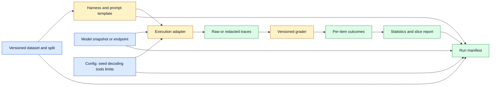

# Benchmark Reproducibility
Status: planned
Sources: [Google DeepMind — Double-blind evaluations](https://deepmind.google/blog/piloting-the-worlds-first-double-blind-ai-evaluations/), [MLCommons](https://mlcommons.org/)

## In one sentence
Benchmark reproducibility means another engineer can identify the exact data, prompt, model, runtime, sampling settings, grader, and environment that produced a score.

## Background: what existed before
Teams often compared a headline score while omitting prompt templates, hidden system messages, retries, context truncation, evaluator versions, or model snapshots. Small differences can change results enough to reverse a ranking.

## What changed and why now
Private and contamination-resistant evaluations make the evaluation harness an auditable artifact. Double-blind evaluation work emphasizes keeping tests and proprietary models confidential while still producing bounded evidence. Reproducibility extends that idea to ordinary internal runs.

## Impact on current processing and architecture
Store an immutable run manifest: dataset hash, split, model identifier, tokenizer, prompt, seed, temperature, tool policy, hardware, code commit, grader version, and failure treatment. Outputs need retention rules, but the manifest should survive the run.

## Real-world applications and constraints
Use this for model selection, regression gates, safety reports, and vendor comparisons. Confidential test sets, nondeterministic services, and changing hosted models limit perfect replay; record uncertainty and service timestamps.

## Mental model
A benchmark score is a build artifact, not a property floating free of its build configuration.

## What changed this month
August’s evaluation discussions make secure test access and reproducible evidence part of the same engineering problem.

## Engineering consequence
Reject a score in CI when its manifest is incomplete or its dataset and grader hashes cannot be resolved.

## Limits and failure modes
Hidden contamination, grader drift, selective failure removal, prompt leakage, and overfitting to a public test can all create false confidence.

## Prerequisites: what a score actually is

A benchmark is a defined workload and a procedure for measuring performance on that workload. The workload may be a set of questions, code repositories, images, conversations, tool tasks, or safety probes. A **metric** turns outcomes into a number: exact match, pass rate, latency, calibration error, human preference, or another measurement. A **grader** is the program or person that determines whether an output satisfies the task. A benchmark score is therefore not an intrinsic property of a model. It is the result of a model interacting with a particular dataset, prompt, runtime, and grader.

That distinction matters because modern model calls are not always deterministic. Sampling settings can change an answer. A hosted provider may update weights, tokenizer behavior, system instructions, or tool implementations without changing an application’s endpoint name. A network retry may produce a second completion. A long input may be truncated by a gateway, model, or evaluation harness. If an engineer records only “Model A scored 82,” another engineer cannot know which conditions produced 82 or whether 83 is a meaningful improvement.

Reproducibility is not the same as determinism. A deterministic run can be reproduced if its inputs and environment are retained. A stochastic run can also be reproduced in a useful sense if the seed, sampling configuration, random-number implementation, and run manifest are retained, though exact provider behavior may still be unavailable. **Repeatability** usually means the same team can rerun the procedure; **reproducibility** means an independent team can obtain consistent evidence from the documented artifacts. **Comparability** means two results measure sufficiently similar things to support a decision.

## Background: the historical baseline

Traditional software benchmarks ran a fixed program against a fixed input on a known machine. Good reports named the compiler, flags, hardware, dataset, and measurement interval. Machine-learning evaluation inherited some of that discipline, but model APIs introduced more hidden variables: prompt templates, demonstrations, decoding parameters, hidden safety layers, context limits, retrieval indexes, and judge models.

Public leaderboards created a useful shared language, but they also created incentives to optimize for a visible test. If test items appear in training data, prompts, or public examples, a high score may reflect memorization rather than generalization. A model can also be tuned to a benchmark’s exact answer format while becoming less useful on the product’s real distribution. A score can be accurate for the benchmark and still be irrelevant to the decision.

The baseline evaluation pipeline was often a script that loaded data, called an endpoint, parsed output, and printed a mean. The modern pipeline needs a manifest, immutable inputs, an execution environment, raw or privacy-safe traces, explicit failure handling, and a provenance record for the score. This is an engineering expansion, not bureaucracy: without it, a regression may be impossible to attribute to the model, prompt, grader, or harness.

## What changed and why now

Double-blind evaluation work in August highlights a confidentiality problem: a model owner may not see private prompts, and an evaluator may not receive proprietary weights. Secure enclaves and bounded result channels are one response. The broader lesson is that evaluation infrastructure is part of the trust boundary. A confidential test is useful only if the parties can identify what code ran, what model was loaded, and what result was allowed to leave.

The same month’s model releases and multimodal systems increase the number of configuration fields. An image task has resolution, crop, color conversion, and image ordering. An audio task has sample rate, channel layout, clipping, and transcript policy. A video task has duration, frame sampling, timestamps, and codec behavior. A voice task has turn detection and interruption handling. A reproducibility record must describe the transformations that determine what the model actually saw.

Evaluation is also moving into continuous delivery. Teams want a small regression suite on every prompt or runtime change, a larger suite nightly, and a confidential suite before release. That creates a hierarchy of evidence. A fast smoke test can catch a broken JSON parser; it cannot establish safety on rare multimodal cases. A large benchmark can reveal a regression but may be too slow or expensive to block every commit. Label the purpose and confidence of each suite.

## Impact on current processing and architecture

Build the evaluation system as a pipeline with immutable stages. The data registry resolves a dataset version and split. The harness materializes prompts or structured requests. The execution adapter calls a local or hosted model under a declared policy. The result store retains outputs or privacy-safe summaries. The grader produces per-item outcomes and an aggregate report. A comparison service computes deltas and confidence intervals. The registry then records the complete run manifest.



The manifest should be machine-readable. At minimum, include run ID, parent run, repository commit, harness image digest, dataset and split hashes, prompt-template hash, model identifier and provider timestamp, tokenizer, sampling parameters, tool definitions, retrieval index version, timeout and retry policy, grader version, random seed, hardware, locale, and environment variables that influence behavior. Record the schema version of the manifest itself so future readers know how to interpret missing fields.

Do not put secrets into the manifest. Store references to secret versions or confidential datasets, plus access-controlled hashes. A hash proves that the resolved object has not changed; it does not reveal the object. For private evaluation, keep the prompt set inside the evaluator boundary and record a commitment or encrypted identifier that can later establish which set was used.

The execution adapter must define failures. A timeout may count as failure, be excluded with a separate availability metric, or trigger a bounded retry. Each policy is defensible for a different question, but silently dropping timeouts inflates quality. Report attempted, succeeded, failed, refused, malformed, and retried item counts. For agent tasks, distinguish task failure from infrastructure failure and from an unsafe action blocked by policy.

```mermaid
sequenceDiagram
    participant R as Registry
    participant H as Harness
    participant M as Model adapter
    participant G as Grader
    participant C as Comparator
    R->>H: resolve dataset, prompt, config, and policy hashes
    H->>M: send item with run and item IDs
    alt response arrives
        M-->>H: output plus usage and timing
        H->>G: output, expected evidence, and item metadata
        G-->>H: per-item label and reason
    else timeout or transport error
        M-->>H: typed failure
        H->>G: failure record; no silent deletion
    end
    H->>R: persist manifest and item outcomes
    R->>C: compare against approved baseline
    C-->>R: delta, slices, uncertainty, and gate decision
```

For stochastic models, run enough repetitions to estimate variation. One lucky completion is not a stable capability estimate. Use a fixed set of seeds for regression, then a separate random-seed sample when you need a distribution. Report the unit of analysis: averaging all attempts can let easy items dominate, while averaging per user or per task may better reflect product impact. For correlated items, ordinary independent-sample assumptions can make confidence intervals too narrow.

Slice analysis is more informative than one mean. Group by language, input length, modality, task family, difficulty, customer segment, safety category, tool count, or data source. Define slices before looking at the result when possible. If a release improves the average by two points but harms a small high-impact slice by ten, a single aggregate should not authorize deployment. Maintain minimum sample sizes and label unstable slices rather than ranking them confidently.

Human grading needs its own reproducibility contract. Version the rubric, instructions, sampling plan, annotator pool, adjudication rules, and interface. Blind evaluators to model identity when comparative preference is the goal. Measure agreement and inspect disagreements; a low agreement score can indicate an unclear task rather than a model failure. Do not report a human score without describing who was asked to judge and what information they saw.

## Real-world applications and constraints

An API team can use a compact regression suite to decide whether a new model snapshot preserves structured output, tool selection, latency, and refusal behavior. The suite should include malformed inputs and provider errors, not only successful happy paths. Store a baseline report and require an explicit decision when a metric changes beyond a threshold.

An enterprise retrieval assistant can compare embedding model, chunking, reranking, and generation changes. If the prompt and model remain constant but the index changes, the manifest must make that visible. Evaluate retrieval recall separately from answer faithfulness. A better answer score may hide a retrieval regression because the model guessed correctly from prior knowledge.

A coding agent needs repository fixtures, dependency versions, test commands, tool permissions, and sandbox configuration. “Pass rate” is not enough if one run was allowed network access and another was not. Record patch size, tests executed, runtime, and whether the agent modified files outside its workspace. A successful code patch that violates a permission boundary is not a product success.

Safety and security evaluation has unusual disclosure constraints. Private prompts can leak if outputs, logs, or error messages echo them. A malicious model may try to use tools or network channels during evaluation. The harness must minimize egress, constrain outputs, attest the execution environment when needed, and retain evidence that the intended code ran. The Google DeepMind double-blind pilot describes this kind of mutual-confidentiality problem; it does not by itself establish that a benchmark is valid or that a model is safe.

Multimodal evaluation adds storage and annotation cost. A visual answer may require a bounding box or time interval, not only a text label. A speech test may need speaker attribution, word timestamps, accent slices, and background-noise conditions. A generated video may require human review for temporal continuity, text legibility, or identity consistency. Use lower-cost proxy suites for iteration, but validate that the proxy correlates with the final decision.

## Engineering consequence

Treat every result as a signed evidence bundle with four layers:

1. **Identity:** run ID, parent, model, provider snapshot, artifact digest, code commit, and environment image.
2. **Inputs:** dataset and split, prompt or request template, preprocessing, retrieval state, tool definitions, and policy.
3. **Execution:** seed, decoding, timeouts, retries, hardware, timestamps, usage, and failure dispositions.
4. **Interpretation:** grader, per-item outcomes, slices, uncertainty, exclusions, human process, and deployment decision.

Numbered local implementation steps:

1. Choose one decision the benchmark must support, such as selecting a model for JSON extraction. Define success and unacceptable failure before collecting scores.
2. Freeze a small fixture set and calculate a content hash. Keep a private holdout that is never used to tune prompts.
3. Create a versioned request template and record all transformations, including truncation and normalization.
4. Wrap the model call in an adapter that emits request ID, item ID, latency, token usage, output, and typed failure.
5. Define how timeout, refusal, malformed output, and duplicate retry are counted. Test each branch.
6. Implement a grader that returns per-item outcomes and reasons, not only an aggregate.
7. Store a machine-readable manifest beside the report, excluding secrets and protected payloads.
8. Run the same configuration twice. Compare outputs, failures, and distributions; do not assume a matching mean proves reproducibility.
9. Add at least three predeclared slices and a baseline comparison with an uncertainty or minimum-effect rule.
10. Put the regression gate in CI, but route large, private, and human-reviewed suites to an asynchronous release workflow.

## Build it locally

Save the example as `benchmark_manifest.py` and run `python3 benchmark_manifest.py`. It uses a deterministic toy grader and hashes the configuration. The pattern is intentionally small: in a real harness, replace `run_case` with an adapter that calls a model and persists typed failures. The important property is that a score cannot be interpreted without the manifest that produced it.

```python
import hashlib
import json
from dataclasses import dataclass, asdict

@dataclass(frozen=True)
class Case:
    case_id: str
    expected: str
    input_text: str

def run_case(case: Case) -> dict:
    # Deterministic stand-in for a model adapter.
    prediction = case.input_text.split(":", 1)[-1].strip().lower()
    return {"case_id": case.case_id, "prediction": prediction,
            "correct": prediction == case.expected}

cases = [
    Case("1", "blue", "color: blue"),
    Case("2", "green", "color: yellow"),
    Case("3", "red", "color: red"),
]
config = {"model": "toy-v1", "prompt_version": "p3", "seed": 7,
          "grader": "exact-v1", "dataset": "fixture-v2"}
config_bytes = json.dumps(config, sort_keys=True).encode()
manifest_id = hashlib.sha256(config_bytes).hexdigest()[:12]
outcomes = [run_case(case) for case in cases]
score = sum(item["correct"] for item in outcomes) / len(outcomes)
print(json.dumps({"manifest_id": manifest_id, "config": config,
                  "score": score, "outcomes": outcomes}, indent=2))
```

Change `prompt_version`, `seed`, or `dataset` and observe that the manifest ID changes even if this toy model happens to return the same score. That is intentional: identical outcomes do not prove identical experimental conditions. Add a timeout outcome and report it separately from an incorrect answer. Then run the example twice and compare the serialized outcome list.

## Limits and failure modes

**Contamination** makes a test easier because its content or answer appears in training or tuning data. Keep sensitive holdouts, use contamination investigations where practical, and avoid presenting a public score as broad generalization.

**Configuration drift** occurs when a provider changes an endpoint or the harness changes a hidden prompt. Pin versions where possible and record provider timestamps, response headers, or model snapshot identifiers that are safe to retain.

**Grader error** occurs when exact string matching rejects a valid answer, a judge model rewards persuasive nonsense, or a rubric hides ambiguity. Inspect per-item outcomes and validate the grader against human-labeled examples.

**Selective reporting** occurs when failed requests, difficult slices, or unfavorable seeds disappear from the denominator. Publish attempted counts, exclusions, and failure categories. Make exclusion rules executable before the run.

**Variance blindness** occurs when one sampled completion becomes a headline score. Repeat stochastic cases, report dispersion, and use a minimum detectable effect for release decisions.

**Benchmark overfitting** occurs when prompts and behavior are tuned to the visible suite. Maintain private holdouts, rotate challenge sets, and compare against real traffic or representative fixtures.

**Leakage** occurs when logs or outputs expose private prompts or expected answers. Redact payloads, use access-controlled references, test the result channel, and separate evaluator and model-owner permissions.

**Metric substitution** occurs when a proxy improves while the product goal worsens. Pair automated metrics with task outcomes, human review, latency, cost, and safety measures. A faster answer that is wrong on high-impact cases is not necessarily an improvement.

## Mini exercise (15–30 min)

Extend the local example with a fourth case that returns a typed timeout. Compute both attempted accuracy and success-only accuracy, then explain why reporting only the latter is misleading. Add a second configuration with a changed grader version and show that the manifest changes. Finally, define one slice—such as inputs longer than ten characters—and report its count and score separately. This is enough to reveal denominator, configuration, and small-sample problems in a benchmark.

## Interview Q&A

**Q: What must be versioned for a model benchmark?**
The dataset and split, model snapshot or endpoint timestamp, tokenizer, prompt, preprocessing, decoding, seed, tools, retrieval index, runtime, hardware, grader, failure policy, and environment. Version only what can change the measured result.

**Q: Does a fixed seed make a hosted model reproducible?**
Not necessarily. The provider may change weights, kernels, hidden instructions, or sampling implementation. A seed helps describe a run, but reproducibility also requires stable model and environment identity.

**Q: Why keep per-item outcomes?**
Aggregates hide slices, failures, and denominator changes. Per-item records support debugging, audit, error analysis, and later recomputation with a corrected grader.

**Q: How should timeouts be scored?**
Choose the policy based on the product question, but declare it before the run and report timeout rate separately. Silently dropping timeouts overstates both quality and availability.

**Q: Can a private benchmark be independently verified?**
Yes, if the evaluator exposes an auditable manifest, signed or committed dataset identity, harness evidence, and bounded results without exposing protected prompts or weights. Confidentiality may limit replay, so report the remaining trust assumptions.

## Glossary

- **Benchmark:** A defined workload and measurement procedure.
- **Contamination:** Evaluation content or answers appearing in training or tuning data.
- **Grader:** A program or human process that labels model outputs.
- **Manifest:** Machine-readable identity and configuration record for a run.
- **Metric:** A rule that maps outcomes to a measurement.
- **Reproducibility:** Ability for another party to recreate and verify an experimental result.
- **Slice:** A predeclared subgroup of evaluation cases.
- **Holdout:** Data kept separate from tuning and prompt development.
- **Variance:** Change in measured outcomes across repetitions or samples.

## References

- [Google DeepMind: Piloting the world’s first double-blind AI evaluations](https://deepmind.google/blog/piloting-the-worlds-first-double-blind-ai-evaluations/) — August 2026 secure evaluation pilot and bounded evidence workflow.
- [MLCommons](https://mlcommons.org/) — benchmark community and standardized evaluation context.
- [OpenAI GPT-4o System Card](https://openai.com/index/gpt-4o-system-card/) — example of capability and safety evaluation reporting across modalities.
- [Google DeepMind: Evaluating social and ethical risks from generative AI](https://deepmind.google/blog/evaluating-social-and-ethical-risks-from-generative-ai/) — context and modality gaps in evaluation coverage.

## Claim ledger

| Claim | Source | Fact or inference |
|---|---|---|
| Double-blind evaluation can keep private prompts and proprietary weights within a secure execution boundary. | Google DeepMind | Fact about the pilot’s stated design |
| A score depends on its dataset, prompt, model, runtime, grader, and failure policy. | Evaluation engineering | Inference |
| Multimodal evaluation requires recording preprocessing and temporal parameters. | Multimodal systems analysis | Inference |
| Per-item outcomes and slices are more diagnostic than a single aggregate. | Measurement engineering | Inference |
| Vendor-reported scores and performance claims should be independently validated for a target workload. | Source interpretation | Inference |

## Mini exercise (15–30 min)
Run a deterministic prompt suite twice, then change only temperature and show which manifest fields explain the score difference.

## Claim ledger
| Claim | Source | Fact or inference |
|---|---|---|
| Double-blind evaluation protects confidential prompts and weights during a run. | Google DeepMind | Fact about the pilot |
| A score requires a versioned manifest to be meaningfully comparable. | Evaluation engineering | Inference |
