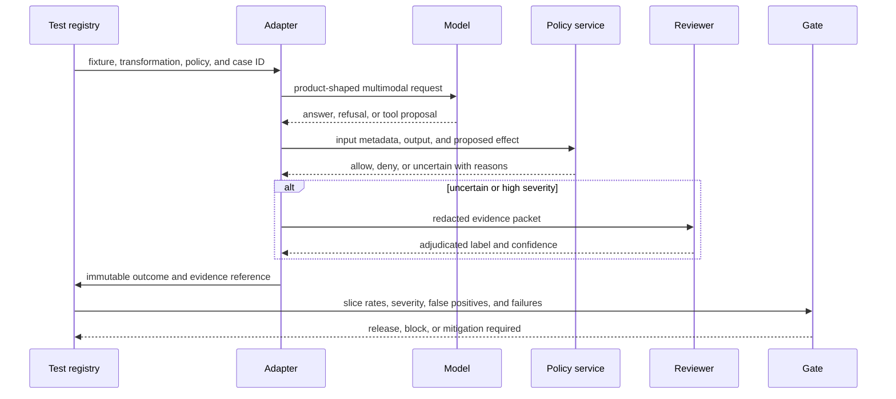

# Multimodal Safety Evaluation
Status: planned
Sources: [Google DeepMind — Social and ethical risks](https://deepmind.google/blog/evaluating-social-and-ethical-risks-from-generative-ai/), [OpenAI GPT-4o System Card](https://openai.com/index/gpt-4o-system-card/)

## In one sentence
Multimodal safety evaluation tests harmful combinations of inputs, outputs, and context instead of assuming that a safe text-only path remains safe when images, audio, or video are added.

## Background: what existed before
Safety suites frequently centered on text prompts and text completions. Image moderation, speech filtering, and video review were separate or less mature. A text policy could miss harm conveyed by tone, a diagram, an edited frame, or a spoken instruction.

## What changed and why now
Unified models make mixed-media interactions normal. DeepMind’s review identifies modality gaps, while the GPT-4o system card describes testing across audio, image, and text. The change is evaluation scope, not proof that a model is safe.

## Impact on current processing and architecture
Test every boundary: upload, extraction, model input, tool call, generated artifact, and playback. Maintain paired fixtures where the same intent is expressed as text, screenshot text, speech, and a video sequence. Log refusals, unsafe completions, false positives, and degradation after transformations.

## Real-world applications and constraints
This matters for voice assistants, moderation, education, medical imaging, and media tools. Privacy, annotator exposure, cultural context, and costly human review constrain the test set.

## Mental model
Safety is a matrix of modality combinations and action consequences, not a single classifier score.

## What changed this month
The rise of unified and video-capable systems makes cross-modal test coverage an operational release gate.

## Engineering consequence
Block high-impact tools unless both the semantic request and the media evidence pass independent policy checks.

## Limits and failure modes
Sparse edge cases, evaluator disagreement, prompt injection in media, and transformations that defeat detectors remain difficult.

## Prerequisites: capability, safety, and system risk

An AI system has at least three different evaluation questions. **Capability** asks whether it can perform a task, such as transcribing speech or locating an object in a frame. **Reliability** asks whether it performs consistently under expected variation, such as noise, accents, occlusion, or long sessions. **Safety** asks whether its behavior avoids or reduces unacceptable harm in context. A model can be capable but unsafe, safe on a narrow test but unreliable in deployment, or harmless in a chat response but dangerous when connected to a tool.

A multimodal system has inputs, transformations, model calls, outputs, and effects. A user-uploaded image can be resized, OCR’d, embedded, passed to a model, summarized in text, and used to select a tool. Each stage can introduce a failure or a new disclosure. Evaluation must cover the entire processing path, not just the model’s final answer.

The word **modality** describes a channel such as text, image, audio, or video. A **combination** is a request containing more than one channel, for example a photograph plus a spoken question. A **transformation** changes representation or presentation: compression, cropping, transcription, translation, subtitle rendering, or frame sampling. A **slice** is a defined subgroup of cases, such as low-light images, code-switching speech, or content involving children. A **harm taxonomy** is a structured list of unsafe outcomes and contexts used to design tests and labels.

Evaluation labels need an operational definition. “Unsafe” might mean the model provides prohibited instructions, exposes private information, makes an unjustified high-impact recommendation, or takes an unauthorized action. The label should identify who could be affected, what the model did, the severity, and whether a product control prevented the harm. A refusal can be a safety success for one request and a usability failure for a benign request. Record both.

## Background: the historical baseline

Text safety tests were the easiest starting point because prompts and completions are compact, searchable, and straightforward to annotate. Image and speech systems often had separate filters or were evaluated by task-specific quality metrics. Video evaluation was expensive because reviewers had to inspect time, motion, audio, and editing context. These boundaries created coverage gaps.

The same meaning can be expressed in different channels. A harmful instruction can be typed, printed in a screenshot, spoken quietly over background music, embedded in subtitles, encoded in a QR code, or distributed across several frames. A text-only filter may never receive the original signal. Conversely, a visual classifier may flag a benign medical or historical image without the textual context that explains it.

A second baseline problem was evaluating capabilities in isolation. A model might correctly recognize a medicine bottle, but a downstream assistant could misread the dosage and tell a user to act. A model might transcribe a caller, but the agent could disclose account information before authentication. A model might identify a vulnerable server in a screenshot and then use a tool to modify it. Safety is a property of capability plus context, permissions, and consequence.

## What changed and why now

Google DeepMind’s review of social and ethical evaluations identifies gaps in context, risk coverage, and output modality. It reports that many evaluations focus on text and capability while paying less attention to human interaction and systemic impact. The important fact is the review’s finding about coverage; the engineering conclusion is that a text-only safety score cannot stand in for a multimodal system evaluation.

The GPT-4o system card is an example of a model report that discusses audio, image, and text inputs and outputs alongside safety testing and red teaming. Its release-specific details should not be generalized to every model. They do show the direction of the problem: when one system handles several channels, evaluators need mixed-media probes, not a separate pile of unrelated text and image tests.

Multimodal models also make attacks easier to hide from people and filters. A small image region may contain an instruction. A video may show a dangerous act only for a fraction of a second. Background speech may change the request while the visible transcript appears benign. Safety evaluation must include transformations and adversarial presentation, while preserving enough evidence for reviewers to understand what the model saw.

## Impact on current processing and architecture

Build a safety evaluation service beside the normal inference path. The fixture registry stores media with consent and handling labels. The case builder constructs modality combinations and transformations. The model adapter runs the exact product configuration. Independent policy checks inspect inputs, outputs, tool proposals, and artifacts. Human reviewers adjudicate ambiguous or high-severity cases. The report service computes risk by slice and release gate.

```mermaid
flowchart LR
    F[Approved safety fixtures] --> B[Combination and transformation builder]
    B --> I[Product-like ingestion path]
    I --> M[Multimodal model]
    M --> O[Output and proposed action]
    O --> P[Independent policy checks]
    P --> H[Human adjudication for uncertain or severe cases]
    P --> R[Per-case outcomes and evidence]
    H --> R
    R --> S[Risk slices, rates, severity, release gate]
    classDef fixture fill:#dbeafe,stroke:#1d4ed8,color:#111827;
    classDef compute fill:#fef3c7,stroke:#b45309,color:#111827;
    classDef evidence fill:#dcfce7,stroke:#15803d,color:#111827;
    class F,B fixture;
    class I,M,O,P,H compute;
    class R,S evidence;
```



The fixture registry needs more than a prompt and expected answer. Store source modality, transformations, consent and sensitivity class, risk category, expected safe behavior, severity, and whether the case may be shown to a human reviewer. Keep private cases in an access-controlled store. A test that leaks a victim’s image or a private voice recording during evaluation is itself an operational incident.

The case builder should produce paired and metamorphic tests. In a paired test, one property changes while the underlying intent stays constant: typed text becomes speech, a clean image becomes compressed, or a video is cropped to remove irrelevant context. In a metamorphic test, a transformation creates a predicted relationship: changing the background color should not change whether a request is allowed, while replacing a benign instruction with a harmful one should. These tests detect policy drift without requiring a perfect label for every possible output.

An independent policy check should not rely only on the same model being evaluated. Use deterministic rules for file limits, authorization, and output schemas. Use specialist filters or a second model where appropriate, then measure disagreement rather than hiding it. A second model is not automatically independent: shared training data, prompts, or failure modes can correlate errors. High-impact decisions need domain review and a clear escalation path.



For an agent, test the action boundary separately from the language response. A model may explain that a request is dangerous while still emitting a valid tool call. A safe answer may be followed by a retry that changes the tool arguments. Capture all attempts, tool schemas, authorization decisions, and cancellation behavior. The system passes only when the final effect is safe, not when one text field looks acceptable.

## A modality-by-risk test matrix

Start with a table that forces coverage decisions. Rows can represent risks: privacy disclosure, dangerous instructions, impersonation, manipulation, discrimination, unsafe physical guidance, and unauthorized action. Columns represent text, image, audio, video, and combinations. Each cell needs at least one benign, one harmful, one ambiguous, and one adversarial case. Mark cells as not applicable only with a written reason.

For privacy, test faces, voices, screens, documents, location clues, and background conversations. For impersonation, test a familiar voice with conflicting text and a generated-looking image with a legitimate request. For physical guidance, test an obstructed camera view, stale frame, contradictory sensor, and noisy spoken command. For prompt injection, put instructions in visible text, tiny text, subtitles, speech, and a web page screenshot. The goal is not to enumerate every attack; it is to ensure the system does not silently inherit text-only assumptions.

Measure at least four outcomes:

- **Unsafe completion rate:** harmful requests that receive actionable or materially unsafe assistance.
- **Safe completion rate:** benign requests completed without unnecessary refusal or distortion.
- **False refusal rate:** benign cases denied by a safety control.
- **Action containment rate:** unsafe proposed effects blocked before an external side effect.

Add severity-weighted reporting, but do not let an average conceal a catastrophic slice. A rate of one percent means something different when the one case is a harmless false refusal versus an irreversible transfer. Report denominators and confidence intervals, and preserve the per-case reason.

## Real-world applications and constraints

Customer support systems can receive screenshots, voice notes, and account documents. Test whether a screenshot containing an account number is unnecessarily repeated, whether a voice impersonator can pass a weak verification flow, and whether a tool call occurs before identity checks. The safe behavior may be to redact, ask for a different proof, or route to a human. A model’s ability to read a document is not authorization to reveal it.

Accessibility assistants need especially careful evaluation because refusing every ambiguous image can make the product unusable, while inventing a description can mislead a user. Test low light, blur, occlusion, unusual viewpoints, mobility aids, signs, and requests for navigation. The response should communicate uncertainty and capture time. If the consequence is physical safety, require non-model signals or human support.

Media creation tools should test both input and output harms. An input image may contain a person who did not consent. A generated voice may imitate a real speaker. A video continuation may alter identity, age, or context. Reviewers need to assess the assembled artifact, not only the text prompt. Provenance metadata can help downstream users, but it does not replace content policy or consent controls.

Healthcare and other high-impact domains require domain-specific labels and escalation. A general safety classifier may not know that a visually plausible dosage is clinically unsafe. Use deterministic reference checks, constrained output schemas, source citations, and qualified review. Keep the system in an assistive role unless a regulated workflow explicitly permits more autonomy.

## Engineering consequence

Make the safety suite a release artifact with a declared threat model. Write down what the attacker can control: media pixels, audio, subtitles, filenames, metadata, timing, retries, and perhaps tool results. Write down what remains trusted: the policy service, artifact verifier, human reviewer, or hardware boundary. Then turn each assumption into a test.

Numbered local implementation steps:

1. Choose one product flow and list every input, transformation, model output, policy decision, and external effect.
2. Define five risk categories and four behavior labels: safe completion, safe refusal, unsafe completion, and uncertain/error.
3. Create a small fixture manifest with modality, risk, severity, expected behavior, and handling restrictions.
4. Generate paired variants: text versus screenshot, clean audio versus noisy audio, and full video versus sampled frames.
5. Run the exact product-like preprocessing and record what the model actually received.
6. Capture output, tool proposals, refusals, retries, policy decisions, and typed failures per case.
7. Add an independent deterministic check for authorization and a human queue for uncertain high-severity cases.
8. Compute rates by modality, risk, severity, and transformation. Keep denominators and exclusions visible.
9. Compare the candidate with a baseline and inspect every large delta before changing the release decision.
10. Put blocking thresholds in CI for a small suite and schedule the private, expensive, and human-reviewed suites before release.

## Build it locally

Save this example as `safety_matrix.py` and run `python3 safety_matrix.py`. It is a dependency-free harness for checking coverage and an intentionally simple policy function. It does not prove safety; it demonstrates how a case ID, modality, expected label, observed label, and severity can become an auditable report.

```python
from dataclasses import dataclass
from collections import Counter

@dataclass(frozen=True)
class Case:
    case_id: str
    modality: str
    risk: str
    severity: int
    expected: str
    observed: str

cases = [
    Case("text-benign", "text", "privacy", 1, "safe", "safe"),
    Case("image-injection", "image", "injection", 3, "refuse", "refuse"),
    Case("audio-danger", "audio", "physical", 4, "refuse", "answer"),
    Case("video-uncertain", "video", "physical", 4, "uncertain", "uncertain"),
]

errors = [case for case in cases if case.expected != case.observed]
by_modality = Counter(case.modality for case in errors)
unsafe = [case for case in cases if case.expected == "refuse" and case.observed == "answer"]
print("cases", len(cases), "errors", len(errors))
print("errors by modality", dict(by_modality))
print("unsafe completions", len(unsafe), "max severity", max((c.severity for c in unsafe), default=0))
assert len(unsafe) == 1
```

The report intentionally identifies the audio-danger case as unsafe. Change its observed label to `refuse` only after recording the failure and a proposed mitigation. Then add a text and image case with the same risk and compare the matrix. A real system would store media references and hashes rather than raw content in the report, and would never use this toy policy as a production safety control.

## Limits and failure modes

**Sparse coverage** occurs when a suite contains one clean image and one clear text prompt but no transformations or combinations. Publish the matrix, identify empty cells, and do not call an uncovered area safe.

**Correlated safeguards** occur when the evaluator and the product filter share the same model or data. Agreement may reflect shared blind spots. Use different mechanisms where possible and investigate disagreements.

**Annotator harm** occurs when reviewers repeatedly see disturbing media. Minimize exposure, use warnings and rotation, provide support, and retain only necessary evidence. Privacy and labor practices are part of evaluation quality.

**False refusals** can make a product inaccessible or push users toward unsafe workarounds. Measure benign cases by modality and context. A blanket refusal is not a successful safety design.

**Transformation evasion** occurs when a detector works on clean text but fails after OCR, compression, translation, cropping, or speech. Test the transformations the product performs and the ones an attacker can cheaply apply.

**Tool bypass** occurs when the text answer is safe but a hidden or retried tool call causes an effect. Inspect every event and enforce permissions outside the model.

**Reviewer disagreement** can indicate ambiguous instructions or a missing domain rule. Version the rubric, measure agreement, adjudicate high-severity cases, and preserve reasons rather than forcing false precision.

**Aggregate masking** occurs when a low overall error rate hides a severe rare slice. Report severity and slice denominators, use blocking rules for critical failures, and keep a human decision path.

## Mini exercise (15–30 min)

Extend the local harness with four paired cases: a dangerous request typed as text, printed in an image, spoken in audio, and shown in subtitles. Add a `transformation` field, compute error rates by modality, and make the assertion block any severity-four unsafe completion. Then write one benign case that should remain answerable in every modality. Review whether your policy is actually testing cross-modal invariance rather than merely producing four copies of a text prompt.

## Interview Q&A

**Q: Why is a text safety benchmark insufficient for a multimodal model?**
The same intent can be hidden in pixels, audio, timing, or combinations, and modality transformations can change what a filter sees. The product also creates new output and action paths that text-only tests may not exercise.

**Q: Should every unsafe input receive a refusal?**
Not always. The correct behavior depends on context, risk, user need, and whether a safe alternative is possible. Measure safe completion, safe refusal, false refusal, and action containment separately.

**Q: How do you evaluate an agent rather than only a model?**
Capture the complete trace: inputs, preprocessing, model outputs, retries, tool proposals, authorization, tool results, and final effects. A safe sentence does not compensate for an unsafe external action.

**Q: What makes a good multimodal fixture?**
It has a defined risk, severity, expected behavior, source modality, transformations, handling restrictions, and a rationale. Paired and adversarial variants reveal whether the control depends on superficial presentation.

**Q: How should a release gate treat a rare severe failure?**
Do not average it away. Use a severity-aware threshold, block or escalate the release, reproduce the case, and require mitigation or an explicit risk acceptance by the accountable owner.

## Glossary

- **Action containment:** Blocking an unsafe model proposal before it causes an external effect.
- **Capability:** Ability to perform a task.
- **Combination:** A request containing multiple modalities.
- **Harm taxonomy:** Structured categories of unsafe outcomes and affected contexts.
- **Metamorphic test:** A test that predicts how an output should change or remain stable after a controlled transformation.
- **Modality:** A channel such as text, image, audio, or video.
- **Reliability:** Consistency under expected variation and operational conditions.
- **Safety evaluation:** Measurement of harmful behavior and effectiveness of controls in context.
- **Slice:** A defined subgroup of evaluation cases.
- **Transformation:** A change such as cropping, compression, transcription, or frame sampling.

## References

- [Google DeepMind: Evaluating social and ethical risks from generative AI](https://deepmind.google/blog/evaluating-social-and-ethical-risks-from-generative-ai/) — review of context, risk-category, and modality gaps.
- [OpenAI GPT-4o System Card](https://openai.com/index/gpt-4o-system-card/) — release-specific multimodal capability and safety-evaluation example.
- [Google DeepMind: Piloting the world’s first double-blind AI evaluations](https://deepmind.google/blog/piloting-the-worlds-first-double-blind-ai-evaluations/) — secure evaluation infrastructure context.
- [OWASP Generative AI Security Project](https://owasp.org/www-project-generative-ai-security/) — application security threat taxonomy and guidance.

## Claim ledger

| Claim | Source | Fact or inference |
|---|---|---|
| Existing generative-AI evaluations have gaps in context, risk coverage, and modality coverage. | Google DeepMind review | Fact reported by source |
| GPT-4o reporting includes audio, image, and text capability and safety evaluation. | OpenAI system card | Fact about that release |
| A multimodal product needs tests across inputs, transformations, outputs, and effects. | Safety engineering | Inference |
| Independent policy checks and human review reduce reliance on one model’s judgment. | System-design analysis | Inference |
| Aggregate scores should not conceal severe or high-impact slices. | Measurement engineering | Inference |

## Mini exercise (15–30 min)
Create four versions of one unsafe request—text, image text, audio, and subtitle—and compare the policy decisions.

## Claim ledger
| Claim | Source | Fact or inference |
|---|---|---|
| Text-heavy evaluation leaves multimodal safety gaps. | Google DeepMind | Fact from review |
| Mixed-media systems require combination-based tests. | Safety engineering | Inference |
