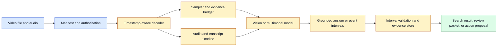
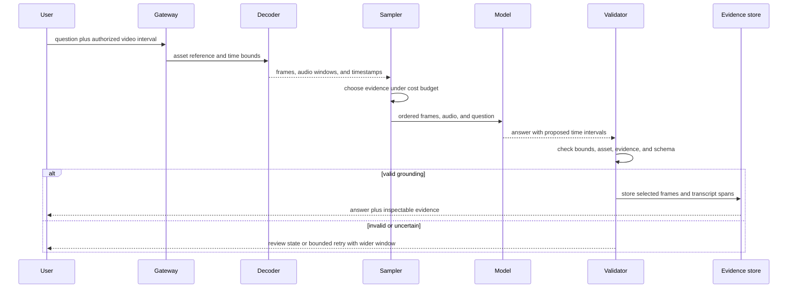

# Video Temporal Grounding
Status: planned
Sources: [Google Blog — Gemini Omni 1.1 Flash](https://blog.google/innovation-and-ai/technology/developers-tools/build-with-gemini-omni-1-1-flash/), [Google DeepMind — Generating audio for video](https://deepmind.google/blog/generating-audio-for-video/)

## In one sentence
Temporal grounding links a model’s statement or action to the interval in a video that supports it.

## Background: what existed before
Many video systems sampled a few frames and produced one caption. This reduced compute but discarded brief actions, transitions, and the ordering that distinguishes “before” from “after.”

## What changed and why now
Video APIs increasingly expose clips, prior context, scene continuation, and reference segments. Google’s August announcement describes up to ten seconds of prior context for scene extension and three-second video references. These are release-specific controls; the engineering pattern is explicit temporal context.

## Impact on current processing and architecture
Represent every clip with start time, end time, frame rate, audio offset, and source hash. Sampling policy should be recorded beside the prompt. Answers that matter should cite an interval or return evidence frames.

## Real-world applications and constraints
Use temporal grounding in incident review, sports analysis, maintenance, accessibility, and editing. Long videos raise storage, decode, privacy, and latency costs; sparse sampling can miss decisive events.

## Mental model
Video understanding is indexed search over a changing scene, not image classification repeated without order.

## What changed this month
Continuations and reference-video controls turn temporal context into a first-class API parameter.

## Engineering consequence
Make temporal windows inspectable and reject answers whose evidence lies outside the user-authorized interval.

## Limits and failure modes
Frame aliasing, clock drift, occlusion, scene cuts, and hallucinated event order can produce persuasive but unsupported answers.

## Prerequisites: video is data plus time

An image has spatial structure; video adds an ordered time axis. A video file contains frames, an audio stream, metadata, and a timeline. The **frame rate** describes how often frames are represented, while the **presentation timestamp** says when a frame should be shown. The two are related but not interchangeable after variable-rate capture, editing, or dropped frames. A **clip** is a bounded interval selected from a larger asset. A **temporal window** is the interval an analyzer actually receives.

**Temporal grounding** means associating an answer, event, or prediction with the interval that supports it. If a system says “the package is picked up,” a grounded answer should identify when that action occurs and, ideally, which frames or audio segment justify it. This helps users inspect an answer and helps engineers distinguish a recognition error from a timestamp error.

The basic video pipeline is decode, select, represent, infer, and map results back to source time. Decode turns a compressed file into frames and audio. Selection chooses all frames, fixed-rate samples, keyframes, or event-centered windows. Representation converts selected media into model inputs. Inference produces labels, text, or generated media. Mapping restores source timestamps and asset identity. A bug in any stage can produce a plausible but incorrectly timed result.

## Background: the historical baseline

Early video understanding systems commonly sampled a fixed number of frames, classified each frame, and pooled predictions. This made compute predictable, but it treated time as a sequence of snapshots rather than a source of meaning. A single frame may show a person holding a cup without revealing whether the cup was picked up, put down, or passed to someone else.

Other systems converted the soundtrack to a transcript and analyzed sampled images separately. An orchestration layer then joined outputs by approximate timestamps. This was serviceable for search and coarse captioning but brittle when clocks drifted, speech overlapped action, or the answer depended on a short interval between sampled frames.

Video generation had a related baseline: generate a short clip from a prompt and discard the internal relationship between the source, prompt, and continuation. Editing workflows needed manual trimming and keyframe control. The result could look coherent locally while a character, camera, or object changed across a transition.

These baselines are still appropriate when the task is coarse, the video is short, and missed events are acceptable. The engineering mistake is using a fixed sampling recipe without stating what temporal resolution the product promises.

## What changed and why now

Video APIs increasingly expose temporal context as a user-controlled parameter. Google’s August 27, 2026 announcement for Gemini Omni 1.1 Flash describes scene extension using up to ten seconds of prior context, ten-second extensions, a cumulative length up to forty seconds, first-and-last-frame conditioning, and up to three seconds of reference video. Those are release-specific vendor claims. The durable change is that a media workflow can explicitly pass prior intervals, boundary frames, and reference segments instead of relying on an implicit final frame.

Temporal context changes the contract from “generate a clip from a prompt” to “continue or transform a versioned interval while preserving selected constraints.” The application must identify the parent asset, the source interval, the frame or audio boundary, and the desired continuity. It should also make the model’s context visible to the user or reviewer when continuity is important.

## Impact on current processing and architecture

The ingestion service should create a media manifest before inference. It records asset ID, duration, frame and audio properties, timebase, codec, source hash, tenant, authorization interval, and any edit history. A decoder produces frames and audio windows with timestamps. A sampler selects evidence under a budget. The model adapter receives an ordered request and returns predictions with source references. A grounding layer checks that returned intervals are valid and maps them back to the original asset.



Sampling is a policy decision. **Uniform sampling** takes frames at regular intervals and works for broad scene summaries. **Keyframe sampling** uses codec or edit boundaries and is efficient but may miss motion. **Adaptive sampling** adds frames around detected changes, speech, or user-selected regions. **Event-centered sampling** starts from a cheap detector and expands a window around candidate events. Each method trades coverage, cost, and reproducibility. Persist the sampling policy and selected timestamps so a later reviewer can reproduce what the model saw.

The sampling interval should follow the event duration and risk. If an event can occur for 100 milliseconds, one frame per second has a high chance of missing it. Increasing the sampling rate raises decoded data, model tokens, memory, and latency. A cheap motion or audio detector can narrow the expensive model call, but the detector can create false negatives. For a safety-relevant event, the system should use a sensor or dedicated detector with a known recall target rather than assuming a general model will recover a missed frame.

Audio and video need one clock. Preserve the audio start offset, sample rate, channel count, video timebase, and any edits. A transcript word timestamp may refer to the decoded audio timeline, while a video frame timestamp may be expressed in presentation ticks. Convert both into a canonical unit and retain the original values for debugging. Test known offsets, variable frame rate, silence, dropped frames, and clips that start mid-sentence.

Grounded answers should have a schema. A useful event record contains `asset_id`, `start_seconds`, `end_seconds`, `label`, `confidence`, `evidence_frame_ids`, `audio_span`, and `model_version`. The schema should reject negative times, intervals beyond duration, reversed bounds, unknown assets, and evidence IDs that do not belong to the request. Confidence describes the model’s estimate; it does not prove the interval is correct. A reviewer should be able to open the selected window without searching the entire source.



A bounded retry should change one declared variable. If the model returns an interval with no supporting frame, expand the window or increase sampling and record that action. Do not repeatedly resend the whole video until a desired answer appears; that creates cost and selection bias. The retry budget belongs in the request’s state. A user cancellation should stop decode, inference, and evidence storage where possible.

## Temporal retrieval and search

A long video is better treated as a collection of timestamped searchable units than as one giant prompt. Build segments using scene cuts, speech pauses, topic changes, or fixed windows. Store each segment’s source interval, transcript, visual summary, embedding if used, and access metadata. At query time, retrieve candidate intervals, expand around boundaries, and run a more expensive grounded model on a bounded set.

The retrieval index can return the right topic but the wrong time. A transcript chunk may mention an object before it appears on screen. A visual segment may include the object after a spoken reference. Re-rank with both modality evidence and preserve neighboring context. Boundary expansion is useful because events often cross segment cuts, but it increases the amount of sensitive media exposed to the model.

For generated continuation, the parent clip is evidence and a constraint. Store the exact prior interval, not just a user-facing filename. If a scene is extended repeatedly, the graph may contain several generations with overlapping context. A later export should point to the generated parent and the original source. When continuity fails, engineers can then determine whether the cause was missing context, a changed prompt, a different model version, or an inherent generation limit.

## Real-world applications and constraints

In incident review, an operator may ask when a person entered a restricted area or when an alarm began. False negatives can matter more than average caption quality. Use multiple sampling rates, retain evidence windows, and require human confirmation before a report becomes an enforcement action. Camera clocks may be wrong, so show the source timestamp and ingestion timestamp separately.

In manufacturing, a system may locate a defect or verify that a procedure step occurred. Camera vibration, occlusion, reflective surfaces, and variable lighting create difficult slices. A detector can propose candidate windows, but a deterministic measurement or human inspection may be required for a release decision. Store the fixture and camera configuration so a later reviewer can reproduce the observation.

In accessibility, a user may ask what happened during a short video or what a person said while an object moved. The response should give time ranges and communicate uncertainty. Do not imply continuous observation if the service sampled sparsely. Let the user request a closer look at a chosen interval and offer a transcript or frame view.

In editing, scene continuation and first/last-frame controls can speed storyboarding. The product needs branchable versions, cancellation, render progress, output validation, and cost previews. A low-resolution draft may be suitable for composition but hide text, hands, or lip-sync defects. Require a final-resolution review before publication.

In security operations, a video may contain credentials on a screen, faces, or sensitive facility layouts. Authorization should cover the exact interval and derivative evidence. A user authorized to view an incident may not be authorized to export every frame or send a generated summary to an external service. Media access is not automatically inherited by a model worker or reviewer.

## Engineering consequence

Define a temporal service-level objective before choosing a sampler. Examples include “detect events longer than two seconds with at least 95% recall on the fixture set” or “return a grounded answer within five seconds for clips under one minute.” The requirement determines whether uniform sampling is sufficient, whether a detector is needed, and whether the system may operate asynchronously.

Numbered local implementation steps:

1. Pick a short fixture video with known events and a written timeline.
2. Define the event duration, acceptable timestamp error, evidence format, and consequence of a miss.
3. Create a manifest with asset hash, duration, timebase, frame rate, audio offset, and authorization interval.
4. Implement uniform sampling and record every selected timestamp.
5. Add an event-centered sampler that expands around candidate timestamps under a fixed budget.
6. Validate that every returned interval belongs to the source asset and lies within the authorized range.
7. Add audio spans and test a deliberate audio-video offset.
8. Compare recall, timestamp error, bytes decoded, model input size, and p95 latency for both samplers.
9. Test interrupted jobs, duplicate retries, invalid intervals, and a video with no target event.
10. Store evidence references and sampling metadata with each answer, then review missed and false events.

## Build it locally

Save this example as `temporal_windows.py` and run `python3 temporal_windows.py`. It uses no external library. The example selects bounded evidence windows around candidate events, merges overlaps, and refuses to cross the authorized interval. It is an application-side model of temporal grounding, not a video decoder or a substitute for evaluating a real model.

```python
from dataclasses import dataclass

@dataclass(frozen=True)
class Event:
    start: float
    end: float
    label: str

def grounded_windows(candidates, authorized_start, authorized_end, padding, budget):
    windows = []
    for event in sorted(candidates, key=lambda item: item.start):
        start = max(authorized_start, event.start - padding)
        end = min(authorized_end, event.end + padding)
        if end <= start:
            continue
        if windows and start <= windows[-1][1]:
            old_start, old_end, labels = windows[-1]
            windows[-1] = (old_start, max(old_end, end), labels + [event.label])
        elif sum(item[1] - item[0] for item in windows) + (end - start) <= budget:
            windows.append((start, end, [event.label]))
    return windows

candidates = [Event(1.2, 1.8, "door opens"), Event(1.7, 2.4, "person enters"),
              Event(8.0, 9.0, "vehicle passes")]
for window in grounded_windows(candidates, 0.0, 6.0, 0.5, 4.0):
    print(window)
```

The last candidate is outside the authorized interval and is omitted. The first two overlap and become one inspectable window. Extend the example with frame IDs at 5 frames per second and calculate which frames fall inside each window. Then add a deliberately invalid candidate with negative time and decide whether to discard it, flag the job, or fail the entire response. For a high-integrity system, invalid model output should be observable rather than silently repaired.

## Limits and failure modes

**Frame aliasing** occurs when sampling misses a short action. Report the minimum event duration your sampler can support and use a higher-rate or detector-assisted path for shorter events.

**Boundary errors** occur when an event begins before one segment and ends after another. Expand windows around cuts and preserve neighboring context, but keep the expansion within authorization and budget.

**Clock drift** occurs when audio, video, and external sensors use different clocks. Normalize to a canonical timebase and maintain tests with known offsets and variable-rate streams.

**Occlusion** means the evidence is not visible even if the event occurred. The model should express uncertainty rather than infer an unseen action as fact. Multiple camera views or dedicated sensors may be needed.

**Scene cuts** can make adjacent frames semantically unrelated. Detect cuts or use shot boundaries so a single window does not accidentally combine two scenes.

**Transcript mismatch** occurs when a transcript word is mapped to the wrong video moment or a speaker is misidentified. Preserve audio spans and speaker metadata, and avoid presenting approximate alignment as exact.

**Generated continuity failure** occurs when a continuation changes identity, geometry, lighting, or speech. Compare the generated boundary with the parent, inspect first and last frames, and let users reject or branch rather than silently overwrite.

**Authorization overreach** occurs when a model sees more of a video than the requester may access. Enforce interval filtering before decoding or model upload and apply the same rule to cached evidence and exports.

**Retry duplication** occurs when a timeout leads to a second paid render or duplicate event. Use idempotency keys, durable job state, and parent-child artifact IDs.

## Mini exercise (15–30 min)

Create a 12-second fixture timeline with three events lasting 0.4, 1.5, and 3 seconds. Compare uniform sampling at one frame per second with the local window selector. Record which events are covered, the total evidence duration, and the timestamp error. Add an audio event offset by 0.3 seconds and update the manifest. Finish by writing one test that rejects a model interval outside the authorized range.

## Interview Q&A

**Q: Why is one frame per second not enough for video understanding?**
It can miss events shorter than the sampling interval and cannot reliably establish order or motion. It may be adequate for coarse summaries when the product explicitly accepts that limitation.

**Q: What does a grounded answer contain?**
A source asset, start and end times, a description or label, and evidence references such as frames or audio spans. The schema should be validated before display or action.

**Q: How do you control long-video cost?**
Segment and index the video, retrieve candidate windows, expand boundaries, and apply an expensive model only to a bounded set. Record sampling and retrieval versions for reproducibility.

**Q: How should an agent use a video-derived fact?**
As evidence for a decision, not as authorization. The exact interval, freshness, policy, and domain checks must pass before a tool or physical effect is allowed.

**Q: How do you debug a wrong timestamp?**
Inspect the source manifest, decoder timestamps, selected frames, audio offset, model response, interval validator, and any edit transforms. The answer may be semantically right but mapped to the wrong clock.

## Glossary

- **Adaptive sampling:** Selecting more evidence around detected changes or candidate events.
- **Clip:** A bounded interval from a larger media asset.
- **Frame rate:** The rate at which video frames are represented or presented.
- **Keyframe:** A frame usable as an independent decode or edit anchor.
- **Presentation timestamp:** The time at which a frame or audio sample belongs on the playback timeline.
- **Temporal grounding:** Linking an answer or event to its supporting source interval.
- **Temporal window:** The time interval actually selected for analysis.
- **Timebase:** The unit and clock used to express media timestamps.
- **Uniform sampling:** Selecting frames at regular time intervals.

## References

- [Google Blog: Gemini Omni 1.1 Flash](https://blog.google/innovation-and-ai/technology/developers-tools/build-with-gemini-omni-1-1-flash/) — August 2026 temporal context, scene extension, keyframe, and reference-video controls.
- [Google DeepMind: Generating audio for video](https://deepmind.google/blog/generating-audio-for-video/) — synchronized video/audio generation architecture and limitations.
- [Google DeepMind: Building architectures that can handle the world’s data](https://deepmind.google/blog/building-architectures-that-can-handle-the-worlds-data/) — general architecture context for varied inputs.
- [OpenAI GPT-4o System Card](https://openai.com/index/gpt-4o-system-card/) — multimodal input and evaluation context.

## Claim ledger

| Claim | Source | Fact or inference |
|---|---|---|
| Omni 1.1’s announcement describes ten-second prior context, cumulative scene extension, boundary frames, and reference video. | Google Blog | Fact, release-specific |
| V2A conditions generated audio on video and text and reports synchronization limitations. | Google DeepMind | Fact about the research system |
| Sampling policy determines temporal coverage, cost, and reproducibility. | Video systems engineering | Inference |
| Grounded intervals and evidence references improve inspection and debugging. | System-design analysis | Inference |
| Authorization must constrain decoded and cached video evidence. | Security and privacy design | Inference |

## Mini exercise (15–30 min)
Create a timestamped event manifest and compare one-frame-per-second sampling with event-centered sampling.

## Claim ledger
| Claim | Source | Fact or inference |
|---|---|---|
| Omni 1.1 exposes prior-context and video-reference controls. | Google Blog | Fact, release-specific |
| Evidence timestamps improve debuggability. | System design | Inference |
