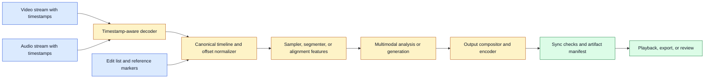
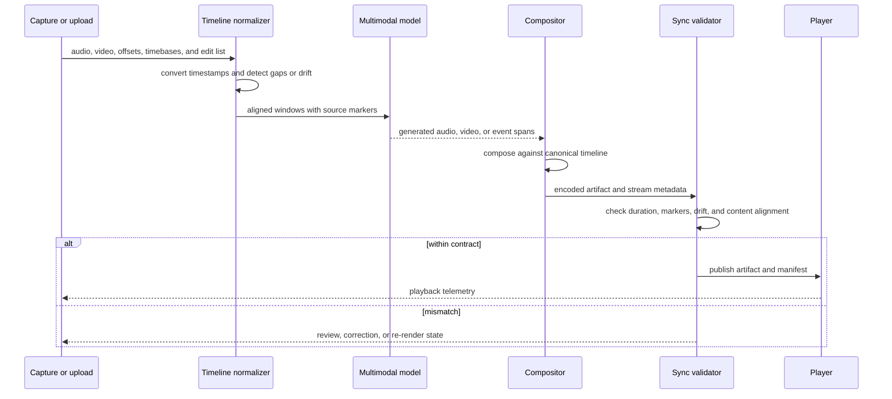

# Audio-Visual Synchronization
Status: planned
Sources: [Google DeepMind — Generating audio for video](https://deepmind.google/blog/generating-audio-for-video/), [OpenAI GPT-4o System Card](https://openai.com/index/gpt-4o-system-card/)

## In one sentence
Audio-visual synchronization preserves the timing and causal relationship between sound and moving images during analysis or generation.

## Background: what existed before
Video and sound were often processed independently: frames went to vision and waveforms went to audio. A later join on filenames or approximate timestamps was fragile, especially after edits, dropped frames, or variable latency.

## What changed and why now
End-to-end multimodal models and video-to-audio systems reason over both signals. DeepMind’s V2A work encodes video and prompts, generates compressed audio, and decodes a waveform, while noting dependence on video quality and lip-sync limitations.

## Impact on current processing and architecture
Carry a single timeline with explicit offsets and time bases. Validate frame count, sample rate, duration, and edit transforms. Keep generated tracks versioned independently so a sound revision does not silently replace the visual source.

## Real-world applications and constraints
Applications include captioning, dubbing, accessibility, editing, simulation, and event detection. Music, background noise, speech, and visual motion have different synchronization tolerances.

## Mental model
Synchronization is a contract between clocks, not an aesthetic property checked only at the end.

## What changed this month
Unified media workflows make synchronized input and output part of the API’s correctness contract.

## Engineering consequence
Add automated sync tests with known offsets and human review for speech, beats, and safety-critical alerts.

## Limits and failure modes
Drift, frame drops, mismatched transcripts, video artifacts, and uncanny lip motion remain common.

## Prerequisites: two streams, one timeline

Audio is a sequence of samples and video is a sequence of frames. Each stream has a rate, an origin, and timestamps. **Synchronization** means that events which belong together occupy the expected relationship on a shared timeline: a footstep sounds near the foot contacting the ground, a spoken word aligns with mouth motion, and a generated soundtrack begins at the intended scene boundary.

An audio sample is a numeric measurement of a waveform at a point in time. A **sample rate** says how many measurements are taken per second. A frame is one decoded image in a video sequence. A **frame rate** describes the intended presentation cadence. A **timebase** is the unit used to express timestamps. A stream’s **offset** is the difference between its start and the shared origin. **Drift** is a changing offset caused by clocks or processing that run at slightly different rates.

The common shortcut is to align streams by file position or array index. That works only when sampling rates, starts, edits, and durations are identical. Audio and video often use different rates, variable-rate video, codecs, edits, silence padding, or missing frames. The correct approach is to preserve timestamps through capture, decode, transform, inference, encode, and playback.

## Background: the historical baseline

Traditional media production used a master timeline and explicit synchronization markers. A recording could include a clap, a timecode, or a slate visible and audible at once. Post-production tools then adjusted tracks against that reference. Consumer software often hid the details and assumed a constant frame rate, which was acceptable for simple clips.

AI pipelines initially separated modalities. An ASR service received audio and returned text; a vision model saw frames; a text model composed a result. An editor might generate music after a video render. The final join was frequently approximate: attach audio to the video file, trim the longer stream, and inspect by eye. This creates problems when the generated track responds to events that happen at different times or when the input’s timestamps were lost during preprocessing.

DeepMind’s video-to-audio work describes encoding video, conditioning a diffusion model, decoding compressed audio, and combining the waveform with video. It also reports limitations around video artifacts and speech lip synchronization when the video generator was not conditioned on the same transcript. The source is a useful example because it shows both the capability and why synchronized generation is not solved by simply producing two high-quality files.

## What changed and why now

Unified multimodal models and media APIs can analyze or generate several streams together. OpenAI’s GPT-4o system card describes an end-to-end multimodal model that accepts combinations of text, audio, image, and video and produces multiple output types. Google’s August 2026 Gemini Omni 1.1 Flash announcement adds video references, scene continuation, boundary-frame controls, and high-resolution output. These are release-specific descriptions, not a guarantee of exact synchronization for every input.

The architectural change is that synchronization becomes an API contract. A request should state whether an audio file belongs to a video, where a clip begins, which reference interval is authoritative, and what timing tolerance is acceptable. An output should report source IDs, durations, offsets, and transformation lineage. A product cannot debug an uncanny transition if it retains only the final MP4.

## Impact on current processing and architecture

Create a canonical media timeline at ingestion. Keep original stream timestamps and convert them to a monotonic internal unit such as integer microseconds or rational timebase ticks. Do not use floating-point seconds as the only stored representation for long media, because repeated conversion and rounding can accumulate error. Retain presentation timestamps, decode timestamps when relevant, and edit operations.



The normalizer must handle missing and duplicated timestamps. If a video capture device drops a frame, the next frame may advance farther than expected. Do not invent a frame without recording that the source was incomplete. If audio has a gap, preserve the gap or insert explicit silence according to the product contract. A speech assistant may conceal a tiny gap for playback, while forensic analysis should preserve it.

There are several kinds of synchronization to measure. **Packet synchronization** asks whether transport preserved order and timestamps. **Playback synchronization** asks whether the client schedules both streams against the same clock. **Semantic synchronization** asks whether an event in one stream corresponds to the event in the other. A file can pass packet checks and still have bad lip-sync because the generated speech content does not match mouth movement.

For live systems, choose a master clock. The audio device clock, video device clock, server clock, and client playback clock can differ. A jitter buffer absorbs network variation but introduces delay. A synchronizer may drop or repeat a video frame, stretch audio slightly, or delay one stream. Each correction needs a threshold and an observable reason. Automatic correction is appropriate for small transport jitter, not for silently changing a safety alert’s timing.

Generated media needs boundary contracts. If a model extends a scene, the last source frame and first generated frame should be compared for dimensions, color space, cadence, and visual continuity. If generated audio starts at scene time 0, the compositor must not insert an unrecorded encoder delay. For first-and-last-frame conditioning, preserve which frames were supplied and their exact source timestamps. A “smooth transition” is a quality objective that must be evaluated against fixtures, not assumed from the presence of two keyframes.



## Alignment algorithms and trade-offs

The simplest alignment uses known markers. A clap, beep, subtitle timestamp, or common visual event establishes an offset. This is cheap and auditable. It fails when markers are absent, edited, or not visible to the model.

Cross-correlation compares audio signals to find a delay that maximizes similarity. It can detect a shifted copy of the same waveform, but it cannot determine whether a newly generated soundtrack is semantically appropriate. It is also sensitive to noise and repeated patterns.

Dynamic time warping (DTW) aligns feature sequences that vary in speed. It can compare phoneme or motion features when a speaker’s pace changes, but it can overfit and produce a visually plausible alignment for content that is not truly causal. Record the feature extraction and constraints. Do not use an alignment algorithm’s lowest distance as proof of authenticity.

Forced alignment uses a known transcript to estimate when words or phonemes occur. It helps captioning and dubbing, but a transcript can be wrong and generated mouth motion may not match it. For safety-sensitive voice identity or consent decisions, use additional evidence and human review.

Model-based alignment can learn relationships between audio and video, but its confidence is still a model output. Use it for candidate generation, then validate ranges and sample difficult cases. Distinguish **temporal precision**—how close a predicted boundary is to the reference—from **semantic correctness**—whether the two streams describe the same event. Improving one does not guarantee the other.

## Real-world applications and constraints

In live captioning, the system trades latency against correction. Early partial transcripts may be revised when more audio arrives. Display the provisional state, preserve word timestamps, and never trigger a consequential action from a partial phrase. A captioning product should measure word error, timestamp error, correction delay, and behavior under packet loss.

In dubbing and translation, the translated sentence may be longer or shorter than the source. The pipeline can adjust speech rate, choose a different phrasing, or accept loose lip alignment. Preserve original and translated tracks, language metadata, speaker identity, and reviewer approval. A fluent translation that changes a warning’s timing is a production defect.

In media generation, a video-to-audio model can produce sound effects or music synchronized to visible action. DeepMind’s V2A source describes this pattern and notes that video artifacts can reduce audio quality. Test impacts, event timing, speech, silence, and unwanted audio. If the output is used in a professional edit, a low-resolution preview should not be the only sync review.

In robotics, a microphone and camera may detect the same event. Clock drift, vibration, reflections, and occlusion complicate fusion. A robot should not execute a physical action solely because audio and video appear aligned. Use current sensor state, safety interlocks, and an independent controller for the actuator.

In accessibility, synchronized descriptions let a user understand what happened while speech occurred. Give the user control over replay, speed, captions, and selected intervals. Do not describe a silent or unseen event as observed. A stale stream and a delayed answer should be visibly distinguished.

In security and compliance, audio and video may be evidence. Preserve originals, hashes, timestamps, acquisition metadata, and any repair or re-encoding. A convenience transcode that shifts audio by 300 milliseconds must not overwrite the evidentiary source. Access to voices, faces, and background conversations must be scoped.

## Engineering consequence

Define sync tolerances by task. A music visualizer may tolerate a loose relationship; lip-sync, captions, and an alarm system need different thresholds. Specify whether the tolerance is constant offset, maximum drift over duration, event-boundary error, or semantic mismatch. Then test each separately.

Numbered local implementation steps:

1. Choose a short fixture with a visible marker and an audible marker at a known time.
2. Write a media manifest containing duration, frame rate, audio rate, offsets, timebase, and source hashes.
3. Convert both streams into one canonical time unit without discarding original timestamps.
4. Implement a checker for duration mismatch, negative timestamps, gaps, and monotonicity.
5. Add a known offset and verify that the checker reports its magnitude and direction.
6. Add gradual drift and define whether correction, rejection, or review is appropriate.
7. Record stream transformations, codec settings, encoder delay, and generated asset parent IDs.
8. Test a partial transcript, dropped frame, duplicated packet, and scene boundary.
9. Compare automatic alignment with human judgment on speech, motion, and event timing.
10. Gate publication or actuator use on the task-specific sync contract and retain the evidence.

## Build it locally

Save this example as `sync_check.py` and run `python3 sync_check.py`. It models synchronization using event timestamps from two streams. It reports offset and accepts only a declared tolerance. The exercise deliberately avoids pretending to decode media; production code should obtain timestamps from a trusted decoder and preserve the source manifest.

```python
from dataclasses import dataclass

@dataclass(frozen=True)
class Marker:
    name: str
    time_ms: int

def compare_markers(video, audio, tolerance_ms):
    audio_by_name = {item.name: item.time_ms for item in audio}
    report = []
    for item in video:
        if item.name not in audio_by_name:
            report.append((item.name, "missing", None))
            continue
        delta = audio_by_name[item.name] - item.time_ms
        status = "pass" if abs(delta) <= tolerance_ms else "fail"
        report.append((item.name, status, delta))
    return report

video = [Marker("clap", 1000), Marker("word-start", 2400)]
audio = [Marker("clap", 1040), Marker("word-start", 2475)]
for row in compare_markers(video, audio, tolerance_ms=60):
    print(row)
```

The clap passes with a 40-millisecond offset while the word-start fails at 75 milliseconds. Add a third marker at 4,000 milliseconds with a 120-millisecond offset to model drift. Then change the function to report the slope between the first and last matched marker. A single offset correction cannot fix a growing drift. Finally, add a missing marker and decide whether the artifact should be rejected or sent to review.

## Limits and failure modes

**Constant offset** shifts one stream by a fixed amount. It is often correctable, but the correction must be recorded and applied only to the intended asset version.

**Clock drift** grows over time. Repeated resampling or time stretching can correct playback, but it can also alter speech or evidence. Define a maximum drift and monitor it continuously.

**Variable frame rate** breaks assumptions based on frame number. Use presentation timestamps and test seeking around cuts and dropped frames.

**Encoder delay** inserts or removes samples at boundaries. Measure the actual output and retain codec settings; do not infer alignment from nominal duration alone.

**Lip-sync mismatch** occurs when the transcript and generated mouth motion were produced under different conditions. Audio quality and visual continuity do not prove that words and mouth shapes correspond.

**Semantic false alignment** occurs when two streams share timing but describe different events. Marker and signal checks need semantic review for consequential media.

**Network jitter** causes playback delay or buffer underrun. Use a bounded jitter buffer, expose latency, and distinguish transport repair from content regeneration.

**Stream loss** can lead an application to fill gaps without disclosure. Preserve gaps or label repairs, especially in audit and safety workflows.

**Unauthorized evidence expansion** occurs when alignment causes a worker to decode or store neighboring media outside the permitted interval. Enforce access bounds before expansion and on derived artifacts.

## Mini exercise (15–30 min)

Use the local checker with five markers. Create one fixture with a constant 50-millisecond offset, one with drift from 20 to 140 milliseconds, and one with a missing marker. Compare a fixed-offset correction with a drift report. Write a publication rule that accepts the first fixture, reviews the second, and rejects or escalates the third. Explain why a passing timing check cannot establish semantic lip-sync.

## Interview Q&A

**Q: Why are audio and video not aligned by frame number?**
They use different rates, timestamps, offsets, and sometimes variable cadence. Frame number has meaning only with a stable timebase and a known origin.

**Q: What is the difference between drift and offset?**
Offset is a fixed difference at a point in time. Drift is a changing difference caused by clocks or processing rates diverging.

**Q: Does synchronized timing prove synchronized meaning?**
No. Two streams can contain unrelated content at the same timestamps. Semantic alignment needs content evidence and, for important cases, review.

**Q: How should a live system handle jitter?**
Choose a master clock, use a bounded jitter buffer, monitor delay and underruns, and apply small documented corrections. Do not hide large content mismatches as transport jitter.

**Q: How would you test a generated soundtrack?**
Check stream metadata and timing, compare event markers, inspect semantic correspondence, test speech and scene boundaries, and evaluate artifact quality on representative and adverse fixtures.

## Glossary

- **Audio sample:** Numeric measurement of a waveform at a point in time.
- **Drift:** A changing timing difference between streams.
- **Frame rate:** Intended rate at which video frames are presented.
- **Jitter buffer:** Queue that smooths variable network arrival times.
- **Offset:** Fixed difference between a stream’s timestamp and the shared origin.
- **Semantic synchronization:** Correspondence between the meanings or events of two streams.
- **Timestamp:** Time position attached to a frame, sample, or event.
- **Timebase:** Unit and clock used to represent timestamps.
- **Variable frame rate:** Video whose frame intervals are not constant.

## References

- [Google DeepMind: Generating audio for video](https://deepmind.google/blog/generating-audio-for-video/) — video-conditioned audio generation, architecture, synchronization, and limitations.
- [OpenAI GPT-4o System Card](https://openai.com/index/gpt-4o-system-card/) — end-to-end multimodal input/output and safety evaluation context.
- [Google Blog: Gemini Omni 1.1 Flash](https://blog.google/innovation-and-ai/technology/developers-tools/build-with-gemini-omni-1-1-flash/) — release-specific video context, reference, and continuation controls.
- [C2PA](https://c2pa.org/) — provenance context for media transformations and artifacts.

## Claim ledger

| Claim | Source | Fact or inference |
|---|---|---|
| DeepMind’s V2A work conditions generated audio on video and text. | Google DeepMind | Fact about the research system |
| V2A reports dependence on video quality and lip-sync limitations. | Google DeepMind | Fact about reported limitations |
| GPT-4o is described as an end-to-end multimodal model. | OpenAI system card | Fact about that release |
| A media API should preserve timestamps, offsets, and edit lineage. | Media systems engineering | Inference |
| Passing timing checks does not prove semantic correspondence. | Systems and evaluation analysis | Inference |
| Sync tolerances should be chosen by task consequence. | Engineering judgment | Inference |

## Mini exercise (15–30 min)
Generate a one-second audio click and visual marker, introduce offsets, and write a checker that reports the measured skew.

## Claim ledger
| Claim | Source | Fact or inference |
|---|---|---|
| V2A uses video and text conditioning for generated audio. | Google DeepMind | Fact |
| Timebase validation should be an ingestion invariant. | Media engineering | Inference |
