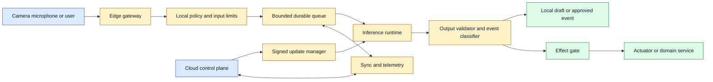

# Edge Model Serving
Status: planned
Sources: [Google DeepMind — Perceiver](https://deepmind.google/blog/building-architectures-that-can-handle-the-worlds-data/), [Hugging Face Blog](https://huggingface.co/blog)

## In one sentence
Edge model serving places inference near sensors or users so decisions can continue under bandwidth, privacy, or latency constraints.

## Background: what existed before
Centralized inference simplified upgrades and capacity pooling. Devices uploaded raw data and waited for a remote response, making the network a required dependency.

## What changed and why now
General multimodal architectures and smaller open models make local processing feasible for cameras, phones, robots, and gateways. Perceiver research shows why a common architecture is attractive for varied sensor inputs, though deployment still depends on hardware.

## Impact on current processing and architecture
An edge fleet needs signed model packages, staged rollout, device health, resource budgets, local queues, and a cloud reconciliation path. Never assume all devices have the same accelerator or clock.

## Real-world applications and constraints
Use edge inference for robotics, inspection, offline translation, and privacy-sensitive cameras. Thermal limits, intermittent connectivity, physical tampering, and fragmented updates are major constraints.

## Mental model
An edge model is a distributed service replica with a battery and a hostile network.

## What changed this month
Multimodal local workloads expand the edge contract from “classify a sensor” to coordinate several streams under a fixed budget.

## Engineering consequence
Define what the device may decide offline and what must be deferred to a trusted service.

## Limits and failure modes
Stale policy, clock skew, partial uploads, corrupted artifacts, and silently degraded sensors can make local decisions unsafe.

## Prerequisites: inference at the edge

The **edge** is the part of a system close to a user, sensor, robot, or physical process rather than a central cloud service. An edge device might be a phone, camera gateway, industrial computer, vehicle, or robot controller. **Edge inference** runs a fixed model on that device or a nearby gateway. It can reduce round trips and data transfer, but it turns one centralized service into a distributed fleet.

Four properties distinguish edge serving from ordinary local experimentation. The device may have limited CPU, memory, power, and storage. Connectivity may be delayed or absent. Software may be physically accessible to an attacker. The fleet may contain multiple hardware generations and versions. A model that works in a notebook can fail when it must start after a battery reboot, share a processor with a camera pipeline, or update through a low-bandwidth link.

An **artifact** is the model file plus its runtime metadata. A **manifest** identifies its digest, compatible hardware, tokenizer or preprocessing, license, and evaluation report. **Admission control** decides whether a request fits current resources and policy before execution. **Backpressure** slows or rejects new work when a queue or resource is full. **Fleet management** distributes versions, observes health, and coordinates rollout and rollback across devices.

## Background: the historical baseline

Centralized inference pooled hardware and made deployment comparatively simple. A client uploaded data, a service loaded a model, and operators could patch the fleet in one place. Bandwidth and round-trip latency were accepted costs. For many applications—especially large-model reasoning—that remains the best architecture.

Embedded systems historically used deterministic signal processing or small classifiers compiled into firmware. They were fast and predictable but narrow. When a model was updated, a device firmware release or physical service visit might be required. Modern model formats and runtimes make updates easier, yet the operational problem remains: the device is a long-lived replica with limited resources and imperfect connectivity.

Cloud-only processing also created privacy and availability concerns. A camera or microphone had to send raw data away. An offline worker could not receive help when the network failed. Edge inference addresses those constraints only partially. A local model may keep raw data local, but its logs and outputs can leak it; a device may continue classifying while it can no longer obtain current authorization or policy.

## What changed and why now

General multimodal architectures and open or compact model artifacts make it feasible to move more vision, audio, and text processing near the source. Google DeepMind’s Perceiver work describes a general architecture for images, point clouds, audio, video, and combinations. The research demonstrates a representational direction, not a deployment guarantee. Hugging Face’s open-model ecosystem and quantized runtimes make hardware placement a practical engineering choice for more teams.

The change is not merely that a smaller model fits a device. Edge products now combine cameras, microphones, text, and physical state. A device may select a video interval, transcribe a command, classify an object, and send a structured event to a cloud service. Each transformation needs timestamps, authorization, and lineage. The device must also decide which actions are safe offline and which require a current server decision.

## Impact on current processing and architecture

Use a gateway process to isolate application policy from the model runtime. The gateway authenticates callers, validates input, limits work, and labels outputs. A local artifact manager verifies and activates model versions. A device queue persists only the events approved for offline storage. A synchronizer uploads results when connectivity returns and applies idempotency and conflict rules. A fleet control plane distributes signed updates but should not be required for a low-risk local read if the product explicitly supports offline operation.



Do not place long-lived cloud credentials in the model process. Give the synchronizer a narrowly scoped identity and let the effect gate use a separate authorization channel. If a local model proposes “open the gate,” the proposal is data until a controller checks sensor state, user authorization, freshness, and safety interlocks. A model is not a trusted actuator driver merely because it runs close to the actuator.

Resource budgets must include all streams. A camera pipeline may consume memory before the model starts. Decoding a high-resolution frame can require more temporary memory than the compressed file suggests. An audio buffer can grow while the network is down. A multimodal request can combine several sources and exceed the model’s context budget. Admission should use bounded estimates and reserve resources before execution.

```mermaid
stateDiagram-v2
    [*] --> Booting
    Booting --> Verifying: load manifest
    Verifying --> Ready: signature, digest, hardware pass
    Verifying --> Quarantined: verification or compatibility failure
    Ready --> OfflineReady: control plane unavailable
    Ready --> Serving: policy and resources available
    OfflineReady --> Serving: fresh policy restored
    OfflineReady --> DraftOnly: only offline-safe work allowed
    DraftOnly --> Serving: authorization refreshed
    Serving --> Backpressure: queue or memory limit reached
    Backpressure --> Serving: work drains
    Serving --> Updating: staged artifact approved
    Updating --> Serving: canary passes
    Updating --> Ready: canary fails; rollback
    Serving --> Quarantined: integrity or runtime alarm
```



The state machine makes failure behavior explicit. `OfflineReady` does not mean “all features continue.” `DraftOnly` may allow classification or a local suggestion while blocking uploads and effects. `Backpressure` should communicate a typed result and preserve ordering where required. `Quarantined` should stop model execution and retain enough diagnostics to investigate without exposing raw media.

## Fleet rollout and update design

A fleet update has at least four artifacts: model bytes, runtime, preprocessing configuration, and policy configuration. Updating only the model can change memory use or tokenization assumptions. Bind compatible versions in the manifest. The device should download to a staging location, verify signature and digest, check available disk, load the artifact in a separate process, run a smoke suite, and activate it atomically.

Canary by cohort rather than only by percentage. Hardware, geography, network quality, and workload mix can create different failure rates. Measure cold-start time, warm p95 latency, memory, battery or thermal state, queue depth, output quality, refusal behavior, and crash rate by model digest and device class. A rollout that looks healthy in a quiet office can fail on an older gateway handling several camera feeds.

Rollback must survive the failure being rolled back. Keep the prior verified artifact until the new version passes a canary and retention window. Do not delete the previous version immediately to save disk if the device cannot redownload it offline. If a model is revoked for a security issue, distinguish “rollback to last version” from “disable model execution”; the latter may be necessary if all available artifacts are affected.

Updates can be adversarial. Verify the signing chain, reject downgrade versions when policy requires, protect update metadata from replay, and restrict which process can activate an artifact. Secure boot can strengthen the device boundary, but it does not make the model’s output trustworthy. An attested binary can still contain a bug or produce a harmful result.

## Connectivity, synchronization, and state

Offline devices accumulate events. Every event should have a unique ID, device ID, capture time, model digest, policy version, and data classification. The server must treat retries as duplicates when the ID is already committed. If two devices observe the same event, define whether deduplication uses a shared source ID, a time window, or human review. Clock skew requires both device and server timestamps; do not sort only by local time.

Storage limits require a retention policy. When a queue fills, the device might drop old telemetry, compress media, keep only metadata, or stop accepting new capture. The correct choice depends on safety and evidence. A dropped debug metric is different from a dropped incident frame. Make overflow visible and test it deliberately.

Privacy also changes under synchronization. A local pipeline may create thumbnails, embeddings, transcripts, and summaries that are more searchable than the original. Apply access controls and retention to every derivative. Synchronize the minimum needed for the business task. If the user deletes a source asset, queue and cloud stores need a deletion workflow that follows its derived artifacts.

## Real-world applications and constraints

In industrial inspection, a gateway can analyze camera frames near a production line and upload defect metadata instead of every frame. This reduces bandwidth and may improve response time. It also risks missed defects when lighting or camera alignment changes. Include calibration checks, drift monitoring, periodic human review, and a fail-safe behavior when the sensor is degraded.

In robotics, local perception is needed when a network round trip is too slow for obstacle avoidance. General models can help with scene interpretation, but the motion controller should use bounded, validated inputs and independent safety sensors. A local model may suggest a route; it should not bypass collision interlocks.

In retail or building systems, cameras and microphones create significant privacy risk. Define purpose, consent, retention, redaction, and access. A device should not continue collecting indefinitely because the network is unavailable. Hardware indicators and user controls should reflect capture state, not merely cloud connection state.

In field service, an offline assistant can search local manuals, interpret a photograph, or translate a checklist. The device must display document version and model version, support later synchronization, and avoid presenting stale safety instructions as current. If a procedure changes, revoke or expire the local copy.

In vehicles and remote operations, thermal and power budgets can dominate. Measure sustained performance, not only the first minute. A device that throttles under heat may miss events exactly when the environment is demanding. Define a degraded mode and tell the operator what coverage has been reduced.

## Engineering consequence

Define the edge contract before selecting a model:

1. **Workload:** input modalities, frame/audio rates, context, concurrency, and output size.
2. **Resource:** memory headroom, CPU/GPU/NPU, battery, thermal envelope, storage, and cold start.
3. **Connectivity:** offline duration, queue capacity, synchronization, retry, and conflict rules.
4. **Trust:** artifact verification, device identity, physical compromise assumptions, and effect authorization.
5. **Operations:** rollout cohorts, metrics, rollback, revocation, support, and end-of-life.

Numbered local implementation steps:

1. Select a bounded edge task and define which outputs are drafts, events, or effects.
2. Inventory target hardware and measure available resources while the real sensor pipeline is active.
3. Create a manifest with model, runtime, preprocessing, hardware constraints, digest, and evaluation slices.
4. Implement verification before load and quarantine mismatched or incompatible artifacts.
5. Add an admission controller for memory, context, concurrency, queue depth, and thermal state.
6. Define offline states and prohibit effectful operations without fresh authorization.
7. Persist event IDs and model digests; make synchronization idempotent and conflict-aware.
8. Stage updates beside the current version and run smoke and workload tests before activation.
9. Canary by hardware and workload cohort, observing p95 latency, quality, crashes, and resource pressure.
10. Exercise rollback, queue overflow, clock skew, device reboot, network loss, and artifact revocation.

## Build it locally

Save this example as `edge_queue.py` and run `python3 edge_queue.py`. It simulates resource admission and offline event synchronization using only the standard library. It does not execute a model; it demonstrates two edge responsibilities that can be tested without special hardware: refusing work that exceeds a budget and deduplicating events after reconnection.

```python
from dataclasses import dataclass

@dataclass(frozen=True)
class Event:
    event_id: str
    estimated_mb: int
    effectful: bool = False

class Edge:
    def __init__(self, memory_mb, queue_limit):
        self.memory_mb = memory_mb
        self.queue_limit = queue_limit
        self.used_mb = 0
        self.queue = []

    def accept(self, event, policy_fresh, online):
        if event.effectful and (not online or not policy_fresh):
            return "blocked: fresh authorization required"
        if len(self.queue) >= self.queue_limit:
            return "blocked: queue full"
        if self.used_mb + event.estimated_mb > self.memory_mb:
            return "blocked: memory budget"
        self.queue.append(event)
        self.used_mb += event.estimated_mb
        return "queued"

    def sync(self, committed_ids):
        sent = []
        for event in self.queue:
            if event.event_id not in committed_ids:
                sent.append(event.event_id)
                committed_ids.add(event.event_id)
        self.queue.clear()
        self.used_mb = 0
        return sent

edge = Edge(memory_mb=100, queue_limit=3)
for event in [Event("a", 30), Event("b", 50), Event("c", 40), Event("x", 5, True)]:
    print(event.event_id, edge.accept(event, policy_fresh=False, online=False))
committed = {"a"}
print("uploaded", edge.sync(committed))
```

The effectful event is blocked offline, the third event exceeds the memory budget, and event `a` is not uploaded twice. Extend the example with a device timestamp and a server timestamp, then create a conflict policy for two devices reporting the same ID. Add a `thermal_state` argument that changes the memory or queue budget. These tests reveal whether the application has an explicit degraded mode rather than silently losing work.

## Limits and failure modes

**Hardware fragmentation** means an artifact or kernel works on one device class but not another. Maintain compatibility metadata, test every supported cohort, and fail clearly when acceleration is unavailable.

**Thermal throttling** changes latency over time. Measure sustained workloads and expose temperature or power state in telemetry. A cold benchmark is not a service-level objective.

**Offline staleness** makes local policy or manuals obsolete. Add expiry, version display, and a safe fallback. Do not convert connectivity failure into permission to execute sensitive effects.

**Queue overflow** loses events or blocks capture. Define retention and priority rules, expose overflow, and test full storage and prolonged outage.

**Duplicate synchronization** creates repeated alerts or effects after retries. Use stable IDs, server-side idempotency, and explicit committed state.

**Clock skew** corrupts ordering and temporal joins. Store both device and server times, synchronize clocks where possible, and avoid treating local timestamps as authoritative evidence.

**Physical tampering** can expose artifacts, alter binaries, or feed crafted inputs. Use secure boot and signed updates where available, minimize secrets, and keep sensitive authorization server-side.

**Sensor degradation** can create confident but unsupported outputs. Monitor calibration, frame quality, audio level, and missing data; enter a degraded or human-review state.

**Derivative leakage** occurs when local thumbnails, embeddings, or logs escape the intended boundary. Govern all representations, encrypt storage, and make deletion traverse the asset graph.

**Unsafe actuator coupling** occurs when a model output directly drives a physical effect. Insert deterministic validation, current-state checks, and independent interlocks between inference and actuation.

## Mini exercise (15–30 min)

Run the local queue example and add a maximum offline duration. After that duration, allow read-only drafts but reject all new synchronization of sensitive media. Simulate a retry with the same event IDs and verify no duplicate upload. Finally, create two device cohorts with different memory budgets and show that the same model request is accepted by one and rejected by the other. Write what the operator sees in each degraded state.

## Interview Q&A

**Q: Why move inference to the edge?**
To reduce latency or data transfer, continue under intermittent connectivity, or keep processing near sensitive sources. It adds fleet operations, hardware constraints, physical security, and update responsibility.

**Q: Does local inference guarantee privacy?**
No. Logs, caches, derivatives, exports, and outputs can leak data. Privacy requires end-to-end data-flow, access, retention, and deletion controls.

**Q: What happens when the device is offline?**
Use explicit states. Permit only operations approved for offline use, bound cached policy age, queue safe events, and require fresh authorization for irreversible effects.

**Q: How do you update a fleet safely?**
Verify signed artifacts, stage beside the current version, run device-specific smoke tests, canary by cohort, monitor quality and resources, and retain a tested rollback.

**Q: Can a general model control a robot actuator?**
It may propose an action, but an independent controller must validate command schema, current sensor state, authorization, and safety interlocks before actuation.

## Glossary

- **Admission control:** Deciding whether a request fits current resources and policy.
- **Backpressure:** Slowing or rejecting work when a queue or resource is full.
- **Edge:** Computing location near users, sensors, or physical processes.
- **Fleet management:** Distribution, monitoring, rollout, and rollback across devices.
- **Manifest:** Versioned identity and compatibility metadata for an artifact.
- **Offline state:** Explicit operating mode when network or control-plane access is unavailable.
- **Quarantine:** State in which an artifact or device is prevented from serving due to integrity or compatibility concerns.
- **Thermal throttling:** Reduced compute performance caused by heat or power limits.
- **Idempotency:** Repeating an operation without creating an additional effect.

## References

- [Google DeepMind: Building architectures that can handle the world’s data](https://deepmind.google/blog/building-architectures-that-can-handle-the-worlds-data/) — general architecture for images, audio, video, and other input arrays.
- [Hugging Face Blog](https://huggingface.co/blog) — open-model and deployment ecosystem context.
- [Google Gemma documentation](https://ai.google.dev/gemma) — official open-model deployment context.
- [Google DeepMind: Generating audio for video](https://deepmind.google/blog/generating-audio-for-video/) — multimodal processing and quality limitations.

## Claim ledger

| Claim | Source | Fact or inference |
|---|---|---|
| Perceiver research describes one architecture for varied input types including audio and video. | Google DeepMind | Fact about the research |
| Open-model ecosystems create more local and edge placement choices. | Hugging Face; Gemma documentation | Fact about ecosystem |
| Edge inference changes model deployment into fleet and distributed-state management. | Distributed-systems analysis | Inference |
| Offline drafts and offline effects require different authorization policies. | Security architecture | Inference |
| Signed updates and rollback reduce artifact deployment risk but do not make outputs safe. | Secure deployment analysis | Inference |

## Mini exercise (15–30 min)
Simulate three devices with different memory limits and route a multimodal job to local or cloud execution.

## Claim ledger
| Claim | Source | Fact or inference |
|---|---|---|
| General architectures can handle varied input arrays. | Google DeepMind | Fact about Perceiver |
| Edge serving requires fleet-level artifact controls. | Distributed systems | Inference |
