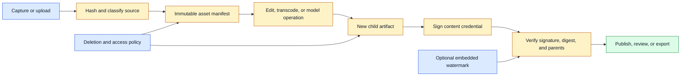
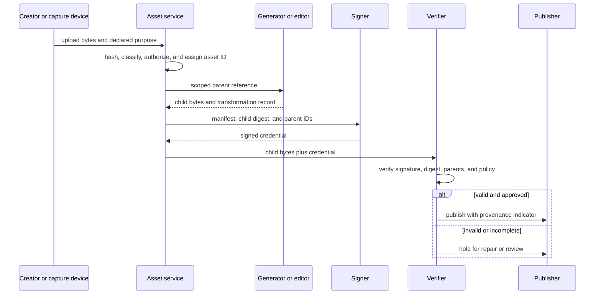

# Media Provenance
Status: planned
Sources: [Google DeepMind — SynthID](https://deepmind.google/blog/watermarking-ai-generated-text-and-video-with-synthid/), [C2PA](https://c2pa.org/)

## In one sentence
Media provenance records where an asset came from, how it was transformed, and which model or human handled it.

## Background: what existed before
Files were copied between tools with weak lineage. A filename and timestamp rarely explained whether an image was captured, edited, generated, or recompressed.

## What changed and why now
Multimodal generation increases the need to communicate origin across text, image, audio, and video. Google describes SynthID as an identification building block, while warning it is not a complete detector. C2PA defines signed provenance manifests.

## Impact on current processing and architecture
Attach content hashes, parent asset IDs, transformation steps, model versions, and signer identity. Store provenance separately from user-visible claims and verify signatures before trusting metadata.

## Real-world applications and constraints
News, education, advertising, archives, and enterprise approval workflows benefit. Cropping, screenshots, transcoding, malicious removal, and missing creator participation limit coverage.

## Mental model
Provenance is a chain of custody, not a truth oracle.

## What changed this month
Unified workflows create more transformations and therefore more points where lineage can be lost.

## Engineering consequence
Make provenance creation automatic at upload, generation, export, and moderation boundaries.

## Limits and failure modes
Valid provenance can describe a false claim; absent provenance does not prove human creation.

## Prerequisites: origin, custody, and truth

**Media provenance** is information about an asset’s origin and transformations: who created it, which source files contributed to it, what software changed it, when an operation happened, and which identity signed the record. It is not the same as content moderation, authenticity, or truth. A signed record can accurately say that a known tool generated a false scene. An asset without a record may be perfectly legitimate if metadata was stripped during export.

An **asset** is a file or logical media object such as an image, audio track, clip, transcript, or generated export. A **parent** is an asset used to create another asset. A **digest** is a cryptographic hash of exact bytes. A **manifest** is structured metadata describing an asset and its history. A **signature** binds a signer identity to a manifest or digest. A **watermark** is an embedded signal intended to survive some transformations and be detected later. A **chain of custody** records handling events from acquisition through publication.

The distinction between metadata provenance and embedded watermarking matters operationally. A manifest can be removed or lost when a file is copied. A watermark can survive some recompression but may not carry detailed edit history, and detection can fail after cropping or adversarial modification. Use them as complementary signals, not as a universal detector.

## Background: the historical baseline

Before formal provenance systems, a media file usually carried a filename, an application tag, an EXIF block, or a timestamp. These clues were useful but easy to remove or change. Editing software might preserve some metadata while losing the original creator, exact operation order, or parent asset. A screenshot of a generated image had little connection to the generation event.

Content review therefore focused on the artifact itself. A reviewer looked for visual manipulation, listened for synthetic speech, or compared the claim with outside evidence. This remains necessary because origin does not establish truth. But repeated AI transformations make visual inspection harder, and a reviewer may need to know whether an image was generated, translated, upscaled, or composited.

The baseline data model was a file table. Modern creative workflows need a graph: a source photograph can produce a crop, a masked edit, a scene extension, an upscaled export, and a social-media transcode. Each node may have its own owner, access policy, model version, and consent status. Deleting or investigating one node requires understanding its parents and children.

## What changed and why now

Generative systems produce images, audio, video, and text that can be transformed repeatedly. Google DeepMind describes SynthID as an identification building block for generated content and explicitly says it is not a silver bullet for identifying AI-generated content. The C2PA standard provides a framework for signed content credentials and transformation claims. These sources establish technologies and limitations; they do not establish that provenance alone resolves misinformation.

Google’s August 27, 2026 announcement for Gemini Omni 1.1 Flash describes scene extensions, reference video, first-and-last-frame conditioning, drafts, and upscaling. Each control creates lineage that a production application should retain. A generated continuation has a parent video and a selected prior interval. A high-resolution export has a lower-resolution or source parent. A user’s prompt, reference assets, and model version may be necessary to explain the result, but they also need access controls.

The engineering change is to make provenance a normal output of the media pipeline rather than an afterthought added at publication. Creation, import, transformation, review, export, and deletion should all emit auditable events. A provenance record should be cryptographically bound to the bytes it describes, and verification should be a distinct step before an application displays provenance as trusted metadata.

## Impact on current processing and architecture

At ingest, calculate a digest, record source metadata, classify sensitivity, and establish the submitting identity. At every transformation, create a new immutable asset ID and parent link. The transformation service records operation type, software, model, configuration, and time. A signer creates a manifest after the output is finalized. A verifier checks the signature, certificate or key policy, parent references, and content digest before a consumer relies on the record.



The digest must be calculated over a precisely defined representation. If a container’s metadata changes, the byte digest changes even when pixels or samples are identical. That is usually desirable for exact custody, but applications may also need perceptual hashes or decoded-content fingerprints to find near-duplicates. A perceptual similarity signal is not a cryptographic identity and should not be used for authorization.

A manifest needs clear semantics. “Created by tool X” could mean the file was rendered by X, the prompt was entered into X, or a parent was merely opened in X. Use typed actions such as `captured`, `imported`, `cropped`, `composited`, `generated`, `upscaled`, `translated`, `reviewed`, and `exported`. Store actor identity, parent IDs, output digest, software or model version, and relevant parameters. Avoid placing sensitive prompts or private source names in an unrestricted public manifest.



The verifier should fail closed for a claim that says “verified.” It should distinguish `valid`, `invalid`, `expired`, `unknown signer`, `parent unavailable`, and `no provenance`. These are different states. If a parent is private, a verifier may be able to confirm a commitment without revealing it, but the user should not see a stronger claim than the evidence supports.

## Watermarks, manifests, and external evidence

Watermarking embeds an identifier or signal into content. It may be useful for finding generated media in a controlled ecosystem, but transformations and attacks can reduce detection. A watermark detector also needs a trust model: who issued the watermark, what key or detector version was used, and what confidence means. “Watermark found” can support an origin claim; it does not prove the depicted event happened.

Signed manifests preserve richer history but depend on ecosystem participation. A camera, editor, model service, and publisher must agree on formats and signing identities. A file shared through a system that strips metadata loses the visible chain even if the original remains verifiable. Applications should retain a server-side graph and provide a way to reconnect exported artifacts where policy allows.

External evidence is separate again. A photograph’s provenance can establish that a camera captured it at a time, but not that the scene was staged or the caption is accurate. For consequential claims, combine provenance with source corroboration, location or sensor evidence, human review, and a clear uncertainty label. Do not let a verified badge become an epistemic shortcut.

## Real-world applications and constraints

Newsrooms can use provenance to preserve camera source, edits, captions, translations, and publication events. Editors need to distinguish a crop from a composite and a generated illustration from a photograph. The system should display missing or incomplete provenance without implying fraud. Access to unpublished source material must remain restricted.

Creative tools can use lineage for undo, branching, licensing, and collaboration. A scene extension can point to the parent clip and selected context. An upscaled export can point to the draft. Users should be able to remove or replace a reference while understanding how that affects the graph. Prompt and reference privacy may require a private manifest with a public summary.

Advertising and brand systems can require approval before a generated asset is published. The approval event should bind to a specific digest, not a mutable filename. A later crop or subtitle change creates a new child requiring policy according to risk. Automated checks can reject missing disclosures, but a signed record alone does not establish that the content complies with brand or legal requirements.

Education and archives benefit from knowing whether a recording was original, cleaned, translated, or enhanced. Preservation systems should keep the original bytes and a readable transformation history. A restoration model may improve accessibility while altering details; the restored file should never replace the archival source.

Incident response uses provenance to trace a suspicious file through upload, model processing, export, and sharing. Investigators need hashes, actor identities, timestamps, and access logs. A missing record is a signal to investigate, not proof of maliciousness. Logs themselves may contain personal data and must be retained and accessed under policy.

Identity and voice applications have heightened risk. A voice-generation event may need consent evidence, model and voice identity, and restrictions on distribution. Do not claim that a watermark makes impersonation safe. Require authorization before generating a recognizable person’s voice or face and provide a review path for disputes.

## Engineering consequence

Treat provenance as two connected stores: a durable internal lineage graph and a portable credential attached to an exported artifact. The internal graph can contain protected prompts and source references; the portable record should reveal only what policy allows. Both must use stable asset IDs, exact digests, typed transformations, signer identity, and verification status.

Numbered local implementation steps:

1. Choose a small asset workflow with an original file, one edit, and one export.
2. Define asset identity, parent-child rules, transformation vocabulary, and which metadata is private.
3. Hash original and derived bytes and store immutable IDs rather than relying on filenames.
4. Record the actor, software, model or editor version, parameters, time, and purpose for each transformation.
5. Build a manifest schema with digest, parents, actions, signer, and verification status.
6. Sign a canonical serialization so equivalent field ordering cannot change meaning.
7. Verify signature and digest before showing a “verified” state to a consumer.
8. Add a missing-parent and altered-bytes test; classify each as a typed failure.
9. Add an optional watermark signal and test recompression, crop, and screenshot behavior.
10. Implement deletion and access checks across the lineage graph without deleting audit evidence required by policy.

## Build it locally

Save this example as `provenance_manifest.py` and run `python3 provenance_manifest.py`. It uses a SHA-256 digest and a canonical JSON payload. The signature is represented by a digest-based demonstration, not a real public-key signature, so it is useful for learning serialization and verification but must not be deployed as authentication.

```python
import hashlib
import json

def digest(data: bytes) -> str:
    return hashlib.sha256(data).hexdigest()

def canonical(manifest: dict) -> bytes:
    return json.dumps(manifest, sort_keys=True, separators=(",", ":")).encode()

source = b"camera bytes"
edited = source + b"|crop=left"
source_id = digest(source)
edited_id = digest(edited)
manifest = {
    "asset_id": edited_id,
    "parents": [source_id],
    "action": "crop",
    "tool": "demo-editor-1",
}
record = {"manifest": manifest, "output_digest": edited_id}
record["demo_signature"] = digest(canonical(record))
encoded = canonical(record)
print(json.dumps(record, indent=2))
print("stable serialization", encoded == canonical(json.loads(encoded)))
```

To turn this into a verifier exercise, parse the record, remove `demo_signature`, recalculate it, and compare the value. Then change one parent ID and show that the signature no longer matches. Change the output bytes without changing the manifest and verify that the output digest no longer matches. The demonstration makes clear why canonicalization and exact byte binding matter, while its comment prevents confusing a hash with a real signature.

## Limits and failure modes

**Metadata stripping** occurs during screenshots, exports, or platform upload. Retain server-side lineage and make the portable record recoverable where policy allows.

**Signer compromise** makes a valid signature untrustworthy. Use key rotation, revocation, protected keys, and an identity policy. Verification must check signer status, not only cryptographic validity.

**False provenance** occurs when a trusted tool records an inaccurate creator, location, or claim. Validate inputs and treat provenance as process evidence, not truth.

**Watermark removal** occurs through cropping, recompression, editing, or adversarial transformation. Report detector limitations and never interpret absence as proof of human origin.

**Parent gaps** make a child’s history incomplete. Classify it as incomplete or unverifiable, not automatically invalid, and restrict strong claims until the parent is resolved.

**Mutable identifiers** occur when a URL or filename points to replacement bytes. Bind records to immutable digests and versioned asset IDs.

**Privacy leakage** occurs when prompts, faces, voices, or source filenames appear in a public manifest. Separate private lineage from public claims and apply access controls to graph traversal.

**Deletion conflict** occurs when privacy requests remove an asset needed for an audit. Define retention authority, cryptographic tombstones, and minimal evidence retention with the responsible legal and security owners.

**Graph explosion** occurs when every preview, cache, and retry becomes a permanent child. Define which transient artifacts are retained, link retries explicitly, and garbage-collect only nodes not required by policy or published lineage.

**User-interface overclaiming** occurs when a verified icon is interpreted as “true.” Use precise language such as source recorded, edit history verified, or origin unknown.

## Mini exercise (15–30 min)

Extend the local example to include a generated child with two parents: an image and a reference clip. Add a `reviewed_by` action that signs the exact child digest. Test three cases: a changed child byte, a missing parent, and a valid record whose caption is false. For each, decide what the UI should display. The final case demonstrates that authentic custody does not make a claim true.

## Interview Q&A

**Q: Does provenance prove that media is true?**
No. It can provide evidence about origin and transformations. Truth requires corroboration, context, and sometimes human or domain review.

**Q: What is the difference between a hash and a signature?**
A hash identifies bytes and detects changes. A signature binds a signer identity to a canonical record; verification also depends on trusting the signer and checking revocation.

**Q: Are watermarks enough to identify generated media?**
No. They can be useful signals but may not survive transformations and generally do not provide complete edit history or truth about depicted events.

**Q: How should generated media represent lineage?**
Create a new immutable child with parent IDs, exact output digest, model or tool version, relevant inputs, transformation type, actor, and verification status.

**Q: What should happen when provenance is missing?**
Show “unknown” or “incomplete” rather than treating absence as fraud or human origin. Apply higher review requirements where the consequence demands stronger evidence.

## Glossary

- **Asset:** A media object or file with an identity.
- **Chain of custody:** Record of who handled an asset and what happened to it.
- **Content credential:** Portable signed metadata describing media origin and actions.
- **Digest:** Cryptographic hash of exact bytes.
- **Lineage graph:** Parent-child graph of source and derived assets.
- **Manifest:** Structured provenance record.
- **Parent:** Asset used to create another asset.
- **Provenance:** Evidence about origin, handling, and transformation.
- **Signature:** Cryptographic binding between an identity and a canonical record.
- **Watermark:** Embedded signal intended to support later detection.

## References

- [Google DeepMind: Watermarking AI-generated text and video with SynthID](https://deepmind.google/blog/watermarking-ai-generated-text-and-video-with-synthid/) — watermarking capabilities and explicit limitations.
- [C2PA](https://c2pa.org/) — content provenance and authenticity standards context.
- [Google Blog: Gemini Omni 1.1 Flash](https://blog.google/innovation-and-ai/technology/developers-tools/build-with-gemini-omni-1-1-flash/) — release-specific media continuation, reference, and upscaling workflow examples.
- [Google DeepMind: Generating audio for video](https://deepmind.google/blog/generating-audio-for-video/) — multimodal media generation and artifact considerations.

## Claim ledger

| Claim | Source | Fact or inference |
|---|---|---|
| SynthID is presented as a building block rather than a complete detector. | Google DeepMind | Fact about source framing |
| C2PA provides a provenance and authenticity standard context. | C2PA | Fact about the standard’s purpose |
| Omni 1.1’s scene extension and reference controls create parent-child media lineage. | Google Blog | Fact plus engineering inference |
| Provenance can establish process history without establishing truth. | Provenance analysis | Inference |
| A production system should bind manifests to immutable digests and verify before display. | Security engineering | Inference |

## Mini exercise (15–30 min)
Hash a source image, create two derived files, and record a signed-looking local manifest with parent relationships.

## Claim ledger
| Claim | Source | Fact or inference |
|---|---|---|
| SynthID is not a silver-bullet detector. | Google DeepMind | Fact |
| Provenance should be treated as custody evidence, not truth. | Security engineering | Inference |
