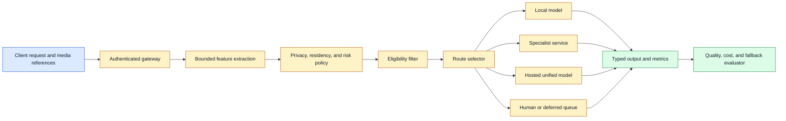
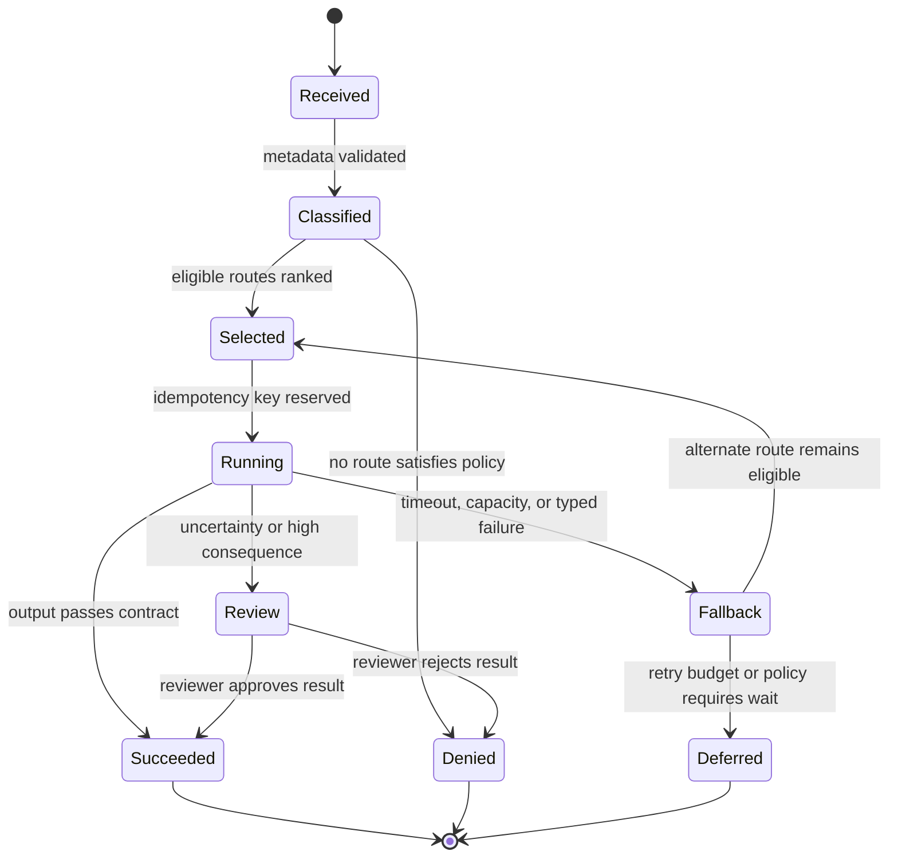

# Multimodal Model Routing
Status: planned
Sources: [Google Blog — Gemini Omni 1.1 Flash](https://blog.google/innovation-and-ai/technology/developers-tools/build-with-gemini-omni-1-1-flash/), [OpenAI GPT-4o System Card](https://openai.com/index/gpt-4o-system-card/)

## In one sentence
Multimodal routing chooses a model and processing path from media type, quality requirement, cost, latency, privacy, and risk.

## Background: what existed before
Applications often used one text model for every request or hard-coded a specialist per feature. Neither approach handled variable clip duration, resolution, or consequence gracefully.

## What changed and why now
APIs expose multiple input types and output tiers. Omni’s 360p draft versus higher-resolution output is an example of a user-visible quality/cost choice, not evidence that one route fits every task.

## Impact on current processing and architecture
The router should inspect bounded metadata, apply policy before model choice, and emit a route decision with model and preprocessing versions. Sensitive content may be prohibited from a cheaper or external route.

## Real-world applications and constraints
Use a small model for triage, a specialist for OCR or ASR, and a larger unified model for cross-modal reasoning. Route oscillation, hidden cost, and quality cliffs require hysteresis and evaluation.

## Mental model
Routing is admission control with quality tiers, not a model’s self-reported confidence chooser.

## What changed this month
Multimodal controls make route features richer: duration, frame count, output resolution, and required alignment join ordinary task metadata.

## Engineering consequence
Keep route policy deterministic and log the reason, not only the selected model.

## Limits and failure modes
Metadata can be misleading, task type can be ambiguous, and a cheap route may fail silently on rare modalities.

## Prerequisites: routing is a policy decision

**Model routing** chooses an execution path for a request. The path may be a local model, a hosted general model, a specialist OCR or speech service, a deterministic parser, a human queue, or a sequence of several services. **Multimodal routing** adds image size, audio duration, video length, frame count, language, output type, and alignment requirements to the usual features of task, latency, cost, and data sensitivity.

The router is not the model. It should make a bounded decision using authenticated request metadata and policy, then record why it made that decision. A model’s self-reported confidence can be one signal after inference, but it should not be the sole authority for choosing a more privileged route or permitting an external effect.

An **SLO** (service-level objective) is a target such as p95 latency or availability. A **fallback** is an alternate path used when the preferred route is unavailable or unsuitable. **Hysteresis** means requiring a meaningful change before switching routes, which prevents oscillation. **Data residency** describes where data is processed or stored. **Quality tier** is a declared level of output capability, latency, or resolution; it is not a guarantee of correctness.

## Background: the historical baseline

Many applications began with one model endpoint per feature. A text summarizer called a text model, an image captioner called a vision model, and a voice assistant called an ASR-plus-text-plus-TTS chain. The route was embedded in application code and changed only when engineers changed the feature.

As model APIs became more capable, teams began using one general model for many tasks. This reduced integration work but created a cost and reliability problem. A short classification request could pay for a large reasoning model, while a long video could exceed context, memory, or timeout limits. A single endpoint also made it difficult to satisfy data residency requirements or continue during a provider outage.

The old alternative was a simple size heuristic: use a small model for easy requests and a large one for hard requests. That can work for text, but multimodal difficulty is not one-dimensional. A tiny image may contain unreadable text; a short audio clip may have many speakers; a five-second video may contain a critical event; a long document may be easy to retrieve but expensive to decode. Routing needs task-specific features and measured outcomes.

## What changed and why now

Multimodal APIs expose richer controls and artifacts. Google’s August 27, 2026 Gemini Omni 1.1 Flash announcement describes 360p drafts, 720p standard output, upscaling to 1080p or 4K, scene extension, boundary-frame conditioning, and reference video. Those are release-specific product capabilities. They create explicit quality and cost tiers that an application may route between, but the announcement’s performance and pricing claims must be measured against the customer workload.

Open-weight and local models add another route class. A local quantized model may be permitted for private drafts or low-risk classification, while a hosted model may be forbidden for a regulated tenant. A specialist service may be selected for exact OCR, transcription, or numerical extraction. The router now mediates between capability, privacy, cost, latency, and authority.

The architecture change is to make route policy observable and testable. Rather than hiding a fallback inside an SDK, return a route decision record containing policy version, feature summary, selected path, reason, and constraints. The user may not need every implementation detail, but operators need it to explain a quality or billing change.

## Impact on current processing and architecture

Use a gateway to authenticate the request, classify data, and normalize safe metadata. A policy engine filters routes that violate tenant, residency, purpose, or risk rules. A cost and capacity estimator bounds work from dimensions and duration. The router chooses among eligible paths. An executor attaches an idempotency key and produces a typed result. An evaluator records quality, latency, cost, and fallback outcomes for later tuning.



Feature extraction should avoid sending sensitive content merely to decide where it may be sent. Use metadata such as tenant policy, declared task, file type, byte size, duration, dimensions, language hint, and requested output. If content inspection is required, perform it inside the most trusted permitted boundary. Do not let a router inspect an entire private video when duration and access metadata are enough.

Eligibility comes before optimization. A cheap route that violates residency is not a candidate. A fast route that cannot produce an auditable structured answer is not eligible for a regulated task. A local route with stale policy may be allowed for a draft and prohibited for a payment. Encode these as policy predicates rather than informal comments.



The state machine prevents a fallback from becoming an unbounded loop. Store the attempted route, failure category, elapsed budget, and remaining eligible routes. A provider timeout is different from policy denial, malformed output, capacity rejection, and quality failure. Some failures should retry the same route; others should skip it. For an effectful operation, a timeout after the provider may have completed requires status reconciliation before any retry.

## Route features and quality tiers

Input size is a resource feature, not a difficulty score. A larger image may need more memory but contain an easy scene. A small image may contain tiny text that requires high resolution. Duration predicts decode and transfer cost but not semantic complexity. Use features to enforce limits and build capacity estimates, then use task evaluation to understand quality.

Task declarations should be typed. `caption`, `extract_fields`, `translate`, `detect_event`, `draft_video`, and `execute_tool` have different quality and authorization requirements. A generic user prompt should not automatically gain the permissions of an effectful task. Normalize the request into an internal schema before route selection.

Quality tiers should be explicit about what changes. A draft video may use lower resolution and shorter context. A final render may require a high-resolution route and human review. A local model may return a suggestion with uncertainty, while a specialist returns structured fields with stronger validation. Do not label a route “high quality” without task and slice measurements.

Cost estimation should include input decoding, model processing, output generation, storage, egress, retries, and review. A route that is cheap per token can be expensive per successful task if it frequently fails and falls back. Conversely, a more capable first route may reduce repeated attempts. Log planned and actual cost where possible, and impose a per-request budget to prevent a fallback cascade.

Latency routing needs phase budgets. Upload and decode may dominate short media; model time may dominate long generation; policy and encoding may dominate large output. Track time to first output separately from completion. If the preferred route exceeds its budget, a fallback may produce a lower-quality answer—or the correct behavior may be to defer rather than surprise the user with a different quality tier.

## Real-world applications and constraints

A private document assistant can route local OCR and retrieval for restricted tenants, then use a permitted hosted model only for redacted text. The router must know whether redaction succeeded and must not assume an embedding is harmless. A route decision should include data classification and derived-data policy.

A video editor can route storyboard previews to a lower-resolution draft path and final publication to a higher-quality path. The user should know when an output is a preview. Parent asset IDs, resolution, reference interval, and model version must follow the artifact so a final render is not mistaken for the draft.

A contact center can route short, clear speech to a low-latency stream and noisy or multilingual calls to a specialist or human queue. Speaker count, consent, recording policy, and account sensitivity affect eligibility. A fallback must not disable identity verification merely to preserve latency.

An industrial system can use a local detector for fast alerts and a cloud or human path for review. The local route may be unavailable under heat or memory pressure. The router should report degraded coverage and never route a physical action to a path that lacks current sensor data or authorization.

An accessibility application may choose a direct vision path for a simple image question and a more expensive temporal path for a video event. Avoid optimizing away evidence that the user needs. A lower-cost route that omits timestamps can be unacceptable even if its text answer is fluent.

## Engineering consequence

Route policy should be deterministic where possible and learned only where its behavior is measurable and bounded. Keep a policy version and reason code with every request. Use shadow routing to compare candidates without exposing their outputs or duplicating side effects. For effectful requests, route selection must happen before authorization and the selected route must be part of the authorization context.

Numbered local implementation steps:

1. Enumerate task types and mark which are drafts, read-only answers, or effects.
2. Define route eligibility rules for tenant, residency, sensitivity, modality, and freshness.
3. Record bounded features: media type, size, duration, dimensions, context estimate, and requested quality.
4. Define resource and latency budgets for each eligible route.
5. Implement deterministic ranking with explicit tie-breaking and hysteresis.
6. Add typed failure categories, idempotency keys, retry budgets, and route state.
7. Validate output schema and required evidence before accepting a route as successful.
8. Measure quality, cost, p50/p95 latency, fallback rate, and failure slices by route.
9. Shadow a candidate route and compare it without creating duplicate effects or leaking data.
10. Roll out policy changes by tenant or cohort and retain a fast rollback to the prior policy version.

## Build it locally

Save this example as `route_policy.py` and run `python3 route_policy.py`. It models eligibility before ranking. The example deliberately routes effectful work only to a path with fresh policy and uses an explicit budget. It does not estimate real model quality; the missing quality model is a reason to measure outcomes rather than let a router claim confidence.

```python
from dataclasses import dataclass

@dataclass(frozen=True)
class Job:
    task: str
    modality: str
    duration_s: float
    sensitive: bool
    effectful: bool

@dataclass(frozen=True)
class Route:
    name: str
    max_duration_s: float
    local: bool
    supports_effects: bool
    estimated_cost: float

def choose(job, routes, policy_fresh, budget):
    eligible = []
    for route in routes:
        if job.duration_s > route.max_duration_s:
            continue
        if job.sensitive and not route.local:
            continue
        if job.effectful and (not policy_fresh or not route.supports_effects):
            continue
        if route.estimated_cost <= budget:
            eligible.append(route)
    return min(eligible, key=lambda route: (route.estimated_cost, route.name)) if eligible else None

routes = [Route("local-draft", 30, True, False, 0.01),
          Route("hosted-final", 120, False, True, 0.20),
          Route("local-action", 20, True, True, 0.05)]
jobs = [Job("caption", "image", 0, True, False),
        Job("send", "audio", 10, True, True)]
for job in jobs:
    result = choose(job, routes, policy_fresh=True, budget=0.10)
    print(job.task, result.name if result else "defer")
```

The sensitive caption uses the local draft path. The sensitive effect can use `local-action` only because that route is explicitly allowed and policy is fresh. Change `policy_fresh` to false and observe that the effect is deferred. Add a route that is cheaper but does not support effects; it must not become eligible merely because it is inexpensive.

## Limits and failure modes

**Policy bypass** occurs when the router chooses a route before applying residency or sensitivity checks. Filter eligibility first and log denied routes without exposing protected content.

**Route oscillation** occurs when latency or a noisy quality signal causes rapid switching. Use hysteresis, sticky route assignments, and a bounded decision interval.

**Fallback cascades** occur when every failure retries through all available routes. Set a total budget, remaining-route set, and terminal deferred state. Reconcile effectful timeouts before retrying.

**Quality cliffs** occur when a cheap route fails on a rare language, tiny text, or long context. Evaluate slices and preserve a human or specialist path for known hard cases.

**Cost surprises** occur when resolution, duration, retries, storage, and egress are omitted from estimates. Log planned versus actual cost and apply per-job budgets.

**Metadata deception** occurs when a user labels a large or sensitive payload as a small benign task. Inspect trusted file metadata and enforce limits at ingestion; do not trust user-declared difficulty.

**Authorization drift** occurs when route selection changes after permission is granted. Bind the selected route and policy version to the authorization context and recheck before execution.

**Shadow side effects** occur when candidate routes are run as if they were harmless. Shadow only read-only work, redact data appropriately, and never duplicate an external effect.

**Provider drift** occurs when a stable route name hides a changing hosted model. Record provider model snapshot or timestamp and rerun representative evaluations.

**Fallback disclosure** occurs when a private local request is sent to a hosted route after a local failure without a new policy decision. Fallback eligibility must be explicit, not an SDK default.

## Mini exercise (15–30 min)

Extend the local router with `residency`, `quality`, and `fresh_policy_age_s`. Add a high-resolution video job and a sensitive audio effect. Verify that a cheap ineligible route is rejected, that a stale policy defers an effect, and that an over-budget job does not loop through every route. Record a reason code for each rejection and decide which metrics would reveal a route quality cliff.

## Interview Q&A

**Q: What should a multimodal router inspect?**
Task type, modality, trusted size and duration metadata, context estimate, sensitivity, residency, latency, quality, cost, capacity, and whether the request is effectful. Inspect no more content than policy permits.

**Q: Why filter before ranking?**
A route that violates privacy, residency, authorization, or output requirements is not a valid candidate. Ranking a forbidden route by cost creates a policy bug.

**Q: How do you handle a timeout after a tool call?**
Reconcile the operation’s status using its idempotency key before retrying. A timeout does not prove that the effect did not happen.

**Q: Should confidence choose the fallback?**
Confidence can inform review, but it is not sufficient for privilege or routing. Use measured task slices, typed validators, and policy constraints.

**Q: How do you evaluate a routing policy?**
Compare route quality, cost, p50/p95 latency, fallback rate, policy denials, and failure slices against a baseline. Use shadow traffic for read-only candidates and never duplicate effects.

## Glossary

- **Eligibility:** Whether a route satisfies policy and resource requirements.
- **Fallback:** Alternate route used after a typed failure or constraint.
- **Hysteresis:** Resistance to rapid route switching after small signal changes.
- **Model routing:** Selecting a model or processing path for a request.
- **Quality tier:** Declared service level with explicit capability, latency, or resolution trade-offs.
- **Residency:** Location where data is processed or stored.
- **Route policy:** Versioned rules governing eligible paths and ranking.
- **Shadow routing:** Running a candidate for comparison without exposing output or causing effects.
- **SLO:** Service-level objective such as a p95 latency or availability target.
- **Typed failure:** A machine-readable failure category used to choose retry, fallback, or defer behavior.

## References

- [Google Blog: Gemini Omni 1.1 Flash](https://blog.google/innovation-and-ai/technology/developers-tools/build-with-gemini-omni-1-1-flash/) — release-specific media quality tiers and workflow controls.
- [OpenAI GPT-4o System Card](https://openai.com/index/gpt-4o-system-card/) — multimodal model and evaluation context.
- [Google DeepMind: Building architectures that can handle the world’s data](https://deepmind.google/blog/building-architectures-that-can-handle-the-worlds-data/) — general architecture for varied modalities.
- [Google DeepMind: Evaluating social and ethical risks from generative AI](https://deepmind.google/blog/evaluating-social-and-ethical-risks-from-generative-ai/) — modality and context evaluation gaps.

## Claim ledger

| Claim | Source | Fact or inference |
|---|---|---|
| Omni 1.1’s announcement describes multiple resolution and temporal workflow controls. | Google Blog | Fact, release-specific |
| Open multimodal models create local route options. | Open-model ecosystem sources | Fact about ecosystem |
| Eligibility must be filtered by policy before cost or latency ranking. | Security architecture | Inference |
| Route choice should be logged with policy and model versions. | Operations engineering | Inference |
| Fallbacks require budgets and effect reconciliation. | Distributed-systems analysis | Inference |

## Mini exercise (15–30 min)
Implement rules that route short low-risk clips to a local path and long or high-impact clips to review.

## Claim ledger
| Claim | Source | Fact or inference |
|---|---|---|
| Omni exposes different resolution workflows. | Google Blog | Fact, release-specific |
| Routing should consider risk and data residency. | Architecture | Inference |
