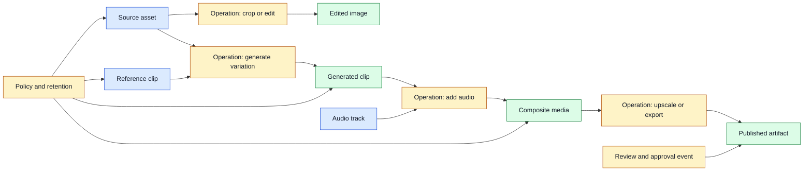
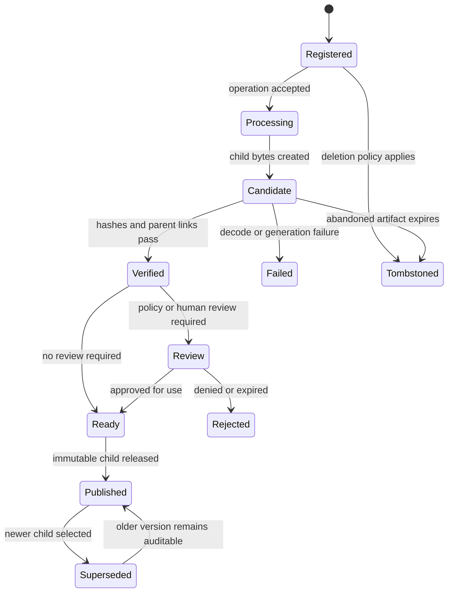

# Multimodal Artifact Lineage
Status: planned
Sources: [Google Blog — Gemini Omni 1.1 Flash](https://blog.google/innovation-and-ai/technology/developers-tools/build-with-gemini-omni-1-1-flash/), [C2PA](https://c2pa.org/)

## In one sentence
Artifact lineage connects an output to its inputs, prompt, preprocessing, model, reviewer, and subsequent transformations.

## Background: what existed before
Text logs could preserve a prompt and response. Large media workflows often stored files without the exact frame references, seed, edit branch, or intermediate policy result that produced them.

## What changed and why now
Scene extension and reference-video generation create parent-child relationships. A new clip may depend on prior context, keyframes, and several reference assets; the output is a node in a graph.

## Impact on current processing and architecture
Persist immutable asset IDs, parent links, hashes, model configuration, policy decisions, and export events. Garbage collection must understand graph reachability and legal deletion.

## Real-world applications and constraints
Lineage supports review, rollback, copyright investigation, reproducibility, and collaborative editing. It costs storage and can expose sensitive prompts or references if access scopes are weak.

## Mental model
Treat every generated asset as a commit with parents and metadata.

## What changed this month
Multimodal continuation makes hidden state a first-class product concern.

## Engineering consequence
Never overwrite a media artifact that may be needed to explain a published result.

## Limits and failure modes
Orphaned derivatives, missing provider metadata, mutable URLs, and cross-tenant references break auditability.

## Prerequisites: files are not the whole artifact

An **artifact** is a meaningful output or input of a media workflow: an image, audio track, video clip, transcript, embedding, thumbnail, prompt package, or structured report. **Lineage** describes how an artifact relates to earlier artifacts and operations. A **parent** is an input used to create a child. A **digest** is a cryptographic hash of exact bytes. An **immutable record** cannot be silently overwritten; a correction creates a new version or event.

Lineage answers questions that ordinary file storage cannot: Which source frames produced this export? Which model and prompt created it? Was the output reviewed? Which version was published? Which derivatives must be deleted when a source is removed? A filename such as `final-final-v2.mp4` answers none of these reliably.

A lineage system has two related identities. **Content identity** binds a record to bytes or a decoded representation. **Business identity** describes the logical item users think of as “the video,” even as edits create versions. Keep them separate. A user-facing project can point to a current child while the immutable graph retains prior parents and review events.

## Background: the historical baseline

Text applications often stored a prompt and response together in a conversation log. Media workflows were more likely to store a file in object storage and record a job row with status. The job might include a source URL and a provider request ID, but not the exact frames, model parameters, edits, or reviewer decision.

This was tolerable when a person manually edited a short file and the output was disposable. It breaks under branching generation. A creator may upload a source image, produce three variations, extend one into a clip, upscale it, add generated audio, crop a preview, and export several platform formats. A retry may produce another artifact after a timeout. Without parent links and operation identity, the system cannot explain which branch a customer approved or which version was distributed.

The baseline deletion workflow was also file-oriented. Removing the original object left thumbnails, transcoded copies, captions, vectors, cached responses, and exported files behind. A lineage graph turns deletion into a reachability and policy problem: find every derived node, determine retention authority, and remove or tombstone each permitted representation.

## What changed and why now

Generative media APIs expose continuation, references, keyframes, resolution tiers, and upscaling. Google’s August 27, 2026 Gemini Omni 1.1 Flash announcement describes scene extension based on prior context, first and last frames, short reference videos, low-resolution drafts, and higher-resolution output. Each operation creates a relationship between inputs and outputs. The product name is a release-specific fact; the graph-shaped workflow is the engineering consequence.

Multimodal models also create hidden derivatives during preprocessing: extracted frames, audio windows, OCR text, transcripts, embeddings, and moderation results. Some are transient and some become searchable or visible. Decide which are retained, assign them access policy, and link them to the source. If a model provider returns only a final artifact, keep the application’s input and configuration lineage even when internal provider steps are unknown.

## Impact on current processing and architecture

Use an asset service to assign IDs and hashes, an operation service to record transformations, a policy service to apply tenant and retention rules, and a graph store or relational tables to preserve parent links. Object storage holds bytes; it should not be the only source of lineage. A publication service resolves a specific immutable child and records the release event. Review tools display the relevant subgraph without granting access to every parent.



An operation record should contain operation ID, action type, actor or service identity, ordered parent IDs, output IDs, model or tool version, configuration reference, start and completion time, policy version, and status. Store large prompts or media references behind access-controlled IDs rather than copying them into every event. An operation may have multiple outputs, such as a transcript and speaker map, so the graph should support one-to-many relationships.

Do not treat a completed job as a published artifact. Generation, policy review, encoding, storage, and publication are separate states. A job can be technically successful but held because a provenance credential is invalid or a human approval is missing. A published child should point to the exact bytes reviewed. If bytes change, create a new child and require the appropriate checks again.



The graph needs idempotent operation creation. If a client retries after a network timeout, the same idempotency key should return the existing operation and child status rather than generate another output silently. If a provider did create an artifact but the callback was lost, reconcile by provider request ID. For nondeterministic generation, a retry may intentionally create a new sibling; record that it is a new attempt, not an overwrite.

## Identity, hashing, and canonical records

Hash exact bytes to detect replacement or corruption. For media, also retain decoded properties and, where useful, a perceptual fingerprint for similarity search. A byte digest changes when metadata changes; this is correct for custody but may not tell whether visible pixels changed. Never use a perceptual fingerprint as an authorization identity because collisions and near matches are expected.

Canonical serialization is important when signing an operation record. Field order, whitespace, and number formatting must be stable. Exclude mutable status fields from a signature that is intended to bind creation, or sign each state transition separately. Keep a schema version. A future reader should know whether a missing field means unknown, not applicable, or lost.

Parent references should be typed and ordered when order changes meaning. A video can have a primary source, a reference clip, a mask, and an audio track. A list of anonymous IDs does not explain their roles. Store `primary_source`, `reference_video`, `mask`, and `audio_parent` relationships. Validate that every parent belongs to the same tenant or has an explicit cross-tenant sharing grant.

Lineage can be private. A public consumer may need to know that an artifact was generated and reviewed, while only an internal auditor may see the prompt or source face. Build graph queries with authorization at every hop. Avoid a “show ancestry” endpoint that bypasses parent-level ACLs.

## Real-world applications and constraints

A creative editor needs undo, branching, and collaboration. Each render should be a child of the selected timeline state and reference assets. A reviewer approves a digest, not a mutable project pointer. If a creator changes the audio after approval, the composite digest changes and the old approval no longer covers it.

A media platform needs transcodes for different devices. A 4K master, 1080p derivative, thumbnail, caption file, and preview should share a logical asset identity but have distinct content IDs and transformation records. Deleting the master may or may not permit retaining a public derivative under policy; that decision must be explicit.

An enterprise assistant may derive OCR text, embeddings, summaries, and answers from a confidential video. A user authorized to view the answer may not be allowed to retrieve all frames. Derivative data can be more searchable than the source, so lineage and ACLs must cover vectors and text as well as media.

An incident-response team needs to trace a suspicious export back to its source, model, reviewer, and recipient. Preserve append-only access events, operation IDs, hashes, and publication events. Do not mutate a history record to fix a typo; issue a correction event linked to the original.

An archive needs to preserve the original even when restoration or upscaling creates a more usable version. The restored file is a child, not a replacement. Record which details may have been synthesized or enhanced, and make the original available to authorized researchers.

Deletion requests are a hard case. A graph can identify descendants, but legal or audit retention may require keeping a minimal record that an artifact existed without retaining the sensitive bytes. Use tombstones, key destruction, redacted manifests, and documented retention authority. Test deletion after caches, exports, and asynchronous jobs have been created.

## Engineering consequence

Design the lineage schema before integrating a generation API. The provider’s request ID is useful but insufficient: it may not identify every input, may expire, and may not cover local preprocessing or post-processing. The application owns the relationship between user intent, permitted sources, model call, output, review, and publication.

Numbered local implementation steps:

1. List every durable and transient artifact in one media workflow.
2. Define content IDs, logical project IDs, parent roles, operation types, and lifecycle states.
3. Hash source and child bytes and store the algorithm beside each digest.
4. Record model, runtime, preprocessing, prompt, reference assets, actor, and policy versions by reference.
5. Implement parent and tenant validation before creating a child operation.
6. Make operation creation idempotent and reconcile provider timeouts by request ID.
7. Separate candidate, verified, reviewed, ready, published, superseded, and tombstoned states.
8. Bind review and publication to immutable output digests, not filenames or current pointers.
9. Enforce ACLs during graph traversal and redact private parents from public lineage views.
10. Test deletion, retention, branching, altered bytes, missing parents, retries, and cross-tenant references.

## Build it locally

Save this example as `lineage_graph.py` and run `python3 lineage_graph.py`. It uses a dictionary to model a small asset graph and checks that an output’s parents exist and belong to the same tenant. It is not a database or signature implementation; it makes parent validation and descendant discovery concrete.

```python
from dataclasses import dataclass

@dataclass(frozen=True)
class Asset:
    asset_id: str
    tenant: str
    parents: tuple[str, ...]
    action: str

assets = {
    "source": Asset("source", "team-a", (), "capture"),
    "reference": Asset("reference", "team-a", (), "upload"),
    "clip": Asset("clip", "team-a", ("source", "reference"), "generate"),
    "export": Asset("export", "team-a", ("clip",), "upscale"),
}

def validate(asset, graph):
    for parent_id in asset.parents:
        if parent_id not in graph:
            return False, "missing parent " + parent_id
        if graph[parent_id].tenant != asset.tenant:
            return False, "cross-tenant parent " + parent_id
    return True, "ok"

for asset in assets.values():
    print(asset.asset_id, validate(asset, assets))

descendants = {asset_id for asset_id, asset in assets.items()
              if "source" in asset.parents or "clip" in asset.parents}
print("affected descendants", sorted(descendants))
```

The validation result shows why a generated clip can depend on more than one parent. Extend the example with an `audio` parent role, a missing parent, and a different tenant. Add a `published_digest` and reject a publication when it differs from the reviewed child. Then implement a reverse index so a deletion request for `source` discovers `clip` and `export` without scanning every file.

## Limits and failure modes

**Mutable pointers** cause an approval for one version to cover another. Bind review, publication, and URLs to immutable content IDs and digests.

**Missing parents** produce incomplete history. Mark the child unverifiable and require repair or review before making strong provenance claims.

**Duplicate retries** create sibling artifacts or duplicate charges. Use idempotency keys, provider reconciliation, and explicit attempt numbers.

**Transient-artifact sprawl** fills storage with every preview and cache. Define retention classes and keep only artifacts required for replay, audit, or user experience.

**Cross-tenant references** leak source data. Validate parent ownership or explicit grants before graph creation and enforce ACLs on traversal.

**Digest confusion** occurs when byte hashes and perceptual fingerprints are treated as interchangeable. Label the identity type and use cryptographic digests for custody.

**Unsigned corrections** make history ambiguous. Preserve the original event and append a correction linked to it.

**Deletion gaps** leave thumbnails, vectors, prompts, or exports after the source is removed. Traverse the graph and related caches; record what was deleted or retained under authority.

**Provider opacity** hides internal transformations. Record the provider request and returned artifact while labeling unknown internal steps as unknown rather than inventing lineage.

**Unauthorized ancestry views** expose private prompts or faces. Apply access checks at every parent and derivative, not only to the root asset.

## Mini exercise (15–30 min)

Extend the local graph with a mask and audio track, then publish a composite. Add a new audio revision and prove that its digest makes the previous approval stale. Simulate a retry with the same idempotency key and ensure no extra child is created. Finally, mark the source for deletion and list every descendant and derivative that policy must inspect.

## Interview Q&A

**Q: Why is a provider request ID not enough for lineage?**
It may not describe local preprocessing, all parents, post-processing, review, or publication. The application must own its complete relationship graph.

**Q: What should be immutable?**
Content records, operation identity, parent links, and review bindings should not be silently overwritten. Mutable project pointers can select a current child but must point to immutable versions.

**Q: How do you handle a retry after a timeout?**
Use an idempotency key and reconcile provider status. Return the existing operation when known; record a new sibling explicitly when a new attempt is intentional.

**Q: How does lineage help deletion?**
It identifies descendants such as transcripts, thumbnails, embeddings, exports, and caches. Policy still decides which nodes must be deleted, tombstoned, or retained as minimal audit evidence.

**Q: Can lineage prove that a scene is true?**
No. It can establish process history and transformations. Truth requires corroborating evidence and context.

## Glossary

- **Artifact:** Meaningful media, data, or output object in a workflow.
- **Business identity:** Logical user-facing item that can have multiple versions.
- **Content ID:** Identity tied to a specific artifact representation.
- **Digest:** Cryptographic hash of exact bytes.
- **Lineage:** Relationships among assets and transformations.
- **Parent:** Input used to produce a child artifact.
- **Provenance:** Evidence about origin and handling.
- **Tombstone:** Record that an object was deleted or is no longer available.
- **Transformation:** Operation that creates a derived asset.
- **Idempotency key:** Identifier that makes a retried operation safe to repeat.

## References

- [Google Blog: Gemini Omni 1.1 Flash](https://blog.google/innovation-and-ai/technology/developers-tools/build-with-gemini-omni-1-1-flash/) — scene extension, references, drafts, and upscaling that motivate media lineage.
- [C2PA](https://c2pa.org/) — portable content provenance and authenticity context.
- [Google DeepMind: Watermarking AI-generated text and video with SynthID](https://deepmind.google/blog/watermarking-ai-generated-text-and-video-with-synthid/) — embedded signal capabilities and limitations.
- [Google DeepMind: Generating audio for video](https://deepmind.google/blog/generating-audio-for-video/) — multimodal generation and transformation context.

## Claim ledger

| Claim | Source | Fact or inference |
|---|---|---|
| Omni 1.1 supports scene extension, reference video, drafts, and upscaling as described in the August announcement. | Google Blog | Fact, release-specific |
| C2PA provides a content provenance and authenticity standard context. | C2PA | Fact about standard purpose |
| Generated and transformed media should be represented as parent-child artifacts. | Data and media systems | Inference |
| Provider request IDs do not replace application-owned lineage. | Systems analysis | Inference |
| Lineage supports audit, deletion impact analysis, and reproducibility. | Data engineering | Inference |

## Mini exercise (15–30 min)
Build a three-node asset graph for an original clip, an extension, and an upscaled export; then answer which source files can be deleted safely.

## Claim ledger
| Claim | Source | Fact or inference |
|---|---|---|
| Omni supports scene extension and reference inputs. | Google Blog | Fact, release-specific |
| Such workflows require graph-shaped lineage. | Data engineering | Inference |
