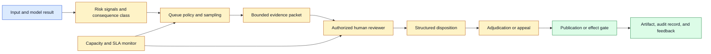
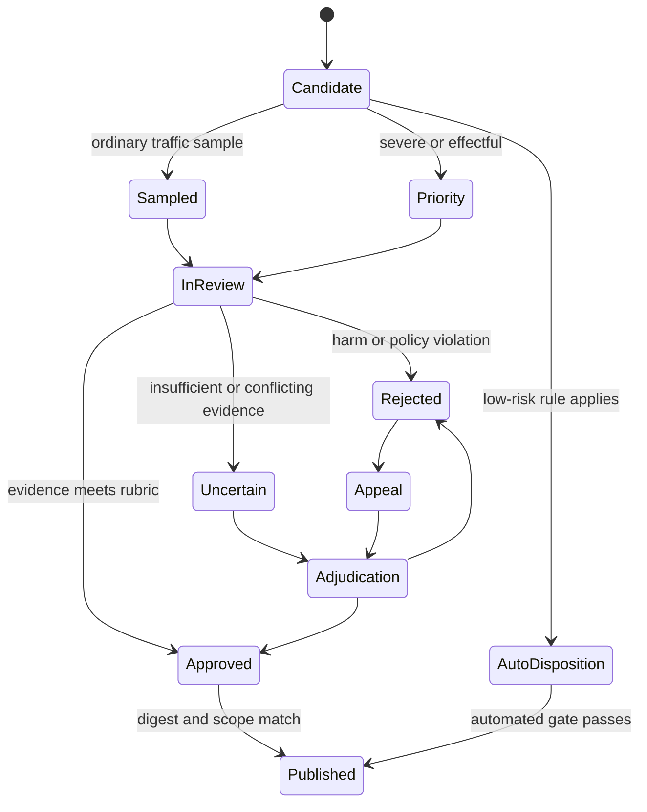

# Human Review in Media Pipelines
Status: planned
Sources: [Google DeepMind — Social and ethical risks](https://deepmind.google/blog/evaluating-social-and-ethical-risks-from-generative-ai/), [OpenAI GPT-4o System Card](https://openai.com/index/gpt-4o-system-card/)

## In one sentence
Human review is a designed queue with evidence, routing, deadlines, and recorded decisions—not a vague instruction to “check the AI.”

## Background: what existed before
Reviewers commonly inspected text samples after generation. Media review is slower, requires playback or rendering, and can expose reviewers to sensitive or disturbing material.

## What changed and why now
Unified models produce persuasive combinations of voice, image, video, and text. Review must assess the relationship among channels and the consequence of publishing or acting.

## Impact on current processing and architecture
Create review packets containing source references, selected evidence intervals, model output, policy scores, uncertainty, and proposed action. Use queues, sampling plans, escalation, redaction, and reviewer agreement metrics.

## Real-world applications and constraints
Moderation, accessibility, advertising, incident analysis, and high-impact assistance need review. Reviewer fatigue, privacy, latency, and inconsistent labels limit coverage.

## Mental model
Human review is a safety control with capacity and recall, like an operations queue.

## What changed this month
More modalities increase both the value and the cost of independent human evidence.

## Engineering consequence
Route uncertainty and high consequence separately; do not use confidence alone to decide what humans never see.

## Limits and failure modes
Sampling misses rare harms, reviewers can anchor on model suggestions, and appeal handling can be absent.

## Prerequisites: review as an engineered control

**Human review** is a controlled decision process in which a person inspects model inputs, outputs, or evidence and records a disposition. It is not a guarantee that a system is safe. Its effectiveness depends on what cases reach reviewers, what evidence they see, how much time they have, how decisions are recorded, and what happens after disagreement.

An **evidence packet** is the bounded set of source references, model output, policy signals, and context shown to a reviewer. A **queue** holds work awaiting a decision. **Triage** assigns priority and routing. **Sampling** selects a subset of traffic for inspection. **Recall** is the fraction of relevant cases that a control finds; review can have high agreement and low recall if the wrong cases are sent to the queue. **Adjudication** resolves disagreement or high-severity cases using a defined authority.

Reviewers need a clear distinction between observation and inference. An image may visibly contain text, while the model’s claim about a person’s intent is an inference. A generated video may carry a valid artifact digest, while its caption may be false. The interface should expose source interval, model version, uncertainty, and policy reason without making a reviewer reconstruct the entire pipeline.

## Background: the historical baseline

Text moderation and quality review often used random samples of messages or a queue of classifier-positive cases. Reviewers worked from a text snippet and a rubric. This remains useful for compact content, but media review introduces playback time, audio volume, visual context, multiple speakers, frame navigation, and sometimes disturbing content.

A second baseline was post-hoc approval. The model generated an answer or artifact, and a person checked it before publication. This can work for low-volume creative workflows, but it does not scale automatically and may be too late if a tool action already occurred. For agents, the review point must be before the external effect when the consequence is irreversible.

The baseline also treated reviewers as an unlimited resource. A queue could grow during an incident, a model rollout, or a viral upload. Long videos consume more attention than short text. If capacity is not modeled, the system either delays legitimate work or silently falls back to automated decisions under pressure.

## What changed and why now

Unified multimodal systems generate and interpret text, images, audio, and video in one workflow. Google DeepMind’s review of social and ethical evaluation identifies gaps in human interaction and output modality coverage. OpenAI’s GPT-4o system card provides a release-specific example of multimodal capability and red-team evaluation. These sources do not claim that humans catch every failure; they show why review and evaluation must include how people interact with multimodal outputs.

Media generation also creates richer artifacts. Google’s August 27, 2026 Gemini Omni 1.1 Flash announcement describes scene extension, first-and-last-frame conditioning, reference video, drafts, and upscaling. A reviewer may need to inspect a parent clip, selected reference, generated transition, audio track, and provenance state. “Review complete” is meaningful only when it is bound to the exact artifact and scope that were inspected.

The engineering change is to treat review as a service with contracts: input selection, evidence limits, risk priority, reviewer permissions, deadlines, escalation, decision schema, audit trail, and appeal. The service should be measurable like any other queue and safety control.

## Impact on current processing and architecture

An event enters a risk classifier and queue policy after ingestion and model processing. The policy can route high-severity or uncertain cases to priority review, sample ordinary traffic, and auto-approve only cases within a defined low-risk envelope. An evidence builder creates a redacted packet with exact asset IDs and timestamps. Reviewers record a structured disposition. Adjudication handles disagreement. The final gate binds approval to a digest and policy version before publication or action.



The queue policy should use consequence as well as model confidence. A low-confidence caption may be harmless, while a high-confidence proposed wire transfer is high consequence. Route by action type, user population, privacy class, severity, and uncertainty. Confidence is a prioritization signal, not a safety certificate.

Evidence packets should be minimal but sufficient. Include the source asset reference, relevant frame or audio interval, transcript span, model answer, proposed action, policy signals, model and preprocessing versions, and the rubric. Avoid making a reviewer download an entire confidential recording when a 20-second window supports the decision. Conversely, hiding surrounding context can cause a wrong label. Let the packet specify why the interval was selected and allow authorized expansion.



Review state must be durable. A reviewer’s browser closing after a decision should not lose it, and a user retry should not create two active approvals. Use a review ID, asset digest, policy version, reviewer identity, decision time, and disposition. If the artifact changes, invalidate the decision or create a new review. A project pointer moving to another child must not inherit approval accidentally.

## Sampling, recall, and capacity

Random sampling estimates ordinary traffic, but it is weak for rare harms. Risk-based sampling overrepresents uncertainty and known attack patterns, which helps discovery but cannot estimate production prevalence without weighting. Stratified sampling gives each modality, language, tenant, and consequence class a defined share. Use more than one sampling strategy and label the purpose of each queue.

Measure review recall with seeded cases. Insert known benign and harmful fixtures into traffic or a replay environment, then calculate how often the queue catches them. Keep the fixtures controlled and authorized. A review system may have excellent reviewer agreement while missing all harms hidden in background audio because its selector never sends audio-bearing cases to people.

Queue capacity is a throughput problem. If arrivals exceed reviewer service rate, backlog grows. Media duration changes service time; a one-minute video does not cost the same attention as a short message. Track arrival rate, queue depth, age of oldest item, service time, reviewer utilization, escalation rate, and deadline misses by queue. Backpressure can defer low-risk work, reduce evidence scope, or pause new publication; it should not silently disable a critical gate.

Reviewer interfaces need safe ergonomics. Provide playback controls, captions, frame stepping, volume normalization, warnings, redaction, and a way to hide unnecessary personal data. Avoid auto-playing disturbing audio or showing faces when a crop is enough. Rotate assignments and provide support for repeated exposure to harmful content. A reviewer who is rushed or distressed is less likely to make a reliable decision.

Independent review reduces anchoring. If the model’s label is shown before evidence, reviewers may accept it without inspecting the media. For comparative or safety decisions, consider blinded review, hide confidence until after an initial label, or show the model rationale only as a separate signal. Record whether a reviewer saw the model disposition because that can affect agreement analysis.

## Real-world applications and constraints

Media moderation needs review for severe, ambiguous, or novel content. A frame may be harmless alone but harmful in sequence; audio may alter the meaning of a visual scene. Review packets should preserve enough temporal context and include transformation history. Policy must account for appeals and regional differences, and reviewers should not be exposed to more content than necessary.

Creative approval workflows can route generated videos to a human before publication. The reviewer checks continuity, text, audio, identity, policy, provenance, and brand requirements. The approval binds to the final digest and output resolution. A low-resolution draft review is not automatically approval of a later 4K render if rendering can change artifacts.

Customer support can use review for account changes suggested from voice notes or screenshots. The reviewer verifies identity, exact fields, and authorization, not merely whether the model’s summary sounds plausible. A reviewer should have trusted account data separate from the customer-provided media so the media cannot redefine the target account.

Accessibility applications may need review of descriptions that affect safety or dignity. The goal is not to block all uncertain content but to communicate uncertainty and offer a correction path. Reviewers should inspect representative disability contexts and avoid rubrics that mistake unfamiliar assistive devices for anomalies.

Healthcare and industrial inspection require domain-qualified review. A general content reviewer may not recognize a dangerous dosage or a production defect. Define reviewer qualification, escalation, and evidence retention. A model can prefill a report, but the accountable professional owns the disposition under the domain workflow.

Agent systems should pause before effects, not after. A reviewer may approve a draft email, a proposed file change, or a payment with exact arguments. The approval token should expire, identify the actor and resource, and be invalidated if arguments change. If a tool already ran, review is incident response or reconciliation, not prevention.

## Engineering consequence

Design the review record as an auditable decision:

1. **Scope:** asset digest, interval, modalities, output, proposed effect, and policy version.
2. **Evidence:** selected frames, audio, transcript, metadata, and reason for selection.
3. **Decision:** disposition, rubric labels, severity, reviewer identity, and confidence.
4. **Process:** queue, sampling strategy, model exposure, review time, disagreement, and escalation.
5. **Binding:** exact approved artifact or tool arguments, expiration, and publication/effect status.

Numbered local implementation steps:

1. Choose one multimodal workflow and identify the decision a reviewer can actually change.
2. Define risk, consequence, severity, benign, harmful, and uncertain labels with examples.
3. Create a fixture manifest with asset IDs, timestamps, sensitivity, expected labels, and reviewer restrictions.
4. Implement queue routing by consequence, uncertainty, modality, and declared sampling strategy.
5. Build minimal evidence packets with source references, selected intervals, output, and model metadata.
6. Add durable review states, idempotent assignment, lease expiry, and an appeal path.
7. Bind approval to immutable asset digest or exact tool arguments and expire it when they change.
8. Measure queue arrival, age, service time, recall fixtures, reviewer agreement, false approvals, and false refusals.
9. Test backlog, reviewer absence, harmful media warnings, incomplete evidence, and a changed artifact.
10. Run a shadow or replay evaluation before allowing review decisions to gate production effects.

## Build it locally

Save this example as `review_triage.py` and run `python3 review_triage.py`. It demonstrates consequence-aware priority and a simple capacity limit. It does not classify real media or replace trained reviewers. The useful property is that an effectful or severe case cannot be hidden behind a low model-confidence value.

```python
from dataclasses import dataclass

@dataclass(frozen=True)
class Case:
    case_id: str
    severity: int
    confidence: float
    effectful: bool
    minutes: int

def priority(case):
    score = case.severity * 10 + (20 if case.effectful else 0)
    if case.confidence < 0.6:
        score += 5
    return score

def triage(cases, capacity_minutes):
    selected = []
    used = 0
    for case in sorted(cases, key=priority, reverse=True):
        if used + case.minutes <= capacity_minutes:
            selected.append(case)
            used += case.minutes
    return selected

cases = [Case("caption", 1, 0.4, False, 2),
         Case("payment", 2, 0.95, True, 3),
         Case("violent-video", 5, 0.8, False, 5)]
for case in triage(cases, capacity_minutes=6):
    print(case.case_id, priority(case))
```

The payment is prioritized even with high confidence because it is effectful, and the severe video competes for limited review time. Extend the function with a minimum guaranteed share for each modality, then add a seeded case that the queue must catch. If capacity is too small, report the unreviewed case explicitly rather than auto-approving it.

## Limits and failure modes

**Low recall** occurs when selectors never route a modality, tenant, or rare risk to reviewers. Seed known cases, stratify sampling, and report coverage by slice.

**Reviewer anchoring** occurs when the model label leads the human. Blind or stage information, compare independent labels, and measure disagreement.

**Evidence truncation** hides context. Let reviewers expand an authorized interval and record what they inspected. Do not claim a whole-video decision from one frame.

**Queue overload** creates long delays or silent bypass. Apply backpressure, prioritize consequence, communicate degraded coverage, and preserve a safe terminal state.

**Reviewer fatigue** reduces attention and increases inconsistent labels. Track service time, rotate harmful queues, limit exposure, and provide support.

**Artifact mismatch** makes an approval cover different bytes. Bind to digest and invalidate approval on any transformation.

**Unqualified review** creates false assurance in healthcare, law, finance, or industrial work. Require domain expertise and escalation.

**Privacy exposure** occurs when reviewers see entire recordings or unrelated faces. Minimize packets, redact, enforce access, and retain only necessary evidence.

**Appeal gaps** leave users with no correction path and operators with no feedback. Record appeals, adjudication, policy changes, and turnaround targets.

**Post-effect review** is too late for irreversible actions. Pause before the tool call and bind approval to exact arguments and expiry.

## Mini exercise (15–30 min)

Extend the triage example with `modality`, `sampled`, and `reviewer_id`. Give the queue a six-minute budget and a minimum one-case quota for audio, image, and video. Add one severe audio case that ordinary confidence ranking would miss. Report selected, deferred, and unreviewed cases. Then change the artifact digest after approval and verify that publication requires a new review.

## Interview Q&A

**Q: Does human review prove a system is safe?**
No. Review quality depends on selection recall, evidence, reviewer skill, capacity, and escalation. It is one control in a defense-in-depth system.

**Q: How should cases be prioritized?**
Use consequence, severity, uncertainty, modality, privacy, and deadlines. Do not rely on model confidence alone; a high-confidence payment is still high consequence.

**Q: What belongs in an evidence packet?**
The exact asset and interval, relevant frames/audio/transcript, model output, proposed effect, policy signals, versions, and rubric—enough to decide, but no unnecessary sensitive data.

**Q: How do you know the review queue catches rare harms?**
Use seeded fixtures, stratified sampling, adversarial cases, and slice-level recall measurement. Reviewer agreement alone does not measure queue coverage.

**Q: When must review happen?**
Before publication or an irreversible external effect. After-the-fact review supports detection and incident response but cannot undo every consequence.

## Glossary

- **Adjudication:** Process that resolves reviewer disagreement or high-severity cases.
- **Evidence packet:** Bounded context shown to a reviewer.
- **Human review:** Structured person-in-the-loop decision process.
- **Recall:** Fraction of relevant cases a control finds.
- **Queue:** Work waiting for assignment and decision.
- **Sampling:** Selecting a subset of traffic for inspection.
- **Severity:** Impact level assigned to a case or failure.
- **Triage:** Prioritizing and routing cases.
- **Disposition:** Structured outcome such as approve, reject, or uncertain.
- **Lease:** Temporary assignment ownership that expires if a reviewer disappears.

## References

- [Google DeepMind: Evaluating social and ethical risks from generative AI](https://deepmind.google/blog/evaluating-social-and-ethical-risks-from-generative-ai/) — gaps across interaction context, risk categories, and output modalities.
- [OpenAI GPT-4o System Card](https://openai.com/index/gpt-4o-system-card/) — release-specific multimodal capability and red-team evaluation context.
- [Google Blog: Gemini Omni 1.1 Flash](https://blog.google/innovation-and-ai/technology/developers-tools/build-with-gemini-omni-1-1-flash/) — media generation controls that create reviewable parent-child artifacts.
- [OWASP Generative AI Security Project](https://owasp.org/www-project-generative-ai-security/) — application risk context for agent and model controls.

## Claim ledger

| Claim | Source | Fact or inference |
|---|---|---|
| DeepMind’s review identifies gaps in interaction context and modality coverage. | Google DeepMind | Fact reported by source |
| GPT-4o’s system card reports multimodal capability and red-team evaluation. | OpenAI | Fact about that release |
| Omni 1.1’s scene and reference controls create artifacts that should be reviewed by exact digest. | Google Blog plus systems analysis | Inference |
| Human review effectiveness depends on selection recall, evidence, capacity, and escalation. | Safety operations | Inference |
| High-consequence effects should be reviewed before execution. | Control design | Inference |

## Mini exercise (15–30 min)
Design a queue policy for 100 generated clips with a five-person review budget and three risk tiers.

## Claim ledger
| Claim | Source | Fact or inference |
|---|---|---|
| Multimodal safety evaluation has context and modality gaps. | Google DeepMind | Fact from review |
| Review capacity must be modeled as a queue. | Operations engineering | Inference |
