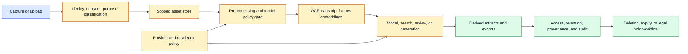
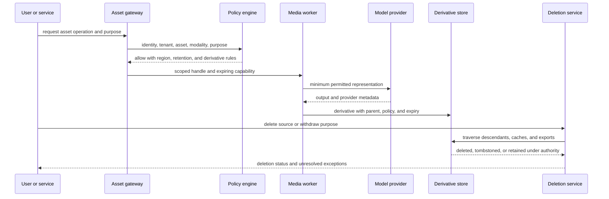

# Media Data Governance
Status: planned
Sources: [Google DeepMind — Social and ethical risks](https://deepmind.google/blog/evaluating-social-and-ethical-risks-from-generative-ai/), [C2PA](https://c2pa.org/)

## In one sentence
Media data governance defines who may collect, transform, retain, retrieve, publish, or delete multimodal data and its derived representations.

## Background: what existed before
Text databases had familiar retention, access, and deletion workflows. Teams often treated images, audio, and video as attachments, overlooking thumbnails, transcripts, embeddings, caches, and generated derivatives.

## What changed and why now
Unified systems make one upload available to vision, speech, retrieval, generation, and human review. Each additional representation can copy sensitive information and create a new access path.

## Impact on current processing and architecture
Attach tenant, purpose, consent, retention, residency, and deletion metadata to every asset and derivative. Use scoped URLs, encryption, audit logs, purpose checks, and deletion jobs that traverse lineage.

## Real-world applications and constraints
Meeting assistants, camera systems, healthcare tools, education, and creative software all need governance. Consent can differ by modality, deletion can be hard to prove, and providers may retain logs under separate terms.

## Mental model
Govern the data graph, not just the original file.

## What changed this month
Multimodal APIs turn one media object into a family of searchable and generative derivatives.

## Engineering consequence
Make retention and access decisions before model invocation, and test deletion end to end.

## Limits and failure modes
Forgotten caches, copied exports, weak tenant isolation, and untracked screenshots defeat policy.

## Prerequisites: a media object becomes a data graph

**Media data governance** is the set of rules and controls that determine how an image, audio recording, video, document, transcript, embedding, or generated artifact may be collected, processed, shared, retained, and deleted. Governance is broader than storage security. It includes purpose, consent, identity, authorization, residency, retention, derivatives, provider access, audit evidence, and user rights.

An **asset** is a source or derived media object. A **derivative** is a representation made from an asset, such as a thumbnail, OCR text, transcript, embedding, caption, summary, or generated response. A **purpose** says why data is processed. **Retention** is the rule for how long a record may remain. **Data minimization** means collecting and retaining no more data than the task needs. **Access control** decides which identity may perform which operation on which resource under which conditions.

The central idea is that a source file is not the whole data object. A meeting recording may create decoded audio buffers, speaker labels, transcript text, search vectors, summaries, reviewer packets, exports, backups, and logs. Some derivatives are more searchable or more revealing than the original. A deletion request that removes only the MP4 is incomplete if a transcript and embedding still expose the conversation.

## Background: the historical baseline

Text applications commonly had a database table, an owner column, a retention job, and an access policy. Attachments were stored separately, often with a link in the table. Teams could forget that previews, caches, and copied exports were separate data stores. Audio and video made this problem larger because files are expensive to inspect and frequently pass through many specialized services.

Earlier AI pipelines also treated preprocessing as disposable. OCR text, frame samples, transcripts, and embeddings lived in temporary directories or provider logs. If the system worked, those intermediates were rarely documented. If a user asked for deletion or a security team investigated an exposure, nobody could list every copy.

The historical baseline also assumed a stable purpose. A file collected for customer support might later be used to improve a model or build a search index without a new decision. A voice recording might be treated like text even though voice, face, location, and background speech have different sensitivity and identity implications.

## What changed and why now

Unified multimodal models accept combinations of text, image, audio, and video and may produce several output types. OpenAI’s GPT-4o system card describes that capability for a particular release. Google’s August 27, 2026 Gemini Omni 1.1 Flash announcement describes reference video, scene extension, low-resolution drafts, and high-resolution output. These are release-specific examples, but they illustrate a general governance change: one request can involve many media assets and create a branching family of derivatives.

Google DeepMind’s evaluation review discusses risk across interaction context and output modalities. C2PA and provenance work add lineage concepts for media handling. Neither source defines an organization’s legal retention policy. The engineering conclusion is that modality, purpose, and derivative lineage must be first-class fields in application data models.

A model provider may retain requests, outputs, abuse-monitoring signals, or diagnostics under terms that differ from the application’s own store. Before sending media, record the allowed provider, region, retention mode, and data classification. A fallback route that sends a restricted file to another provider is a governance decision, not merely a reliability feature.

## Impact on current processing and architecture

Governance begins at intake. Authenticate the submitting principal, bind the asset to a tenant and purpose, validate type and size, scan content, classify sensitivity, set retention, and issue a stable asset ID. Every downstream worker receives a scoped reference and policy context. It should not receive broad credentials or unrestricted access to a tenant bucket.



The policy gate should decide whether a particular representation may be created. A tenant might permit local OCR but prohibit cloud transcription. A user might be allowed to view a recording but not export face crops or embeddings. A support purpose might allow a transcript for 30 days but not model-training reuse. These policies need explicit enums and versioning; a free-form note cannot reliably drive a worker.

Access checks must apply to derivatives. A transcript may be searched by a user who cannot download audio, but it can still reveal the same private statement. An embedding may not be human-readable, yet it can support retrieval or membership inference. A generated summary may combine information from several restricted sources. Propagate source policy or apply a documented transformation policy that determines what access a derivative receives.



Use short-lived capabilities rather than passing permanent bucket credentials. A capability should identify asset, operation, tenant, expiration, and allowed derivative or export behavior. The worker should be unable to use the same handle for unrelated assets. Recheck policy for long-running jobs because a user can lose access or withdraw consent while a render is in progress.

Retention needs states, not only a date. An asset may be active, expired, pending deletion, under legal hold, retained as a minimal audit record, or permanently deleted. A derivative can have a shorter lifetime than its source or require a longer review record. Store the authority for an exception. “Keep forever for safety” is not a complete policy because it can conflict with privacy and minimization.

Deletion is an asynchronous distributed workflow. Mark the source as pending deletion to prevent new derivatives, enumerate descendants through lineage, revoke access capabilities, delete or cryptographically erase permitted bytes, invalidate caches and indexes, and report failures. Backups and provider stores may have separate schedules. Tell the requester what was removed, what remains under a documented exception, and when another store is expected to expire. Never claim instant deletion when the system cannot prove it.

## Data classification and purpose limitation

Classification should reflect content and consequence. A file can contain personal data, biometric or voice identity, financial information, health information, credentials, confidential business content, or public media. Classification can be uncertain; preserve the source of the label and allow a higher-risk override. Do not infer that a short file is low sensitivity.

Purpose limitation prevents silent reuse. “Support” and “model improvement” are different purposes even if both process a transcript. “Internal search” and “public publication” require different access and retention. A generated artifact should record the parent purpose and whether its use is compatible. If a new purpose is not compatible, require a new authorization or refuse the operation.

Consent is not a universal field. A person may consent to a meeting recording but not to voice cloning or face recognition. A bystander may appear in the background without submitting the asset. Capture consent scope, actor, time, version, and withdrawal behavior where applicable. Route uncertain or high-impact use to a responsible policy owner rather than asking a model to interpret consent.

## Real-world applications and constraints

Meeting assistants ingest speech, screens, faces, and documents. Governance should identify participants, recording disclosure, region, retention, transcript access, search permissions, and deletion. A summary should not be available to a larger audience than the meeting unless an explicit sharing decision permits it. Speaker labels can be wrong and should not become authoritative identity records without review.

Camera systems process continuous streams, which creates a retention and minimization problem. Analyze short windows locally where possible, store event metadata rather than all frames, and make capture visible. If an incident requires preservation, create a documented hold for the exact interval. Do not retain an entire day of video because a ten-minute incident might occur.

Healthcare tools need strict purpose and access boundaries. An image used for assistance may create thumbnails, embeddings, reports, and reviewer packets. Use domain-specific authorization and audit, encrypt all representations, and avoid sending restricted media to an unapproved provider. A generated explanation is not automatically a clinical record; define which outputs enter the regulated workflow.

Education platforms may process student voices, faces, or assignments. Minimize collection, separate teaching support from model training, define guardian or institutional controls where applicable, and make deletion understandable. A classroom recording should not silently become a public demonstration artifact.

Creative software needs governance for reference images, voices, and generated exports. A user may be authorized to edit a photo but not clone the person’s voice or publish a recognizable likeness. Track source claims, consent, parent lineage, review, and export destination. A high-resolution render can contain more detail than the low-resolution preview that was approved.

Enterprise search must preserve tenant and document ACLs into chunks, OCR text, embeddings, summaries, and answers. A vector database is not a policy bypass. Recheck authorization at retrieval and before displaying generated text. When a source is deleted or access is revoked, remove or disable its vectors and cached answers.

## Engineering consequence

Represent governance as policy attached to every node and operation in the data graph. At minimum, carry tenant, purpose, sensitivity, region, consent scope, retention state, parent IDs, provider, and policy version. If a worker cannot receive or preserve a field, define the loss explicitly and refuse transformations that would make future decisions impossible.

Numbered local implementation steps:

1. Draw one media workflow from capture to deletion, including every derivative, cache, export, and provider.
2. Define asset, tenant, purpose, sensitivity, region, consent, retention, and legal-hold fields.
3. Assign stable IDs and parent links to source and derived artifacts.
4. Build an allow/deny policy for operations such as view, decode, transcribe, embed, generate, export, and delete.
5. Issue short-lived scoped capabilities to workers and recheck long-running jobs.
6. Propagate source ACLs and purpose into transcripts, thumbnails, vectors, summaries, and review packets.
7. Set explicit expiry states and prevent new derivatives after deletion begins.
8. Implement descendant traversal, cache invalidation, provider deletion, tombstones, and exception reporting.
9. Audit access, policy decisions, provider routes, exports, and unresolved deletion nodes.
10. Test tenant isolation, consent withdrawal, stale capabilities, backup behavior, derivative leakage, and high-resolution re-exports.

## Build it locally

Save this example as `media_policy.py` and run `python3 media_policy.py`. It models purpose, tenant, region, and retention checks for a derivative operation. It uses no external dependencies. The example is intentionally conservative: a transcript cannot be created in an unapproved region, and a source pending deletion cannot create new children.

```python
from dataclasses import dataclass

@dataclass(frozen=True)
class Asset:
    asset_id: str
    tenant: str
    purpose: str
    region: str
    sensitivity: str
    state: str

@dataclass(frozen=True)
class Operation:
    name: str
    output_kind: str
    region: str

def allowed(asset, operation, approved_regions, allowed_purposes):
    if asset.state in {"pending_delete", "deleted"}:
        return False, "source is not active"
    if operation.region not in approved_regions:
        return False, "region is not approved"
    if asset.purpose not in allowed_purposes:
        return False, "purpose is not approved"
    if operation.output_kind == "public_export" and asset.sensitivity != "public":
        return False, "sensitive source cannot become public export"
    return True, "allowed"

source = Asset("meeting-1", "team-a", "support", "us", "confidential", "active")
for operation in [Operation("transcribe", "transcript", "us"),
                  Operation("transcribe", "transcript", "eu"),
                  Operation("export", "public_export", "us")]:
    print(operation, allowed(source, operation, {"us"}, {"support"}))
```

Change the source state to `pending_delete` and confirm that all new operations stop. Add a derivative object with a parent ID and expiry, then write a traversal that finds it when the source is deleted. Finally, create a public source and verify that only it may pass the public-export rule. A production system would also check identity, consent, ACLs, provider retention, legal holds, and cryptographic audit records.

## Limits and failure modes

**Derivative leakage** occurs when OCR, transcripts, vectors, summaries, or caches keep data after source deletion. Maintain parent links and traverse every store.

**Purpose creep** occurs when data collected for support is reused for training or publication without a new decision. Store purpose and require compatibility checks.

**Tenant escape** occurs when a shared vector index or cache returns another tenant’s content. Apply tenant filters at ingestion, retrieval, display, and deletion; test negative cases.

**Stale capability** occurs when a worker continues after consent withdrawal or access revocation. Use short expiry and recheck long-running jobs.

**Provider mismatch** occurs when fallback sends restricted media to an unapproved service or region. Make provider and residency eligibility part of route policy.

**Retention ambiguity** occurs when a source expires but a review packet or export remains indefinitely. Assign retention classes to derivatives and require an authority for exceptions.

**Backup uncertainty** occurs when primary deletion succeeds but backups persist under an undocumented schedule. Track backup policy and report the remaining deletion window accurately.

**Overcollection** occurs when a service uploads an entire video or records continuous audio for a narrow task. Minimize by interval, resolution, modality, and retention.

**Consent mismatch** occurs when recording consent is treated as permission for identification, cloning, or publication. Store purpose-specific consent and route new use to review.

**Audit exposure** occurs when logs copy raw media, prompts, or personal data. Log IDs, hashes, decisions, and bounded metadata unless payload retention is explicitly required.

## Mini exercise (15–30 min)

Extend the local policy example with `consent_scope`, `expires_at`, and `parent_id`. Create a meeting recording, transcript, embedding, summary, and public export. Permit the transcript but deny the public export. Mark the source pending deletion, discover every descendant, and report which nodes can be deleted immediately versus retained under a legal hold. Add a different tenant and ensure it cannot traverse the graph.

## Interview Q&A

**Q: Why is deleting the original file insufficient?**
Models and media workers create transcripts, OCR text, frames, embeddings, summaries, caches, exports, and provider copies. Deletion must follow lineage and retention policy across those derivatives.

**Q: Is an embedding non-sensitive?**
Not automatically. It can support retrieval or reveal information through attacks. Apply access, retention, and deletion rules based on the source and use.

**Q: How should a fallback route handle restricted media?**
Re-run eligibility with tenant, purpose, provider, region, consent, and retention policy. A reliability fallback is not permission to send data to any available provider.

**Q: What should happen during deletion of an active job?**
Stop new derivatives, revoke capabilities, mark the source pending deletion, cancel or isolate work where possible, traverse descendants, and report unresolved provider or backup exceptions.

**Q: How do you preserve auditability while honoring deletion?**
Retain the minimum authorized evidence—such as IDs, hashes, policy decisions, and tombstones—without keeping sensitive payloads, and document the retention authority and scope.

## Glossary

- **Access control:** Rules determining who may perform an operation on a resource.
- **Asset:** Source or derived media object.
- **Consent scope:** Specific permitted use, actor, time, and withdrawal behavior.
- **Data minimization:** Limiting collection and retention to what a task needs.
- **Derivative:** Representation created from a source, such as transcript, vector, or thumbnail.
- **Legal hold:** Authorized exception preventing ordinary deletion.
- **Lineage:** Parent-child relationship among assets and operations.
- **Purpose limitation:** Restricting processing to declared compatible purposes.
- **Retention:** Rule for how long a record may remain.
- **Scoped capability:** Short-lived permission limited to an asset and operation.

## References

- [Google Blog: Gemini Omni 1.1 Flash](https://blog.google/innovation-and-ai/technology/developers-tools/build-with-gemini-omni-1-1-flash/) — release-specific multimodal media workflow and derivative context.
- [OpenAI GPT-4o System Card](https://openai.com/index/gpt-4o-system-card/) — release-specific multimodal input/output and safety context.
- [Google DeepMind: Evaluating social and ethical risks from generative AI](https://deepmind.google/blog/evaluating-social-and-ethical-risks-from-generative-ai/) — modality and interaction risk context.
- [C2PA](https://c2pa.org/) — media provenance and transformation context.

## Claim ledger

| Claim | Source | Fact or inference |
|---|---|---|
| Unified systems can process multiple media types and create multiple output types. | OpenAI system card | Fact about that release; generalization is limited |
| Omni 1.1’s reference, continuation, draft, and upscaling workflows create multiple media derivatives. | Google Blog | Fact plus engineering inference |
| Evaluation gaps include interaction context and output modality. | Google DeepMind review | Fact reported by source |
| Governance must cover source files and derived representations. | Data governance analysis | Inference |
| Deletion and access decisions should traverse the media lineage graph. | Systems engineering | Inference |

## Mini exercise (15–30 min)
Draw the derivative graph for an uploaded meeting recording and write a deletion checklist for every node.

## Claim ledger
| Claim | Source | Fact or inference |
|---|---|---|
| Multimodal risk appears across output modalities and interaction contexts. | Google DeepMind | Fact from review |
| Governance must include derived media representations. | Data governance | Inference |
