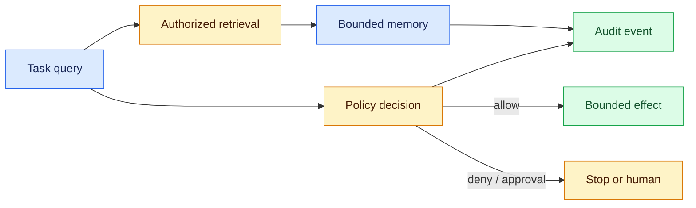

# Secure agent lab

This 30-minute, dependency-free capstone connects the August lessons. It is a deliberately small **control-plane simulation**, not a production agent or secure enclave.



## Run

```bash
cd projects/secure-agent-lab
python3 app.py
PYTHONPATH=. python3 -m unittest discover -s tests -v
```

The example retrieves only Acme memory, then sends a $75 refund proposal to policy. The policy returns `needs_approval`; it never executes a refund.

## What each part teaches

| File behavior | Lesson connection |
|---|---|
| `retrieve` filters tenant before scoring | memory is governed state, not a prompt dump |
| `authorize` returns typed decisions | an agent proposal is not authority |
| test fixtures exercise negative cases | evaluation needs explicit failure criteria |
| structured event includes trace and memory IDs | observability makes a run explainable |

## Extend it

1. Persist events to JSONL and replay a failed run.
2. Add expiry and supersession to memories; write a test that an expired record cannot return.
3. Add a candidate/reranker split and measure latency as candidate count grows.
4. Replace the fake planner only after policy tests pass. Keep the model outside the authorization boundary.

Do not add secrets, production credentials, real customer data, or unrestricted shell/network tools to this lab.
